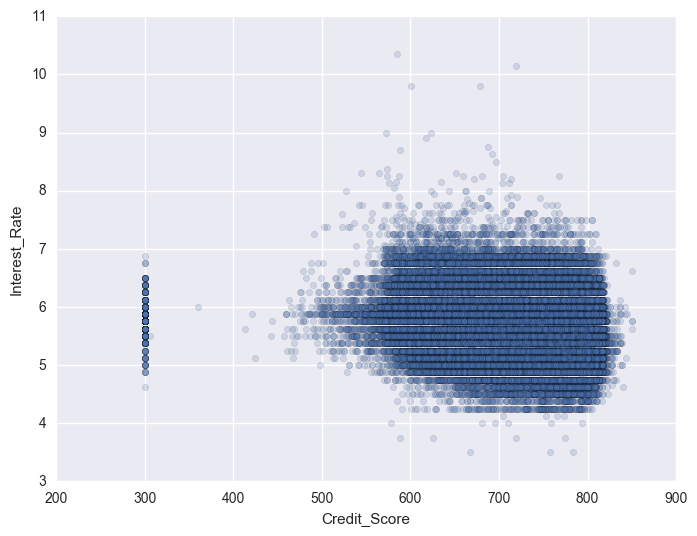
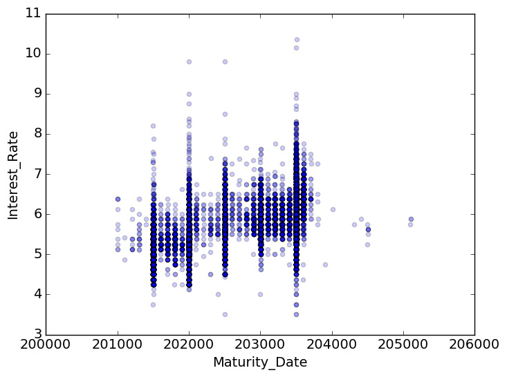
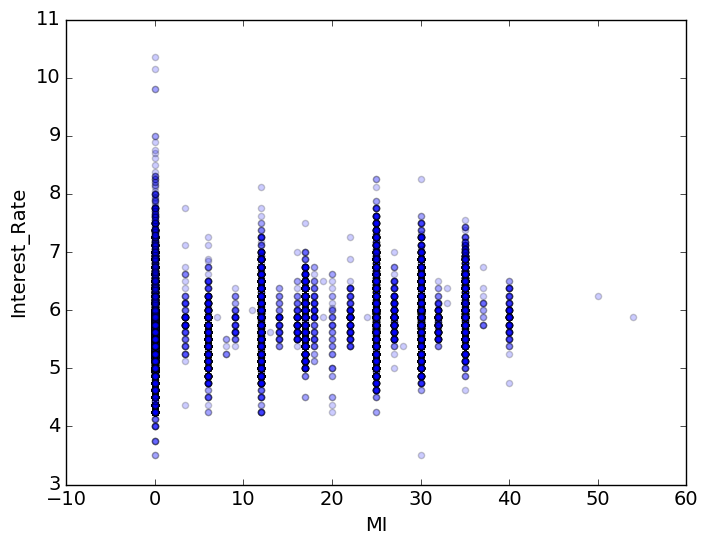
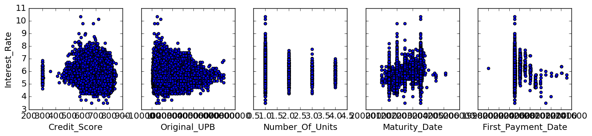
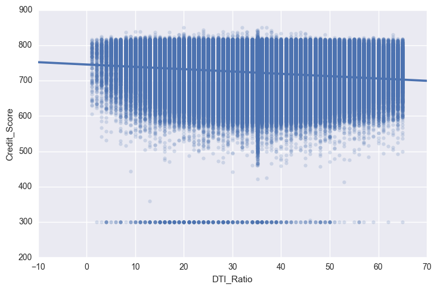
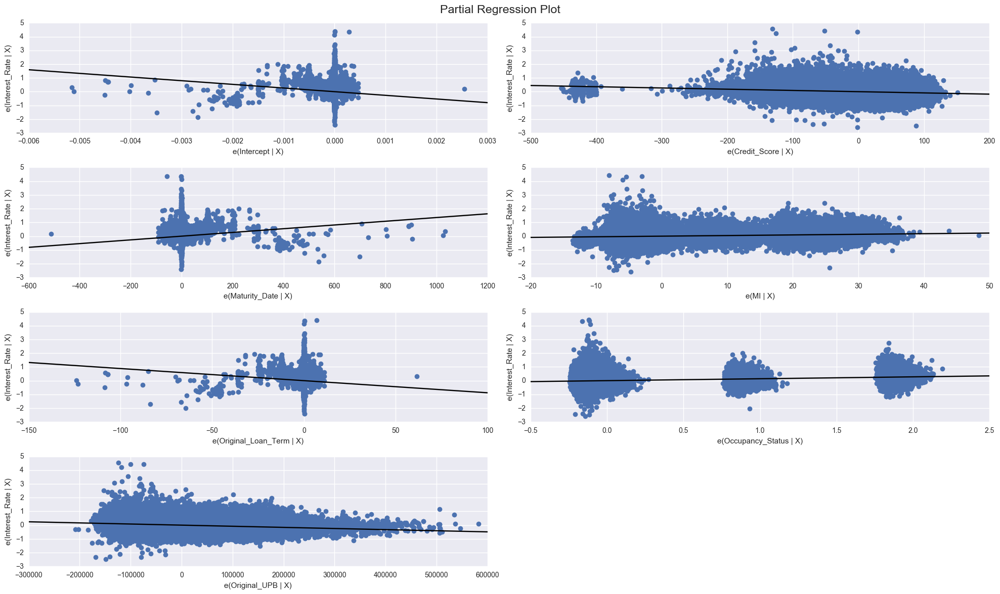
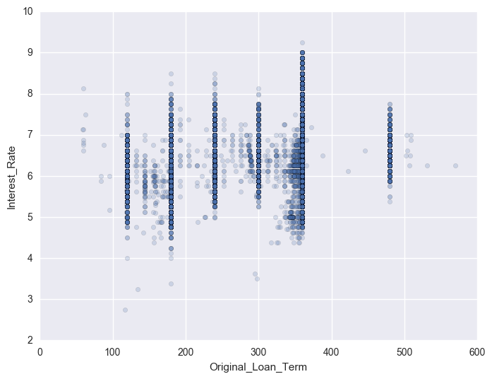
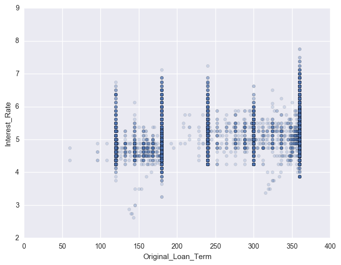

```python
# coding: utf-8
import sys
import pandas as pd
import urllib.request
import zipfile, io
import csv
import os
import numpy as np
from bs4 import BeautifulSoup
import matplotlib.pyplot as plt
import matplotlib
from scipy.stats import norm
import scipy.stats as stats
import matplotlib.mlab as mlab
import math
from urllib.request import urlopen
from urllib.request import urlretrieve
from requests import session
from lxml import html
import requests
import http.cookiejar
#import selenium
#from selenium import webdriver
#from selenium.webdriver.common.keys import Keys
#from bs4 import BeautifulSoup
import tabulate
import h2o
import seaborn as sns
```


```python
import sklearn
from sklearn import *
from sklearn.cross_validation import train_test_split
from sklearn.metrics import *
from IPython.display import HTML, display
import statsmodels.api as sm
from statsmodels.formula.api import ols
from sklearn.preprocessing import LabelEncoder
from sklearn.linear_model import LinearRegression
from sklearn.ensemble import RandomForestRegressor
from sklearn.neighbors import KNeighborsRegressor
from sklearn import datasets, linear_model
```

    C:\Users\Yamini\Anaconda3\lib\site-packages\sklearn\cross_validation.py:44: DeprecationWarning: This module was deprecated in version 0.18 in favor of the model_selection module into which all the refactored classes and functions are moved. Also note that the interface of the new CV iterators are different from that of this module. This module will be removed in 0.20.
      "This module will be removed in 0.20.", DeprecationWarning)
    C:\Users\Yamini\Anaconda3\lib\site-packages\sklearn\grid_search.py:43: DeprecationWarning: This module was deprecated in version 0.18 in favor of the model_selection module into which all the refactored classes and functions are moved. This module will be removed in 0.20.
      DeprecationWarning)
    C:\Users\Yamini\Anaconda3\lib\site-packages\sklearn\lda.py:6: DeprecationWarning: lda.LDA has been moved to discriminant_analysis.LinearDiscriminantAnalysis in 0.17 and will be removed in 0.19
      "in 0.17 and will be removed in 0.19", DeprecationWarning)
    C:\Users\Yamini\Anaconda3\lib\site-packages\sklearn\learning_curve.py:23: DeprecationWarning: This module was deprecated in version 0.18 in favor of the model_selection module into which all the functions are moved. This module will be removed in 0.20
      DeprecationWarning)
    C:\Users\Yamini\Anaconda3\lib\site-packages\sklearn\qda.py:6: DeprecationWarning: qda.QDA has been moved to discriminant_analysis.QuadraticDiscriminantAnalysis in 0.17 and will be removed in 0.19.
      "in 0.17 and will be removed in 0.19.", DeprecationWarning)
    


```python
%matplotlib inline
%matplotlib notebook
```


```python
priorQuarterCleanData = 'priorQuarterCleanData.csv'
nextQuarterCleanData = 'nextQuarterCleanData.csv'
priorQuarter = 'priorQuarter.csv'
nextQuarter = 'nextQuarter.csv'
modelMetrics = 'modelMetrics.csv'
neuralNetworkMetrics = 'neuralNetworkMetrics.csv'

```


```python
quarter = os.getenv("Quarter")
year = os.getenv("Year")

#quarter = sys.argv[1]
#year = sys.argv[2]
```


```python
if(year is None or year==""):
    print("Please enter valid year")
    exit()
else:
    print("Year is:" + str(year))

```

    Please enter valid year
    


```python
#pathPriorquarter = ""
#pathNextquarter = ""
```


```python
# Validate input argument and set year to 2005 if validation fails
try:
    if len(year) >= 2:
        #if isinstance(year,int):
        year=int(year)
        print(year)
        if not(1999 <= year <=2016):
            print("Enter valid year")
    else:
        year=2005
except Exception as err:
    year=2005
print(year)
```

    2005
    


```python
try:
    if len(quarter) == 1:
        #if isinstance(year,int):
        quarter=int(quarter)
        print(quarter)
        if not(1 <= quarter <=4):
            print("Enter valid quarter")
    else:
        quarter=1
except Exception as err:
    quarter=1
print(quarter)
```

    1
    


```python
#Function to generate urlLIst for origination and next quarter URLs
def generateURLList(quarter,year):
    next_quarter = quarter +1
    next_year = year +1
    urlTrainList = []
    urlTestList = []
    train_url = "https://freddiemac.embs.com/FLoan/Data/historical_data1_Q" + str(quarter)+str(year)+ ".zip"
    urlTrainList.append(train_url)
    if quarter == 4:
        quarter=1
        test_url = "https://freddiemac.embs.com/FLoan/Data/historical_data1_Q" + str(quarter)+str(next_year)+ ".zip"
        urlTestList.append(test_url)
    else:
        test_url = "https://freddiemac.embs.com/FLoan/Data/historical_data1_Q" + str(next_quarter)+str(year)+ ".zip"
        urlTestList.append(test_url) 
    return urlTrainList,urlTestList
```


```python
#call to function to get URLs in the list
#replace inputs by int(quarter),int(year)

urlTrainList = generateURLList(1,2005)
#urlTrainList = generateURLList(int(quarter),int(year))
print("----Generated URLs----")
for fileURL in urlTrainList[0]:
     print(fileURL)  
for fileURL in urlTrainList[1]:
     print(fileURL)        
```

    ----Generated URLs----
    https://freddiemac.embs.com/FLoan/Data/historical_data1_Q12005.zip
    https://freddiemac.embs.com/FLoan/Data/historical_data1_Q22005.zip
    


```python
#Start session
session = requests.session()
```


```python
#get the login
login_url = "https://freddiemac.embs.com/FLoan/secure/auth.php"
values = dict(username= 'yamini.mait@gmail.com',password= 'Q4kzCWSk')
r = session.post(login_url,data=values)
r.status_code
```


    200


```python
valuesNew={'accept':'Yes', 'acceptSubmit':'Continue', 'action':'acceptTandC'}
url='https://freddiemac.embs.com/FLoan/Data/download.php'
login=session.post(url,data=valuesNew)
page=login.content
```


```python
#Check cookies
cookies = r.cookies
cookies
```


    <RequestsCookieJar[Cookie(version=0, name='PHPSESSID', value='m4ki0ude1l4buqfpitjc04rfv4', port=None, port_specified=False, domain='freddiemac.embs.com', domain_specified=False, domain_initial_dot=False, path='/', path_specified=True, secure=True, expires=None, discard=True, comment=None, comment_url=None, rest={'HttpOnly': None}, rfc2109=False)]>


```python
#get the geckopathdriver
#geckoPath = 'C:/Users/Yamini/Downloads/geckodriver-v0.14.0-win64/geckodriver.exe'
```


```python
#browser = webdriver.Firefox(executable_path=geckoPath)
#browser.get('https://freddiemac.embs.com/FLoan/secure/login.php')
```


```python
#username = browser.find_element_by_id("username")
#password = browser.find_element_by_id("password")
#username.send_keys("yamini.mait@gmail.com")
#password.send_keys("Q4kzCWSk")
```


```python
#loginForm = browser.find_element_by_name('loginform')
#loginForm.submit()
```


```python
#browser.find_element_by_name('accept').click(); 
#browser.find_element_by_name('acceptSubmit').click(); 
#browser
#page = browser.page_source
```


```python
soup = BeautifulSoup(page)
```

    C:\Users\Yamini\Anaconda3\lib\site-packages\bs4\__init__.py:181: UserWarning: No parser was explicitly specified, so I'm using the best available HTML parser for this system ("lxml"). This usually isn't a problem, but if you run this code on another system, or in a different virtual environment, it may use a different parser and behave differently.
    
    The code that caused this warning is on line 184 of the file C:\Users\Yamini\Anaconda3\lib\runpy.py. To get rid of this warning, change code that looks like this:
    
     BeautifulSoup([your markup])
    
    to this:
    
     BeautifulSoup([your markup], "lxml")
    
      markup_type=markup_type))
    


```python
tables = soup.find_all('table',attrs={'class':'table1'})
a_tags = soup.findAll('a')
```


```python
#quarter=1
#next_quarter = quarter +1
#year =2005
#next_year = year +1
```


```python
####Cleaning dataset method

def handleMissingData(df):
    #Fill date if credit_score is null
    df.Credit_Score = pd.to_numeric(df.Credit_Score,errors = 'coerce')
    df['Credit_Score'].fillna(0,inplace=True)
    df['Credit_Score'].replace(0,df.Credit_Score.mean(),inplace=True)
    #if First_Time_Homebuyer_Flag is null fill 'NotApplicable' 
    df['First_Time_Homebuyer_Flag'].fillna('Not Applicable',inplace=True)
    #If MSA is null, fill mean
    df['MSA'].fillna(df.MSA.median(),inplace=True)
    #If MI is null, just take the finite rows
    df.MI = pd.to_numeric(df.MI,errors = 'coerce')
    df['MI'].fillna(df.MI.mean(),inplace=True)
    #If Number_Of_Units is null fill mode
    df['Number_Of_Units'].fillna(df['Number_Of_Units'].mode()[0],inplace=True)
    #if Occupancy_Status is null, fill mode
    df['Occupancy_Status'].fillna(df['Occupancy_Status'].mode()[0],inplace=True)
    #if CLTV is null, fill mean
    df['CLTV'].fillna(df.CLTV.mean(),inplace=True)
    #if DTI_Ratio is null, fill mean
    df.DTI_Ratio = pd.to_numeric(df.DTI_Ratio,errors = 'coerce')
    df['DTI_Ratio'].fillna(df.DTI_Ratio.mean(),inplace=True)
    #if LTV is null, fill mean
    df['LTV'].fillna( df.LTV.mean(),inplace=True)
    #if Channel is null, fill mode
    df['Channel'].fillna(df['Channel'].mode()[0],inplace=True)
    #if PPM is null, fill mode
    df['PPM'].fillna(df['PPM'].mode()[0],inplace=True)
    #if Property_Type is null, fill mode as SF
    df['Property_Type'].fillna(df['Property_Type'].mode()[0],inplace=True)
    #If Postal_Code is null, fill 0
    df.Postal_Code.fillna(0,inplace=True)
    #If Number_Of_borrowers is null, fill mode
    df['Number_Of_Borrowers'].fillna(df['Number_Of_Borrowers'].mode()[0],inplace=True)
    #If Super_Conforming_Flag is all null, drop the column
    df = df.dropna(axis=1,how='all')
    return df
```


```python
#Factorize the dataset columns
def dataFactorize(df):
    #df.dropna(inplace=True)
    df['First_Time_Homebuyer_Flag'] = pd.factorize(df.First_Time_Homebuyer_Flag)[0]
    df['Occupancy_Status'] = pd.factorize(df.Occupancy_Status)[0]
    df['Channel'] = pd.factorize(df.Channel)[0]   
    df['PPM'] = pd.factorize(df.PPM)[0]
    df['Product_Type'] = pd.factorize(df.Product_Type)[0]  
    df['Property_State'] = pd.factorize(df.Property_State)[0]
    df['Property_Type'] = pd.factorize(df.Property_Type)[0]
    df['Loan_Purpose'] = pd.factorize(df.Loan_Purpose)[0]
    df['Loan_Sequence_Nmber'] = pd.factorize(df.Loan_Sequence_Nmber)[0]
    df['Service_Name'] = pd.factorize(df.Service_Name)[0]
    df['Seller_Name'] = pd.factorize(df.Seller_Name)[0]
    return df
```


```python
def checkPercentageOfMissingData(df):
    mis_val_percent = 100 * df.isnull().sum()/len(df)
    print(mis_val_percent)
```


```python
#Get Prior Quarter Data

for fileURL in urlTrainList[0]:
    try:
        response = urllib.request.urlopen(fileURL)
        if response.getcode()==200:
            data = response.read()
            print("Reading Data")
            if zipfile.is_zipfile(io.BytesIO(data)) == True:
                print("ZipFile is valid")
                z = zipfile.ZipFile(io.BytesIO(data))
                for file in z.namelist():
                    if "historical_data1_Q" in str(file):
                        print("Get the file:"+file)
                        textFile = z.read(file)
                        df_TrainRawData = pd.read_csv(io.BytesIO(textFile),sep = '|',header=None)
                        print("File read into dataframe.This is raw Data.")
                        print(df_TrainRawData.shape)
                        df_TrainRawData.columns =['Credit_Score', 'First_Payment_Date', 'First_Time_Homebuyer_Flag','Maturity_Date',
                                                   'MSA','MI','Number_Of_Units','Occupancy_Status','CLTV','DTI_Ratio',
                                                   'Original_UPB','LTV','Interest_Rate','Channel','PPM','Product_Type',
                                                   'Property_State','Property_Type','Postal_Code','Loan_Sequence_Nmber',
                                                   'Loan_Purpose','Original_Loan_Term','Number_Of_Borrowers','Seller_Name',
                                                    'Service_Name','Super_Conforming_Flag']
            else:
                print("[ERROR] Invalid ZIP File found at " + fileURL)
                exit()
        else:
            print("[ERROR] Invalid URL, URL( " + fileURL + " ) returned a bad HTTP response code of " + str(response.getcode()))
        response.close()
    except Exception as err:
        print("Error occured, possibly an interrupted Internet connection")
        exit()

```


```python
#Get Next Quarter Data
for fileURL in urlTrainList[1]:
    try:
        response = urllib.request.urlopen(fileURL)
        if response.getcode()==200:
            data = response.read()
            print("Reading Data")
            if zipfile.is_zipfile(io.BytesIO(data)) == True:
                print("ZipFile is valid")
                z = zipfile.ZipFile(io.BytesIO(data))
                for file in z.namelist():
                    if "historical_data1_Q" in str(file):
                        print("Get the file:"+file)
                        textFile = z.read(file)
                        df_TestRawData = pd.read_csv(io.BytesIO(textFile),sep = '|',header=None)
                        print(df_TrainRawData.shape)
                        df_TestRawData.columns =['Credit_Score', 'First_Payment_Date', 'First_Time_Homebuyer_Flag','Maturity_Date',
                                                   'MSA','MI','Number_Of_Units','Occupancy_Status','CLTV','DTI_Ratio',
                                                   'Original_UPB','LTV','Interest_Rate','Channel','PPM','Product_Type',
                                                   'Property_State','Property_Type','Postal_Code','Loan_Sequence_Nmber',
                                                   'Loan_Purpose','Original_Loan_Term','Number_Of_Borrowers','Seller_Name',
                                                    'Service_Name','Super_Conforming_Flag']
            else:
                print("[ERROR] Invalid ZIP File found at " + fileURL)
        else:
            print("[ERROR] Invalid URL, URL( " + fileURL + " ) returned a bad HTTP response code of " + str(response.getcode()))
        response.close()
    except Exception as err:
        print("Error occured, possibly an interrupted Internet connection")
```


```python
#create csv file with raw data 
df_TrainRawData.to_csv(priorQuarter,sep='\t', encoding='utf-8',index=False)
print("File created For Given Quarter: priorQuarter.csv")
df_TestRawData.to_csv(nextQuarter,sep='\t', encoding='utf-8',index=False)
print("File created for Next Immediate quarter: nextQuarter.csv")
```


```python
#Check data in both the quarters
df_TrainRawData.head()
```


<div>
<table border="1" class="dataframe">
  <thead>
    <tr style="text-align: right;">
      <th></th>
      <th>Credit_Score</th>
      <th>First_Payment_Date</th>
      <th>First_Time_Homebuyer_Flag</th>
      <th>Maturity_Date</th>
      <th>MSA</th>
      <th>MI</th>
      <th>Number_Of_Units</th>
      <th>Occupancy_Status</th>
      <th>CLTV</th>
      <th>DTI_Ratio</th>
      <th>...</th>
      <th>Property_State</th>
      <th>Property_Type</th>
      <th>Postal_Code</th>
      <th>Loan_Sequence_Nmber</th>
      <th>Loan_Purpose</th>
      <th>Original_Loan_Term</th>
      <th>Number_Of_Borrowers</th>
      <th>Seller_Name</th>
      <th>Service_Name</th>
      <th>Super_Conforming_Flag</th>
    </tr>
  </thead>
  <tbody>
    <tr>
      <th>0</th>
      <td>699</td>
      <td>200505</td>
      <td>N</td>
      <td>203504</td>
      <td>39300.0</td>
      <td>000</td>
      <td>1.0</td>
      <td>O</td>
      <td>56.0</td>
      <td>42</td>
      <td>...</td>
      <td>RI</td>
      <td>SF</td>
      <td>2800.0</td>
      <td>F105Q1000001</td>
      <td>C</td>
      <td>360</td>
      <td>2.0</td>
      <td>Other sellers</td>
      <td>USBANKNA</td>
      <td>NaN</td>
    </tr>
    <tr>
      <th>1</th>
      <td>691</td>
      <td>200504</td>
      <td>N</td>
      <td>203503</td>
      <td>36420.0</td>
      <td>25</td>
      <td>1.0</td>
      <td>O</td>
      <td>90.0</td>
      <td>36</td>
      <td>...</td>
      <td>OK</td>
      <td>SF</td>
      <td>73000.0</td>
      <td>F105Q1000002</td>
      <td>N</td>
      <td>360</td>
      <td>1.0</td>
      <td>Other sellers</td>
      <td>Other servicers</td>
      <td>NaN</td>
    </tr>
    <tr>
      <th>2</th>
      <td>713</td>
      <td>200503</td>
      <td>N</td>
      <td>203502</td>
      <td>28740.0</td>
      <td>000</td>
      <td>1.0</td>
      <td>O</td>
      <td>72.0</td>
      <td>45</td>
      <td>...</td>
      <td>NY</td>
      <td>SF</td>
      <td>12500.0</td>
      <td>F105Q1000003</td>
      <td>P</td>
      <td>360</td>
      <td>2.0</td>
      <td>Other sellers</td>
      <td>Other servicers</td>
      <td>NaN</td>
    </tr>
    <tr>
      <th>3</th>
      <td>719</td>
      <td>200505</td>
      <td>N</td>
      <td>203504</td>
      <td>NaN</td>
      <td>000</td>
      <td>1.0</td>
      <td>S</td>
      <td>85.0</td>
      <td>47</td>
      <td>...</td>
      <td>MO</td>
      <td>CO</td>
      <td>65000.0</td>
      <td>F105Q1000004</td>
      <td>P</td>
      <td>360</td>
      <td>2.0</td>
      <td>Other sellers</td>
      <td>USBANKNA</td>
      <td>NaN</td>
    </tr>
    <tr>
      <th>4</th>
      <td>656</td>
      <td>200503</td>
      <td>N</td>
      <td>203502</td>
      <td>40340.0</td>
      <td>000</td>
      <td>1.0</td>
      <td>O</td>
      <td>68.0</td>
      <td>30</td>
      <td>...</td>
      <td>MN</td>
      <td>SF</td>
      <td>55900.0</td>
      <td>F105Q1000005</td>
      <td>C</td>
      <td>360</td>
      <td>2.0</td>
      <td>Other sellers</td>
      <td>Other servicers</td>
      <td>NaN</td>
    </tr>
  </tbody>
</table>
<p>5 rows × 26 columns</p>
</div>


```python
df_TestRawData.head()
```


<div>
<table border="1" class="dataframe">
  <thead>
    <tr style="text-align: right;">
      <th></th>
      <th>Credit_Score</th>
      <th>First_Payment_Date</th>
      <th>First_Time_Homebuyer_Flag</th>
      <th>Maturity_Date</th>
      <th>MSA</th>
      <th>MI</th>
      <th>Number_Of_Units</th>
      <th>Occupancy_Status</th>
      <th>CLTV</th>
      <th>DTI_Ratio</th>
      <th>...</th>
      <th>Property_State</th>
      <th>Property_Type</th>
      <th>Postal_Code</th>
      <th>Loan_Sequence_Nmber</th>
      <th>Loan_Purpose</th>
      <th>Original_Loan_Term</th>
      <th>Number_Of_Borrowers</th>
      <th>Seller_Name</th>
      <th>Service_Name</th>
      <th>Super_Conforming_Flag</th>
    </tr>
  </thead>
  <tbody>
    <tr>
      <th>0</th>
      <td>715</td>
      <td>200508</td>
      <td>N</td>
      <td>203507</td>
      <td>33700.0</td>
      <td>0</td>
      <td>1.0</td>
      <td>O</td>
      <td>58.0</td>
      <td>41</td>
      <td>...</td>
      <td>CA</td>
      <td>SF</td>
      <td>95300.0</td>
      <td>F105Q2000001</td>
      <td>C</td>
      <td>360</td>
      <td>2.0</td>
      <td>Other sellers</td>
      <td>WELLSFARGOBANK,NA</td>
      <td>NaN</td>
    </tr>
    <tr>
      <th>1</th>
      <td>743</td>
      <td>200508</td>
      <td>N</td>
      <td>203507</td>
      <td>NaN</td>
      <td>0</td>
      <td>1.0</td>
      <td>O</td>
      <td>80.0</td>
      <td>36</td>
      <td>...</td>
      <td>IL</td>
      <td>SF</td>
      <td>62400.0</td>
      <td>F105Q2000002</td>
      <td>N</td>
      <td>360</td>
      <td>2.0</td>
      <td>Other sellers</td>
      <td>PNCMTGESERVICES,INC</td>
      <td>NaN</td>
    </tr>
    <tr>
      <th>2</th>
      <td>772</td>
      <td>200508</td>
      <td>N</td>
      <td>203507</td>
      <td>37860.0</td>
      <td>0</td>
      <td>1.0</td>
      <td>O</td>
      <td>80.0</td>
      <td>34</td>
      <td>...</td>
      <td>FL</td>
      <td>PU</td>
      <td>32500.0</td>
      <td>F105Q2000003</td>
      <td>P</td>
      <td>360</td>
      <td>1.0</td>
      <td>Other sellers</td>
      <td>Other servicers</td>
      <td>NaN</td>
    </tr>
    <tr>
      <th>3</th>
      <td>773</td>
      <td>200507</td>
      <td>N</td>
      <td>203506</td>
      <td>NaN</td>
      <td>0</td>
      <td>1.0</td>
      <td>O</td>
      <td>64.0</td>
      <td>60</td>
      <td>...</td>
      <td>MN</td>
      <td>SF</td>
      <td>56300.0</td>
      <td>F105Q2000004</td>
      <td>N</td>
      <td>360</td>
      <td>2.0</td>
      <td>Other sellers</td>
      <td>USBANKNA</td>
      <td>NaN</td>
    </tr>
    <tr>
      <th>4</th>
      <td>647</td>
      <td>200508</td>
      <td>N</td>
      <td>203507</td>
      <td>NaN</td>
      <td>30</td>
      <td>1.0</td>
      <td>O</td>
      <td>91.0</td>
      <td>28</td>
      <td>...</td>
      <td>MI</td>
      <td>SF</td>
      <td>49200.0</td>
      <td>F105Q2000005</td>
      <td>N</td>
      <td>360</td>
      <td>1.0</td>
      <td>Other sellers</td>
      <td>Other servicers</td>
      <td>NaN</td>
    </tr>
  </tbody>
</table>
<p>5 rows × 26 columns</p>
</div>


```python
#Check Summary statistics
df_TrainRawData.describe()

```

    C:\Users\Yamini\Anaconda3\lib\site-packages\numpy\lib\function_base.py:3834: RuntimeWarning: Invalid value encountered in percentile
      RuntimeWarning)
    


<div>
<table border="1" class="dataframe">
  <thead>
    <tr style="text-align: right;">
      <th></th>
      <th>First_Payment_Date</th>
      <th>Maturity_Date</th>
      <th>MSA</th>
      <th>Number_Of_Units</th>
      <th>CLTV</th>
      <th>Original_UPB</th>
      <th>LTV</th>
      <th>Interest_Rate</th>
      <th>Postal_Code</th>
      <th>Original_Loan_Term</th>
      <th>Number_Of_Borrowers</th>
      <th>Super_Conforming_Flag</th>
    </tr>
  </thead>
  <tbody>
    <tr>
      <th>count</th>
      <td>351739.000000</td>
      <td>351739.000000</td>
      <td>296942.000000</td>
      <td>351735.000000</td>
      <td>351720.000000</td>
      <td>351739.000000</td>
      <td>351720.000000</td>
      <td>351739.000000</td>
      <td>351737.000000</td>
      <td>351739.000000</td>
      <td>351628.000000</td>
      <td>0.0</td>
    </tr>
    <tr>
      <th>mean</th>
      <td>200504.721819</td>
      <td>203110.734152</td>
      <td>30556.484566</td>
      <td>1.029295</td>
      <td>70.785133</td>
      <td>164822.695237</td>
      <td>69.394504</td>
      <td>5.660460</td>
      <td>51152.845166</td>
      <td>312.855518</td>
      <td>1.583799</td>
      <td>NaN</td>
    </tr>
    <tr>
      <th>std</th>
      <td>10.507942</td>
      <td>651.172151</td>
      <td>11364.449318</td>
      <td>0.215589</td>
      <td>18.059677</td>
      <td>85000.217431</td>
      <td>17.382294</td>
      <td>0.367824</td>
      <td>29228.174395</td>
      <td>78.116860</td>
      <td>0.492928</td>
      <td>NaN</td>
    </tr>
    <tr>
      <th>min</th>
      <td>200001.000000</td>
      <td>201002.000000</td>
      <td>10180.000000</td>
      <td>1.000000</td>
      <td>6.000000</td>
      <td>6000.000000</td>
      <td>6.000000</td>
      <td>3.500000</td>
      <td>600.000000</td>
      <td>60.000000</td>
      <td>1.000000</td>
      <td>NaN</td>
    </tr>
    <tr>
      <th>25%</th>
      <td>200503.000000</td>
      <td>202504.000000</td>
      <td>NaN</td>
      <td>NaN</td>
      <td>NaN</td>
      <td>100000.000000</td>
      <td>NaN</td>
      <td>5.375000</td>
      <td>NaN</td>
      <td>240.000000</td>
      <td>NaN</td>
      <td>NaN</td>
    </tr>
    <tr>
      <th>50%</th>
      <td>200504.000000</td>
      <td>203503.000000</td>
      <td>NaN</td>
      <td>NaN</td>
      <td>NaN</td>
      <td>150000.000000</td>
      <td>NaN</td>
      <td>5.625000</td>
      <td>NaN</td>
      <td>360.000000</td>
      <td>NaN</td>
      <td>NaN</td>
    </tr>
    <tr>
      <th>75%</th>
      <td>200505.000000</td>
      <td>203504.000000</td>
      <td>NaN</td>
      <td>NaN</td>
      <td>NaN</td>
      <td>217000.000000</td>
      <td>NaN</td>
      <td>5.875000</td>
      <td>NaN</td>
      <td>360.000000</td>
      <td>NaN</td>
      <td>NaN</td>
    </tr>
    <tr>
      <th>max</th>
      <td>201509.000000</td>
      <td>205109.000000</td>
      <td>49740.000000</td>
      <td>4.000000</td>
      <td>160.000000</td>
      <td>692000.000000</td>
      <td>100.000000</td>
      <td>10.350000</td>
      <td>99900.000000</td>
      <td>557.000000</td>
      <td>2.000000</td>
      <td>NaN</td>
    </tr>
  </tbody>
</table>
</div>


```python
#Check correlation matrix
df_TrainRawData.corr()

```


<div>
<table border="1" class="dataframe">
  <thead>
    <tr style="text-align: right;">
      <th></th>
      <th>First_Payment_Date</th>
      <th>Maturity_Date</th>
      <th>MSA</th>
      <th>Number_Of_Units</th>
      <th>CLTV</th>
      <th>Original_UPB</th>
      <th>LTV</th>
      <th>Interest_Rate</th>
      <th>Postal_Code</th>
      <th>Original_Loan_Term</th>
      <th>Number_Of_Borrowers</th>
      <th>Super_Conforming_Flag</th>
    </tr>
  </thead>
  <tbody>
    <tr>
      <th>First_Payment_Date</th>
      <td>1.000000</td>
      <td>0.025902</td>
      <td>0.005235</td>
      <td>-0.004890</td>
      <td>-0.000788</td>
      <td>0.019629</td>
      <td>-0.000249</td>
      <td>0.049077</td>
      <td>-0.011274</td>
      <td>0.010606</td>
      <td>0.015294</td>
      <td>NaN</td>
    </tr>
    <tr>
      <th>Maturity_Date</th>
      <td>0.025902</td>
      <td>1.000000</td>
      <td>0.014618</td>
      <td>0.004271</td>
      <td>0.321345</td>
      <td>0.250198</td>
      <td>0.316252</td>
      <td>0.512327</td>
      <td>0.012663</td>
      <td>0.999870</td>
      <td>-0.049046</td>
      <td>NaN</td>
    </tr>
    <tr>
      <th>MSA</th>
      <td>0.005235</td>
      <td>0.014618</td>
      <td>1.000000</td>
      <td>-0.003489</td>
      <td>-0.072563</td>
      <td>0.055513</td>
      <td>-0.070425</td>
      <td>0.019171</td>
      <td>0.097302</td>
      <td>0.014572</td>
      <td>0.014848</td>
      <td>NaN</td>
    </tr>
    <tr>
      <th>Number_Of_Units</th>
      <td>-0.004890</td>
      <td>0.004271</td>
      <td>-0.003489</td>
      <td>1.000000</td>
      <td>-0.035890</td>
      <td>0.075519</td>
      <td>-0.030635</td>
      <td>0.040716</td>
      <td>-0.042541</td>
      <td>0.004338</td>
      <td>-0.024080</td>
      <td>NaN</td>
    </tr>
    <tr>
      <th>CLTV</th>
      <td>-0.000788</td>
      <td>0.321345</td>
      <td>-0.072563</td>
      <td>-0.035890</td>
      <td>1.000000</td>
      <td>0.111187</td>
      <td>0.964120</td>
      <td>0.246179</td>
      <td>-0.039533</td>
      <td>0.321469</td>
      <td>-0.034486</td>
      <td>NaN</td>
    </tr>
    <tr>
      <th>Original_UPB</th>
      <td>0.019629</td>
      <td>0.250198</td>
      <td>0.055513</td>
      <td>0.075519</td>
      <td>0.111187</td>
      <td>1.000000</td>
      <td>0.098958</td>
      <td>-0.080605</td>
      <td>0.039254</td>
      <td>0.249994</td>
      <td>0.171106</td>
      <td>NaN</td>
    </tr>
    <tr>
      <th>LTV</th>
      <td>-0.000249</td>
      <td>0.316252</td>
      <td>-0.070425</td>
      <td>-0.030635</td>
      <td>0.964120</td>
      <td>0.098958</td>
      <td>1.000000</td>
      <td>0.254511</td>
      <td>-0.043230</td>
      <td>0.316365</td>
      <td>-0.043682</td>
      <td>NaN</td>
    </tr>
    <tr>
      <th>Interest_Rate</th>
      <td>0.049077</td>
      <td>0.512327</td>
      <td>0.019171</td>
      <td>0.040716</td>
      <td>0.246179</td>
      <td>-0.080605</td>
      <td>0.254511</td>
      <td>1.000000</td>
      <td>-0.010093</td>
      <td>0.511831</td>
      <td>-0.090701</td>
      <td>NaN</td>
    </tr>
    <tr>
      <th>Postal_Code</th>
      <td>-0.011274</td>
      <td>0.012663</td>
      <td>0.097302</td>
      <td>-0.042541</td>
      <td>-0.039533</td>
      <td>0.039254</td>
      <td>-0.043230</td>
      <td>-0.010093</td>
      <td>1.000000</td>
      <td>0.012809</td>
      <td>0.046934</td>
      <td>NaN</td>
    </tr>
    <tr>
      <th>Original_Loan_Term</th>
      <td>0.010606</td>
      <td>0.999870</td>
      <td>0.014572</td>
      <td>0.004338</td>
      <td>0.321469</td>
      <td>0.249994</td>
      <td>0.316365</td>
      <td>0.511831</td>
      <td>0.012809</td>
      <td>1.000000</td>
      <td>-0.049249</td>
      <td>NaN</td>
    </tr>
    <tr>
      <th>Number_Of_Borrowers</th>
      <td>0.015294</td>
      <td>-0.049046</td>
      <td>0.014848</td>
      <td>-0.024080</td>
      <td>-0.034486</td>
      <td>0.171106</td>
      <td>-0.043682</td>
      <td>-0.090701</td>
      <td>0.046934</td>
      <td>-0.049249</td>
      <td>1.000000</td>
      <td>NaN</td>
    </tr>
    <tr>
      <th>Super_Conforming_Flag</th>
      <td>NaN</td>
      <td>NaN</td>
      <td>NaN</td>
      <td>NaN</td>
      <td>NaN</td>
      <td>NaN</td>
      <td>NaN</td>
      <td>NaN</td>
      <td>NaN</td>
      <td>NaN</td>
      <td>NaN</td>
      <td>NaN</td>
    </tr>
  </tbody>
</table>
</div>


```python
#Create a dataframe on which we will form our models and do analysis
df_PriorQuarter = pd.DataFrame(df_TrainRawData,columns=['Credit_Score', 'First_Payment_Date', 'First_Time_Homebuyer_Flag','Maturity_Date',
                                                   'MSA','MI','Number_Of_Units','Occupancy_Status','CLTV','DTI_Ratio',
                                                   'Original_UPB','LTV','Interest_Rate','Channel','PPM','Product_Type',
                                                   'Property_State','Property_Type','Postal_Code','Loan_Sequence_Nmber',
                                                   'Loan_Purpose','Original_Loan_Term','Number_Of_Borrowers','Seller_Name',
                                                    'Service_Name'])
```


```python
df_PriorQuarter.head()
```


<div>
<table border="1" class="dataframe">
  <thead>
    <tr style="text-align: right;">
      <th></th>
      <th>Credit_Score</th>
      <th>First_Payment_Date</th>
      <th>First_Time_Homebuyer_Flag</th>
      <th>Maturity_Date</th>
      <th>MSA</th>
      <th>MI</th>
      <th>Number_Of_Units</th>
      <th>Occupancy_Status</th>
      <th>CLTV</th>
      <th>DTI_Ratio</th>
      <th>...</th>
      <th>Product_Type</th>
      <th>Property_State</th>
      <th>Property_Type</th>
      <th>Postal_Code</th>
      <th>Loan_Sequence_Nmber</th>
      <th>Loan_Purpose</th>
      <th>Original_Loan_Term</th>
      <th>Number_Of_Borrowers</th>
      <th>Seller_Name</th>
      <th>Service_Name</th>
    </tr>
  </thead>
  <tbody>
    <tr>
      <th>0</th>
      <td>699</td>
      <td>200505</td>
      <td>N</td>
      <td>203504</td>
      <td>39300.0</td>
      <td>000</td>
      <td>1.0</td>
      <td>O</td>
      <td>56.0</td>
      <td>42</td>
      <td>...</td>
      <td>FRM</td>
      <td>RI</td>
      <td>SF</td>
      <td>2800.0</td>
      <td>F105Q1000001</td>
      <td>C</td>
      <td>360</td>
      <td>2.0</td>
      <td>Other sellers</td>
      <td>USBANKNA</td>
    </tr>
    <tr>
      <th>1</th>
      <td>691</td>
      <td>200504</td>
      <td>N</td>
      <td>203503</td>
      <td>36420.0</td>
      <td>25</td>
      <td>1.0</td>
      <td>O</td>
      <td>90.0</td>
      <td>36</td>
      <td>...</td>
      <td>FRM</td>
      <td>OK</td>
      <td>SF</td>
      <td>73000.0</td>
      <td>F105Q1000002</td>
      <td>N</td>
      <td>360</td>
      <td>1.0</td>
      <td>Other sellers</td>
      <td>Other servicers</td>
    </tr>
    <tr>
      <th>2</th>
      <td>713</td>
      <td>200503</td>
      <td>N</td>
      <td>203502</td>
      <td>28740.0</td>
      <td>000</td>
      <td>1.0</td>
      <td>O</td>
      <td>72.0</td>
      <td>45</td>
      <td>...</td>
      <td>FRM</td>
      <td>NY</td>
      <td>SF</td>
      <td>12500.0</td>
      <td>F105Q1000003</td>
      <td>P</td>
      <td>360</td>
      <td>2.0</td>
      <td>Other sellers</td>
      <td>Other servicers</td>
    </tr>
    <tr>
      <th>3</th>
      <td>719</td>
      <td>200505</td>
      <td>N</td>
      <td>203504</td>
      <td>NaN</td>
      <td>000</td>
      <td>1.0</td>
      <td>S</td>
      <td>85.0</td>
      <td>47</td>
      <td>...</td>
      <td>FRM</td>
      <td>MO</td>
      <td>CO</td>
      <td>65000.0</td>
      <td>F105Q1000004</td>
      <td>P</td>
      <td>360</td>
      <td>2.0</td>
      <td>Other sellers</td>
      <td>USBANKNA</td>
    </tr>
    <tr>
      <th>4</th>
      <td>656</td>
      <td>200503</td>
      <td>N</td>
      <td>203502</td>
      <td>40340.0</td>
      <td>000</td>
      <td>1.0</td>
      <td>O</td>
      <td>68.0</td>
      <td>30</td>
      <td>...</td>
      <td>FRM</td>
      <td>MN</td>
      <td>SF</td>
      <td>55900.0</td>
      <td>F105Q1000005</td>
      <td>C</td>
      <td>360</td>
      <td>2.0</td>
      <td>Other sellers</td>
      <td>Other servicers</td>
    </tr>
  </tbody>
</table>
<p>5 rows × 25 columns</p>
</div>


```python
#Just checking the datatypes
df_PriorQuarter.dtypes
```


    Credit_Score                  object
    First_Payment_Date             int64
    First_Time_Homebuyer_Flag     object
    Maturity_Date                  int64
    MSA                          float64
    MI                            object
    Number_Of_Units              float64
    Occupancy_Status              object
    CLTV                         float64
    DTI_Ratio                     object
    Original_UPB                   int64
    LTV                          float64
    Interest_Rate                float64
    Channel                       object
    PPM                           object
    Product_Type                  object
    Property_State                object
    Property_Type                 object
    Postal_Code                  float64
    Loan_Sequence_Nmber           object
    Loan_Purpose                  object
    Original_Loan_Term             int64
    Number_Of_Borrowers          float64
    Seller_Name                   object
    Service_Name                  object
    dtype: object


```python
#get the data for testing dataset into some other dataframe
df_NextQuarter = pd.DataFrame(df_TestRawData,columns=['Credit_Score', 'First_Payment_Date', 'First_Time_Homebuyer_Flag','Maturity_Date',
                                                   'MSA','MI','Number_Of_Units','Occupancy_Status','CLTV','DTI_Ratio',
                                                   'Original_UPB','LTV','Interest_Rate','Channel','PPM','Product_Type',
                                                   'Property_State','Property_Type','Postal_Code','Loan_Sequence_Nmber',
                                                   'Loan_Purpose','Original_Loan_Term','Number_Of_Borrowers','Seller_Name',
                                                    'Service_Name'])

```


```python
df_NextQuarter.head()
```


<div>
<table border="1" class="dataframe">
  <thead>
    <tr style="text-align: right;">
      <th></th>
      <th>Credit_Score</th>
      <th>First_Payment_Date</th>
      <th>First_Time_Homebuyer_Flag</th>
      <th>Maturity_Date</th>
      <th>MSA</th>
      <th>MI</th>
      <th>Number_Of_Units</th>
      <th>Occupancy_Status</th>
      <th>CLTV</th>
      <th>DTI_Ratio</th>
      <th>...</th>
      <th>Product_Type</th>
      <th>Property_State</th>
      <th>Property_Type</th>
      <th>Postal_Code</th>
      <th>Loan_Sequence_Nmber</th>
      <th>Loan_Purpose</th>
      <th>Original_Loan_Term</th>
      <th>Number_Of_Borrowers</th>
      <th>Seller_Name</th>
      <th>Service_Name</th>
    </tr>
  </thead>
  <tbody>
    <tr>
      <th>0</th>
      <td>715</td>
      <td>200508</td>
      <td>N</td>
      <td>203507</td>
      <td>33700.0</td>
      <td>0</td>
      <td>1.0</td>
      <td>O</td>
      <td>58.0</td>
      <td>41</td>
      <td>...</td>
      <td>FRM</td>
      <td>CA</td>
      <td>SF</td>
      <td>95300.0</td>
      <td>F105Q2000001</td>
      <td>C</td>
      <td>360</td>
      <td>2.0</td>
      <td>Other sellers</td>
      <td>WELLSFARGOBANK,NA</td>
    </tr>
    <tr>
      <th>1</th>
      <td>743</td>
      <td>200508</td>
      <td>N</td>
      <td>203507</td>
      <td>NaN</td>
      <td>0</td>
      <td>1.0</td>
      <td>O</td>
      <td>80.0</td>
      <td>36</td>
      <td>...</td>
      <td>FRM</td>
      <td>IL</td>
      <td>SF</td>
      <td>62400.0</td>
      <td>F105Q2000002</td>
      <td>N</td>
      <td>360</td>
      <td>2.0</td>
      <td>Other sellers</td>
      <td>PNCMTGESERVICES,INC</td>
    </tr>
    <tr>
      <th>2</th>
      <td>772</td>
      <td>200508</td>
      <td>N</td>
      <td>203507</td>
      <td>37860.0</td>
      <td>0</td>
      <td>1.0</td>
      <td>O</td>
      <td>80.0</td>
      <td>34</td>
      <td>...</td>
      <td>FRM</td>
      <td>FL</td>
      <td>PU</td>
      <td>32500.0</td>
      <td>F105Q2000003</td>
      <td>P</td>
      <td>360</td>
      <td>1.0</td>
      <td>Other sellers</td>
      <td>Other servicers</td>
    </tr>
    <tr>
      <th>3</th>
      <td>773</td>
      <td>200507</td>
      <td>N</td>
      <td>203506</td>
      <td>NaN</td>
      <td>0</td>
      <td>1.0</td>
      <td>O</td>
      <td>64.0</td>
      <td>60</td>
      <td>...</td>
      <td>FRM</td>
      <td>MN</td>
      <td>SF</td>
      <td>56300.0</td>
      <td>F105Q2000004</td>
      <td>N</td>
      <td>360</td>
      <td>2.0</td>
      <td>Other sellers</td>
      <td>USBANKNA</td>
    </tr>
    <tr>
      <th>4</th>
      <td>647</td>
      <td>200508</td>
      <td>N</td>
      <td>203507</td>
      <td>NaN</td>
      <td>30</td>
      <td>1.0</td>
      <td>O</td>
      <td>91.0</td>
      <td>28</td>
      <td>...</td>
      <td>FRM</td>
      <td>MI</td>
      <td>SF</td>
      <td>49200.0</td>
      <td>F105Q2000005</td>
      <td>N</td>
      <td>360</td>
      <td>1.0</td>
      <td>Other sellers</td>
      <td>Other servicers</td>
    </tr>
  </tbody>
</table>
<p>5 rows × 25 columns</p>
</div>


```python
#Now we have Training:df_PriorQuarter  and Testing:df_NextQuarter dataset ready
####################Data Cleansing############################
```


```python
#Check percentage of missing values in all the columns of given quarter
print("percentage of missing values in all the columns of given quarter")
checkPercentageOfMissingData(df_PriorQuarter)
checkPercentageOfMissingData(df_NextQuarter)
```

    percentage of missing values in all the columns of given quarter
    Credit_Score                  0.000000
    First_Payment_Date            0.000000
    First_Time_Homebuyer_Flag    12.125184
    Maturity_Date                 0.000000
    MSA                          15.578881
    MI                            0.000000
    Number_Of_Units               0.001137
    Occupancy_Status              0.000000
    CLTV                          0.005402
    DTI_Ratio                     0.129073
    Original_UPB                  0.000000
    LTV                           0.005402
    Interest_Rate                 0.000000
    Channel                       0.000000
    PPM                           0.094672
    Product_Type                  0.000000
    Property_State                0.000000
    Property_Type                 0.000000
    Postal_Code                   0.000569
    Loan_Sequence_Nmber           0.000000
    Loan_Purpose                  0.000000
    Original_Loan_Term            0.000000
    Number_Of_Borrowers           0.031557
    Seller_Name                   0.000000
    Service_Name                  0.000000
    dtype: float64
    Credit_Score                  0.000000
    First_Payment_Date            0.000000
    First_Time_Homebuyer_Flag    10.814202
    Maturity_Date                 0.000000
    MSA                          15.893320
    MI                            0.000000
    Number_Of_Units               0.002958
    Occupancy_Status              0.000000
    CLTV                          0.008628
    DTI_Ratio                     0.095893
    Original_UPB                  0.000000
    LTV                           0.007642
    Interest_Rate                 0.000000
    Channel                       0.000000
    PPM                           0.093428
    Product_Type                  0.000000
    Property_State                0.000000
    Property_Type                 0.000000
    Postal_Code                   0.000247
    Loan_Sequence_Nmber           0.000000
    Loan_Purpose                  0.000000
    Original_Loan_Term            0.000000
    Number_Of_Borrowers           0.033526
    Seller_Name                   0.000000
    Service_Name                  0.000000
    dtype: float64
    


```python
#Call method for data cleansing
handleMissingData(df_PriorQuarter)
```


<div>
<table border="1" class="dataframe">
  <thead>
    <tr style="text-align: right;">
      <th></th>
      <th>Credit_Score</th>
      <th>First_Payment_Date</th>
      <th>First_Time_Homebuyer_Flag</th>
      <th>Maturity_Date</th>
      <th>MSA</th>
      <th>MI</th>
      <th>Number_Of_Units</th>
      <th>Occupancy_Status</th>
      <th>CLTV</th>
      <th>DTI_Ratio</th>
      <th>...</th>
      <th>Product_Type</th>
      <th>Property_State</th>
      <th>Property_Type</th>
      <th>Postal_Code</th>
      <th>Loan_Sequence_Nmber</th>
      <th>Loan_Purpose</th>
      <th>Original_Loan_Term</th>
      <th>Number_Of_Borrowers</th>
      <th>Seller_Name</th>
      <th>Service_Name</th>
    </tr>
  </thead>
  <tbody>
    <tr>
      <th>0</th>
      <td>699.0</td>
      <td>200505</td>
      <td>N</td>
      <td>203504</td>
      <td>39300.0</td>
      <td>0.0</td>
      <td>1.0</td>
      <td>O</td>
      <td>56.0</td>
      <td>42.0</td>
      <td>...</td>
      <td>FRM</td>
      <td>RI</td>
      <td>SF</td>
      <td>2800.0</td>
      <td>F105Q1000001</td>
      <td>C</td>
      <td>360</td>
      <td>2.0</td>
      <td>Other sellers</td>
      <td>USBANKNA</td>
    </tr>
    <tr>
      <th>1</th>
      <td>691.0</td>
      <td>200504</td>
      <td>N</td>
      <td>203503</td>
      <td>36420.0</td>
      <td>25.0</td>
      <td>1.0</td>
      <td>O</td>
      <td>90.0</td>
      <td>36.0</td>
      <td>...</td>
      <td>FRM</td>
      <td>OK</td>
      <td>SF</td>
      <td>73000.0</td>
      <td>F105Q1000002</td>
      <td>N</td>
      <td>360</td>
      <td>1.0</td>
      <td>Other sellers</td>
      <td>Other servicers</td>
    </tr>
    <tr>
      <th>2</th>
      <td>713.0</td>
      <td>200503</td>
      <td>N</td>
      <td>203502</td>
      <td>28740.0</td>
      <td>0.0</td>
      <td>1.0</td>
      <td>O</td>
      <td>72.0</td>
      <td>45.0</td>
      <td>...</td>
      <td>FRM</td>
      <td>NY</td>
      <td>SF</td>
      <td>12500.0</td>
      <td>F105Q1000003</td>
      <td>P</td>
      <td>360</td>
      <td>2.0</td>
      <td>Other sellers</td>
      <td>Other servicers</td>
    </tr>
    <tr>
      <th>3</th>
      <td>719.0</td>
      <td>200505</td>
      <td>N</td>
      <td>203504</td>
      <td>32900.0</td>
      <td>0.0</td>
      <td>1.0</td>
      <td>S</td>
      <td>85.0</td>
      <td>47.0</td>
      <td>...</td>
      <td>FRM</td>
      <td>MO</td>
      <td>CO</td>
      <td>65000.0</td>
      <td>F105Q1000004</td>
      <td>P</td>
      <td>360</td>
      <td>2.0</td>
      <td>Other sellers</td>
      <td>USBANKNA</td>
    </tr>
    <tr>
      <th>4</th>
      <td>656.0</td>
      <td>200503</td>
      <td>N</td>
      <td>203502</td>
      <td>40340.0</td>
      <td>0.0</td>
      <td>1.0</td>
      <td>O</td>
      <td>68.0</td>
      <td>30.0</td>
      <td>...</td>
      <td>FRM</td>
      <td>MN</td>
      <td>SF</td>
      <td>55900.0</td>
      <td>F105Q1000005</td>
      <td>C</td>
      <td>360</td>
      <td>2.0</td>
      <td>Other sellers</td>
      <td>Other servicers</td>
    </tr>
    <tr>
      <th>5</th>
      <td>641.0</td>
      <td>200504</td>
      <td>N</td>
      <td>203503</td>
      <td>19500.0</td>
      <td>30.0</td>
      <td>1.0</td>
      <td>O</td>
      <td>94.0</td>
      <td>41.0</td>
      <td>...</td>
      <td>FRM</td>
      <td>IL</td>
      <td>SF</td>
      <td>62500.0</td>
      <td>F105Q1000006</td>
      <td>N</td>
      <td>360</td>
      <td>1.0</td>
      <td>Other sellers</td>
      <td>Other servicers</td>
    </tr>
    <tr>
      <th>6</th>
      <td>646.0</td>
      <td>200505</td>
      <td>N</td>
      <td>203504</td>
      <td>17140.0</td>
      <td>0.0</td>
      <td>1.0</td>
      <td>O</td>
      <td>77.0</td>
      <td>43.0</td>
      <td>...</td>
      <td>FRM</td>
      <td>KY</td>
      <td>SF</td>
      <td>41000.0</td>
      <td>F105Q1000007</td>
      <td>N</td>
      <td>360</td>
      <td>2.0</td>
      <td>Other sellers</td>
      <td>Other servicers</td>
    </tr>
    <tr>
      <th>7</th>
      <td>586.0</td>
      <td>200503</td>
      <td>N</td>
      <td>203502</td>
      <td>28740.0</td>
      <td>0.0</td>
      <td>1.0</td>
      <td>O</td>
      <td>80.0</td>
      <td>34.0</td>
      <td>...</td>
      <td>FRM</td>
      <td>NY</td>
      <td>PU</td>
      <td>12400.0</td>
      <td>F105Q1000008</td>
      <td>P</td>
      <td>360</td>
      <td>2.0</td>
      <td>Other sellers</td>
      <td>Other servicers</td>
    </tr>
    <tr>
      <th>8</th>
      <td>582.0</td>
      <td>200503</td>
      <td>N</td>
      <td>203502</td>
      <td>32900.0</td>
      <td>0.0</td>
      <td>1.0</td>
      <td>O</td>
      <td>80.0</td>
      <td>41.0</td>
      <td>...</td>
      <td>FRM</td>
      <td>WA</td>
      <td>MH</td>
      <td>98900.0</td>
      <td>F105Q1000009</td>
      <td>P</td>
      <td>360</td>
      <td>2.0</td>
      <td>Other sellers</td>
      <td>Other servicers</td>
    </tr>
    <tr>
      <th>9</th>
      <td>720.0</td>
      <td>200503</td>
      <td>N</td>
      <td>203502</td>
      <td>36500.0</td>
      <td>30.0</td>
      <td>1.0</td>
      <td>O</td>
      <td>95.0</td>
      <td>32.0</td>
      <td>...</td>
      <td>FRM</td>
      <td>WA</td>
      <td>CO</td>
      <td>98500.0</td>
      <td>F105Q1000010</td>
      <td>P</td>
      <td>360</td>
      <td>1.0</td>
      <td>Other sellers</td>
      <td>PNCMTGESERVICES,INC</td>
    </tr>
    <tr>
      <th>10</th>
      <td>731.0</td>
      <td>200504</td>
      <td>N</td>
      <td>203503</td>
      <td>32900.0</td>
      <td>0.0</td>
      <td>1.0</td>
      <td>O</td>
      <td>59.0</td>
      <td>30.0</td>
      <td>...</td>
      <td>FRM</td>
      <td>TX</td>
      <td>SF</td>
      <td>75900.0</td>
      <td>F105Q1000011</td>
      <td>P</td>
      <td>360</td>
      <td>2.0</td>
      <td>Other sellers</td>
      <td>PNCMTGESERVICES,INC</td>
    </tr>
    <tr>
      <th>11</th>
      <td>762.0</td>
      <td>200504</td>
      <td>N</td>
      <td>203503</td>
      <td>32900.0</td>
      <td>0.0</td>
      <td>1.0</td>
      <td>S</td>
      <td>80.0</td>
      <td>37.0</td>
      <td>...</td>
      <td>FRM</td>
      <td>MO</td>
      <td>CO</td>
      <td>65000.0</td>
      <td>F105Q1000012</td>
      <td>P</td>
      <td>360</td>
      <td>2.0</td>
      <td>Other sellers</td>
      <td>USBANKNA</td>
    </tr>
    <tr>
      <th>12</th>
      <td>672.0</td>
      <td>200503</td>
      <td>N</td>
      <td>203502</td>
      <td>27260.0</td>
      <td>0.0</td>
      <td>1.0</td>
      <td>I</td>
      <td>75.0</td>
      <td>41.0</td>
      <td>...</td>
      <td>FRM</td>
      <td>FL</td>
      <td>CO</td>
      <td>32000.0</td>
      <td>F105Q1000013</td>
      <td>P</td>
      <td>360</td>
      <td>2.0</td>
      <td>Other sellers</td>
      <td>Other servicers</td>
    </tr>
    <tr>
      <th>13</th>
      <td>805.0</td>
      <td>200503</td>
      <td>N</td>
      <td>203502</td>
      <td>32900.0</td>
      <td>0.0</td>
      <td>1.0</td>
      <td>O</td>
      <td>69.0</td>
      <td>36.0</td>
      <td>...</td>
      <td>FRM</td>
      <td>IL</td>
      <td>MH</td>
      <td>61900.0</td>
      <td>F105Q1000014</td>
      <td>N</td>
      <td>360</td>
      <td>1.0</td>
      <td>Other sellers</td>
      <td>WELLSFARGOBANK,NA</td>
    </tr>
    <tr>
      <th>14</th>
      <td>605.0</td>
      <td>200503</td>
      <td>N</td>
      <td>203502</td>
      <td>32900.0</td>
      <td>0.0</td>
      <td>1.0</td>
      <td>O</td>
      <td>68.0</td>
      <td>37.0</td>
      <td>...</td>
      <td>FRM</td>
      <td>TX</td>
      <td>SF</td>
      <td>77900.0</td>
      <td>F105Q1000015</td>
      <td>N</td>
      <td>360</td>
      <td>1.0</td>
      <td>Other sellers</td>
      <td>PNCMTGESERVICES,INC</td>
    </tr>
    <tr>
      <th>15</th>
      <td>760.0</td>
      <td>200503</td>
      <td>N</td>
      <td>203502</td>
      <td>40140.0</td>
      <td>0.0</td>
      <td>1.0</td>
      <td>I</td>
      <td>25.0</td>
      <td>44.0</td>
      <td>...</td>
      <td>FRM</td>
      <td>CA</td>
      <td>SF</td>
      <td>92800.0</td>
      <td>F105Q1000016</td>
      <td>C</td>
      <td>360</td>
      <td>1.0</td>
      <td>Other sellers</td>
      <td>Other servicers</td>
    </tr>
    <tr>
      <th>16</th>
      <td>754.0</td>
      <td>200503</td>
      <td>N</td>
      <td>203502</td>
      <td>32900.0</td>
      <td>0.0</td>
      <td>1.0</td>
      <td>O</td>
      <td>75.0</td>
      <td>37.0</td>
      <td>...</td>
      <td>FRM</td>
      <td>KY</td>
      <td>SF</td>
      <td>42100.0</td>
      <td>F105Q1000017</td>
      <td>N</td>
      <td>360</td>
      <td>2.0</td>
      <td>Other sellers</td>
      <td>Other servicers</td>
    </tr>
    <tr>
      <th>17</th>
      <td>641.0</td>
      <td>200504</td>
      <td>N</td>
      <td>203503</td>
      <td>32900.0</td>
      <td>0.0</td>
      <td>1.0</td>
      <td>O</td>
      <td>69.0</td>
      <td>32.0</td>
      <td>...</td>
      <td>FRM</td>
      <td>KY</td>
      <td>SF</td>
      <td>42700.0</td>
      <td>F105Q1000018</td>
      <td>N</td>
      <td>360</td>
      <td>2.0</td>
      <td>Other sellers</td>
      <td>WASHINGTONMUTUALBANK</td>
    </tr>
    <tr>
      <th>18</th>
      <td>757.0</td>
      <td>200503</td>
      <td>N</td>
      <td>203502</td>
      <td>23844.0</td>
      <td>12.0</td>
      <td>1.0</td>
      <td>O</td>
      <td>84.0</td>
      <td>39.0</td>
      <td>...</td>
      <td>FRM</td>
      <td>IN</td>
      <td>SF</td>
      <td>46300.0</td>
      <td>F105Q1000019</td>
      <td>P</td>
      <td>360</td>
      <td>2.0</td>
      <td>Other sellers</td>
      <td>PNCMTGESERVICES,INC</td>
    </tr>
    <tr>
      <th>19</th>
      <td>657.0</td>
      <td>200504</td>
      <td>N</td>
      <td>203503</td>
      <td>35644.0</td>
      <td>0.0</td>
      <td>2.0</td>
      <td>O</td>
      <td>70.0</td>
      <td>33.0</td>
      <td>...</td>
      <td>FRM</td>
      <td>NJ</td>
      <td>SF</td>
      <td>7000.0</td>
      <td>F105Q1000020</td>
      <td>C</td>
      <td>360</td>
      <td>2.0</td>
      <td>Other sellers</td>
      <td>Other servicers</td>
    </tr>
    <tr>
      <th>20</th>
      <td>705.0</td>
      <td>200504</td>
      <td>N</td>
      <td>203503</td>
      <td>30300.0</td>
      <td>17.0</td>
      <td>1.0</td>
      <td>O</td>
      <td>83.0</td>
      <td>41.0</td>
      <td>...</td>
      <td>FRM</td>
      <td>ID</td>
      <td>MH</td>
      <td>83500.0</td>
      <td>F105Q1000021</td>
      <td>P</td>
      <td>360</td>
      <td>2.0</td>
      <td>Other sellers</td>
      <td>Other servicers</td>
    </tr>
    <tr>
      <th>21</th>
      <td>718.0</td>
      <td>200503</td>
      <td>N</td>
      <td>203502</td>
      <td>32900.0</td>
      <td>0.0</td>
      <td>1.0</td>
      <td>O</td>
      <td>72.0</td>
      <td>41.0</td>
      <td>...</td>
      <td>FRM</td>
      <td>TN</td>
      <td>SF</td>
      <td>37800.0</td>
      <td>F105Q1000022</td>
      <td>N</td>
      <td>360</td>
      <td>2.0</td>
      <td>Other sellers</td>
      <td>USBANKNA</td>
    </tr>
    <tr>
      <th>22</th>
      <td>719.0</td>
      <td>200503</td>
      <td>N</td>
      <td>203502</td>
      <td>32900.0</td>
      <td>0.0</td>
      <td>1.0</td>
      <td>O</td>
      <td>78.0</td>
      <td>45.0</td>
      <td>...</td>
      <td>FRM</td>
      <td>IL</td>
      <td>MH</td>
      <td>62400.0</td>
      <td>F105Q1000023</td>
      <td>N</td>
      <td>360</td>
      <td>2.0</td>
      <td>Other sellers</td>
      <td>WELLSFARGOBANK,NA</td>
    </tr>
    <tr>
      <th>23</th>
      <td>801.0</td>
      <td>200503</td>
      <td>N</td>
      <td>203502</td>
      <td>32900.0</td>
      <td>0.0</td>
      <td>1.0</td>
      <td>O</td>
      <td>80.0</td>
      <td>24.0</td>
      <td>...</td>
      <td>FRM</td>
      <td>KS</td>
      <td>SF</td>
      <td>67100.0</td>
      <td>F105Q1000024</td>
      <td>P</td>
      <td>360</td>
      <td>2.0</td>
      <td>Other sellers</td>
      <td>Other servicers</td>
    </tr>
    <tr>
      <th>24</th>
      <td>644.0</td>
      <td>200504</td>
      <td>N</td>
      <td>203503</td>
      <td>33780.0</td>
      <td>0.0</td>
      <td>1.0</td>
      <td>O</td>
      <td>80.0</td>
      <td>37.0</td>
      <td>...</td>
      <td>FRM</td>
      <td>MI</td>
      <td>SF</td>
      <td>48100.0</td>
      <td>F105Q1000025</td>
      <td>N</td>
      <td>360</td>
      <td>2.0</td>
      <td>Other sellers</td>
      <td>Other servicers</td>
    </tr>
    <tr>
      <th>25</th>
      <td>681.0</td>
      <td>200503</td>
      <td>N</td>
      <td>203502</td>
      <td>31460.0</td>
      <td>0.0</td>
      <td>1.0</td>
      <td>O</td>
      <td>75.0</td>
      <td>42.0</td>
      <td>...</td>
      <td>FRM</td>
      <td>CA</td>
      <td>SF</td>
      <td>93600.0</td>
      <td>F105Q1000026</td>
      <td>C</td>
      <td>360</td>
      <td>2.0</td>
      <td>Other sellers</td>
      <td>Other servicers</td>
    </tr>
    <tr>
      <th>26</th>
      <td>676.0</td>
      <td>200503</td>
      <td>N</td>
      <td>203502</td>
      <td>28140.0</td>
      <td>0.0</td>
      <td>1.0</td>
      <td>O</td>
      <td>80.0</td>
      <td>42.0</td>
      <td>...</td>
      <td>FRM</td>
      <td>KS</td>
      <td>SF</td>
      <td>66000.0</td>
      <td>F105Q1000027</td>
      <td>N</td>
      <td>360</td>
      <td>2.0</td>
      <td>Other sellers</td>
      <td>Other servicers</td>
    </tr>
    <tr>
      <th>27</th>
      <td>677.0</td>
      <td>200503</td>
      <td>N</td>
      <td>203502</td>
      <td>32900.0</td>
      <td>25.0</td>
      <td>1.0</td>
      <td>O</td>
      <td>90.0</td>
      <td>45.0</td>
      <td>...</td>
      <td>FRM</td>
      <td>FL</td>
      <td>SF</td>
      <td>32400.0</td>
      <td>F105Q1000028</td>
      <td>P</td>
      <td>360</td>
      <td>1.0</td>
      <td>Other sellers</td>
      <td>Other servicers</td>
    </tr>
    <tr>
      <th>28</th>
      <td>810.0</td>
      <td>200503</td>
      <td>N</td>
      <td>203502</td>
      <td>32900.0</td>
      <td>0.0</td>
      <td>1.0</td>
      <td>O</td>
      <td>78.0</td>
      <td>30.0</td>
      <td>...</td>
      <td>FRM</td>
      <td>IA</td>
      <td>SF</td>
      <td>52100.0</td>
      <td>F105Q1000029</td>
      <td>N</td>
      <td>360</td>
      <td>2.0</td>
      <td>Other sellers</td>
      <td>Other servicers</td>
    </tr>
    <tr>
      <th>29</th>
      <td>800.0</td>
      <td>200504</td>
      <td>N</td>
      <td>203503</td>
      <td>36740.0</td>
      <td>0.0</td>
      <td>1.0</td>
      <td>O</td>
      <td>80.0</td>
      <td>7.0</td>
      <td>...</td>
      <td>FRM</td>
      <td>FL</td>
      <td>SF</td>
      <td>34700.0</td>
      <td>F105Q1000030</td>
      <td>P</td>
      <td>360</td>
      <td>2.0</td>
      <td>Other sellers</td>
      <td>Other servicers</td>
    </tr>
    <tr>
      <th>...</th>
      <td>...</td>
      <td>...</td>
      <td>...</td>
      <td>...</td>
      <td>...</td>
      <td>...</td>
      <td>...</td>
      <td>...</td>
      <td>...</td>
      <td>...</td>
      <td>...</td>
      <td>...</td>
      <td>...</td>
      <td>...</td>
      <td>...</td>
      <td>...</td>
      <td>...</td>
      <td>...</td>
      <td>...</td>
      <td>...</td>
      <td>...</td>
    </tr>
    <tr>
      <th>351709</th>
      <td>718.0</td>
      <td>200711</td>
      <td>N</td>
      <td>202502</td>
      <td>32900.0</td>
      <td>0.0</td>
      <td>1.0</td>
      <td>O</td>
      <td>89.0</td>
      <td>30.0</td>
      <td>...</td>
      <td>FRM</td>
      <td>AL</td>
      <td>SF</td>
      <td>35500.0</td>
      <td>F105Q1356008</td>
      <td>C</td>
      <td>208</td>
      <td>2.0</td>
      <td>Other sellers</td>
      <td>CITIMORTGAGE,INC</td>
    </tr>
    <tr>
      <th>351710</th>
      <td>688.0</td>
      <td>200504</td>
      <td>N</td>
      <td>202003</td>
      <td>22180.0</td>
      <td>0.0</td>
      <td>1.0</td>
      <td>O</td>
      <td>96.0</td>
      <td>40.0</td>
      <td>...</td>
      <td>FRM</td>
      <td>NC</td>
      <td>CO</td>
      <td>28300.0</td>
      <td>F105Q1356009</td>
      <td>C</td>
      <td>180</td>
      <td>1.0</td>
      <td>Other sellers</td>
      <td>Other servicers</td>
    </tr>
    <tr>
      <th>351711</th>
      <td>581.0</td>
      <td>200504</td>
      <td>N</td>
      <td>201503</td>
      <td>12020.0</td>
      <td>0.0</td>
      <td>1.0</td>
      <td>O</td>
      <td>22.0</td>
      <td>14.0</td>
      <td>...</td>
      <td>FRM</td>
      <td>GA</td>
      <td>SF</td>
      <td>30600.0</td>
      <td>F105Q1356010</td>
      <td>C</td>
      <td>120</td>
      <td>1.0</td>
      <td>Other sellers</td>
      <td>CITIMORTGAGE,INC</td>
    </tr>
    <tr>
      <th>351712</th>
      <td>572.0</td>
      <td>200502</td>
      <td>N</td>
      <td>202001</td>
      <td>32900.0</td>
      <td>0.0</td>
      <td>1.0</td>
      <td>O</td>
      <td>31.0</td>
      <td>50.0</td>
      <td>...</td>
      <td>FRM</td>
      <td>NC</td>
      <td>SF</td>
      <td>28300.0</td>
      <td>F105Q1356011</td>
      <td>C</td>
      <td>180</td>
      <td>1.0</td>
      <td>Other sellers</td>
      <td>Other servicers</td>
    </tr>
    <tr>
      <th>351713</th>
      <td>589.0</td>
      <td>200505</td>
      <td>N</td>
      <td>202504</td>
      <td>32900.0</td>
      <td>0.0</td>
      <td>1.0</td>
      <td>O</td>
      <td>54.0</td>
      <td>38.0</td>
      <td>...</td>
      <td>FRM</td>
      <td>TX</td>
      <td>SF</td>
      <td>75400.0</td>
      <td>F105Q1356012</td>
      <td>C</td>
      <td>240</td>
      <td>1.0</td>
      <td>Other sellers</td>
      <td>NATIONSTARMTGELLC</td>
    </tr>
    <tr>
      <th>351714</th>
      <td>733.0</td>
      <td>200502</td>
      <td>N</td>
      <td>202001</td>
      <td>35614.0</td>
      <td>0.0</td>
      <td>1.0</td>
      <td>O</td>
      <td>30.0</td>
      <td>22.0</td>
      <td>...</td>
      <td>FRM</td>
      <td>NJ</td>
      <td>SF</td>
      <td>7700.0</td>
      <td>F105Q1356013</td>
      <td>C</td>
      <td>180</td>
      <td>1.0</td>
      <td>Other sellers</td>
      <td>CITIMORTGAGE,INC</td>
    </tr>
    <tr>
      <th>351715</th>
      <td>709.0</td>
      <td>200504</td>
      <td>N</td>
      <td>202503</td>
      <td>26420.0</td>
      <td>0.0</td>
      <td>1.0</td>
      <td>O</td>
      <td>80.0</td>
      <td>36.0</td>
      <td>...</td>
      <td>FRM</td>
      <td>TX</td>
      <td>SF</td>
      <td>77400.0</td>
      <td>F105Q1356014</td>
      <td>C</td>
      <td>240</td>
      <td>1.0</td>
      <td>Other sellers</td>
      <td>NATIONSTARMTGELLC</td>
    </tr>
    <tr>
      <th>351716</th>
      <td>544.0</td>
      <td>200506</td>
      <td>N</td>
      <td>202005</td>
      <td>32900.0</td>
      <td>0.0</td>
      <td>1.0</td>
      <td>O</td>
      <td>90.0</td>
      <td>50.0</td>
      <td>...</td>
      <td>FRM</td>
      <td>NC</td>
      <td>SF</td>
      <td>28300.0</td>
      <td>F105Q1356015</td>
      <td>C</td>
      <td>180</td>
      <td>2.0</td>
      <td>Other sellers</td>
      <td>CITIMORTGAGE,INC</td>
    </tr>
    <tr>
      <th>351717</th>
      <td>587.0</td>
      <td>200504</td>
      <td>N</td>
      <td>202003</td>
      <td>21340.0</td>
      <td>0.0</td>
      <td>1.0</td>
      <td>O</td>
      <td>78.0</td>
      <td>41.0</td>
      <td>...</td>
      <td>FRM</td>
      <td>TX</td>
      <td>SF</td>
      <td>79900.0</td>
      <td>F105Q1356016</td>
      <td>C</td>
      <td>180</td>
      <td>2.0</td>
      <td>Other sellers</td>
      <td>NATIONSTARMTGELLC</td>
    </tr>
    <tr>
      <th>351718</th>
      <td>679.0</td>
      <td>200502</td>
      <td>N</td>
      <td>202001</td>
      <td>26420.0</td>
      <td>0.0</td>
      <td>1.0</td>
      <td>O</td>
      <td>75.0</td>
      <td>31.0</td>
      <td>...</td>
      <td>FRM</td>
      <td>TX</td>
      <td>SF</td>
      <td>77000.0</td>
      <td>F105Q1356017</td>
      <td>C</td>
      <td>180</td>
      <td>2.0</td>
      <td>Other sellers</td>
      <td>Other servicers</td>
    </tr>
    <tr>
      <th>351719</th>
      <td>710.0</td>
      <td>200609</td>
      <td>N</td>
      <td>201503</td>
      <td>21340.0</td>
      <td>0.0</td>
      <td>1.0</td>
      <td>O</td>
      <td>51.0</td>
      <td>39.0</td>
      <td>...</td>
      <td>FRM</td>
      <td>TX</td>
      <td>SF</td>
      <td>79900.0</td>
      <td>F105Q1356018</td>
      <td>C</td>
      <td>103</td>
      <td>2.0</td>
      <td>Other sellers</td>
      <td>CITIMORTGAGE,INC</td>
    </tr>
    <tr>
      <th>351720</th>
      <td>767.0</td>
      <td>200801</td>
      <td>N</td>
      <td>202004</td>
      <td>35084.0</td>
      <td>0.0</td>
      <td>1.0</td>
      <td>O</td>
      <td>72.0</td>
      <td>26.0</td>
      <td>...</td>
      <td>FRM</td>
      <td>NJ</td>
      <td>SF</td>
      <td>8800.0</td>
      <td>F105Q1356019</td>
      <td>C</td>
      <td>148</td>
      <td>2.0</td>
      <td>Other sellers</td>
      <td>CITIMORTGAGE,INC</td>
    </tr>
    <tr>
      <th>351721</th>
      <td>627.0</td>
      <td>200706</td>
      <td>N</td>
      <td>201502</td>
      <td>32900.0</td>
      <td>0.0</td>
      <td>1.0</td>
      <td>O</td>
      <td>79.0</td>
      <td>22.0</td>
      <td>...</td>
      <td>FRM</td>
      <td>NY</td>
      <td>SF</td>
      <td>12900.0</td>
      <td>F105Q1356020</td>
      <td>C</td>
      <td>93</td>
      <td>1.0</td>
      <td>Other sellers</td>
      <td>CITIMORTGAGE,INC</td>
    </tr>
    <tr>
      <th>351722</th>
      <td>794.0</td>
      <td>201009</td>
      <td>N</td>
      <td>202411</td>
      <td>39540.0</td>
      <td>0.0</td>
      <td>1.0</td>
      <td>O</td>
      <td>41.0</td>
      <td>42.0</td>
      <td>...</td>
      <td>FRM</td>
      <td>WI</td>
      <td>SF</td>
      <td>53100.0</td>
      <td>F105Q1356021</td>
      <td>N</td>
      <td>171</td>
      <td>2.0</td>
      <td>Other sellers</td>
      <td>Other servicers</td>
    </tr>
    <tr>
      <th>351723</th>
      <td>811.0</td>
      <td>200503</td>
      <td>Not Applicable</td>
      <td>202002</td>
      <td>32900.0</td>
      <td>0.0</td>
      <td>1.0</td>
      <td>O</td>
      <td>58.0</td>
      <td>38.0</td>
      <td>...</td>
      <td>FRM</td>
      <td>NH</td>
      <td>SF</td>
      <td>3200.0</td>
      <td>F105Q1356022</td>
      <td>N</td>
      <td>180</td>
      <td>2.0</td>
      <td>Other sellers</td>
      <td>Other servicers</td>
    </tr>
    <tr>
      <th>351724</th>
      <td>795.0</td>
      <td>200505</td>
      <td>Not Applicable</td>
      <td>202004</td>
      <td>32900.0</td>
      <td>0.0</td>
      <td>1.0</td>
      <td>S</td>
      <td>73.0</td>
      <td>32.0</td>
      <td>...</td>
      <td>FRM</td>
      <td>NH</td>
      <td>SF</td>
      <td>3800.0</td>
      <td>F105Q1356023</td>
      <td>P</td>
      <td>180</td>
      <td>2.0</td>
      <td>Other sellers</td>
      <td>Other servicers</td>
    </tr>
    <tr>
      <th>351725</th>
      <td>683.0</td>
      <td>201008</td>
      <td>N</td>
      <td>203503</td>
      <td>17140.0</td>
      <td>0.0</td>
      <td>1.0</td>
      <td>O</td>
      <td>74.0</td>
      <td>25.0</td>
      <td>...</td>
      <td>FRM</td>
      <td>OH</td>
      <td>SF</td>
      <td>45200.0</td>
      <td>F105Q1356024</td>
      <td>N</td>
      <td>296</td>
      <td>2.0</td>
      <td>FIFTHTHIRDBANK</td>
      <td>Other servicers</td>
    </tr>
    <tr>
      <th>351726</th>
      <td>776.0</td>
      <td>200505</td>
      <td>N</td>
      <td>202004</td>
      <td>45820.0</td>
      <td>0.0</td>
      <td>1.0</td>
      <td>O</td>
      <td>88.0</td>
      <td>21.0</td>
      <td>...</td>
      <td>FRM</td>
      <td>KS</td>
      <td>SF</td>
      <td>66600.0</td>
      <td>F105Q1356025</td>
      <td>C</td>
      <td>180</td>
      <td>1.0</td>
      <td>Other sellers</td>
      <td>Other servicers</td>
    </tr>
    <tr>
      <th>351727</th>
      <td>810.0</td>
      <td>200504</td>
      <td>Not Applicable</td>
      <td>202003</td>
      <td>23844.0</td>
      <td>0.0</td>
      <td>1.0</td>
      <td>O</td>
      <td>17.0</td>
      <td>35.0</td>
      <td>...</td>
      <td>FRM</td>
      <td>IN</td>
      <td>SF</td>
      <td>46300.0</td>
      <td>F105Q1356026</td>
      <td>N</td>
      <td>180</td>
      <td>2.0</td>
      <td>Other sellers</td>
      <td>Other servicers</td>
    </tr>
    <tr>
      <th>351728</th>
      <td>757.0</td>
      <td>201101</td>
      <td>N</td>
      <td>202508</td>
      <td>33340.0</td>
      <td>0.0</td>
      <td>1.0</td>
      <td>O</td>
      <td>23.0</td>
      <td>19.0</td>
      <td>...</td>
      <td>FRM</td>
      <td>WI</td>
      <td>SF</td>
      <td>53100.0</td>
      <td>F105Q1356027</td>
      <td>P</td>
      <td>176</td>
      <td>2.0</td>
      <td>Other sellers</td>
      <td>Other servicers</td>
    </tr>
    <tr>
      <th>351729</th>
      <td>686.0</td>
      <td>200503</td>
      <td>N</td>
      <td>202002</td>
      <td>32900.0</td>
      <td>0.0</td>
      <td>1.0</td>
      <td>O</td>
      <td>23.0</td>
      <td>40.0</td>
      <td>...</td>
      <td>FRM</td>
      <td>NH</td>
      <td>SF</td>
      <td>3800.0</td>
      <td>F105Q1356028</td>
      <td>P</td>
      <td>180</td>
      <td>2.0</td>
      <td>Other sellers</td>
      <td>Other servicers</td>
    </tr>
    <tr>
      <th>351730</th>
      <td>763.0</td>
      <td>200504</td>
      <td>Not Applicable</td>
      <td>201807</td>
      <td>16974.0</td>
      <td>0.0</td>
      <td>1.0</td>
      <td>O</td>
      <td>80.0</td>
      <td>31.0</td>
      <td>...</td>
      <td>FRM</td>
      <td>IL</td>
      <td>SF</td>
      <td>60000.0</td>
      <td>F105Q1356029</td>
      <td>C</td>
      <td>160</td>
      <td>2.0</td>
      <td>Other sellers</td>
      <td>Other servicers</td>
    </tr>
    <tr>
      <th>351731</th>
      <td>773.0</td>
      <td>200504</td>
      <td>Not Applicable</td>
      <td>202003</td>
      <td>35614.0</td>
      <td>0.0</td>
      <td>1.0</td>
      <td>O</td>
      <td>42.0</td>
      <td>36.0</td>
      <td>...</td>
      <td>FRM</td>
      <td>NJ</td>
      <td>SF</td>
      <td>8700.0</td>
      <td>F105Q1356030</td>
      <td>C</td>
      <td>180</td>
      <td>2.0</td>
      <td>Other sellers</td>
      <td>Other servicers</td>
    </tr>
    <tr>
      <th>351732</th>
      <td>816.0</td>
      <td>200504</td>
      <td>Y</td>
      <td>202003</td>
      <td>35614.0</td>
      <td>0.0</td>
      <td>1.0</td>
      <td>O</td>
      <td>31.0</td>
      <td>31.0</td>
      <td>...</td>
      <td>FRM</td>
      <td>NJ</td>
      <td>SF</td>
      <td>8700.0</td>
      <td>F105Q1356031</td>
      <td>P</td>
      <td>180</td>
      <td>1.0</td>
      <td>Other sellers</td>
      <td>Other servicers</td>
    </tr>
    <tr>
      <th>351733</th>
      <td>764.0</td>
      <td>200505</td>
      <td>Not Applicable</td>
      <td>202004</td>
      <td>35614.0</td>
      <td>0.0</td>
      <td>1.0</td>
      <td>O</td>
      <td>27.0</td>
      <td>26.0</td>
      <td>...</td>
      <td>FRM</td>
      <td>NJ</td>
      <td>SF</td>
      <td>8700.0</td>
      <td>F105Q1356032</td>
      <td>N</td>
      <td>180</td>
      <td>1.0</td>
      <td>Other sellers</td>
      <td>Other servicers</td>
    </tr>
    <tr>
      <th>351734</th>
      <td>807.0</td>
      <td>200505</td>
      <td>Not Applicable</td>
      <td>201504</td>
      <td>35614.0</td>
      <td>0.0</td>
      <td>1.0</td>
      <td>O</td>
      <td>42.0</td>
      <td>30.0</td>
      <td>...</td>
      <td>FRM</td>
      <td>NJ</td>
      <td>SF</td>
      <td>8700.0</td>
      <td>F105Q1356033</td>
      <td>C</td>
      <td>120</td>
      <td>1.0</td>
      <td>Other sellers</td>
      <td>Other servicers</td>
    </tr>
    <tr>
      <th>351735</th>
      <td>720.0</td>
      <td>200503</td>
      <td>Not Applicable</td>
      <td>202502</td>
      <td>35614.0</td>
      <td>0.0</td>
      <td>1.0</td>
      <td>O</td>
      <td>34.0</td>
      <td>23.0</td>
      <td>...</td>
      <td>FRM</td>
      <td>NJ</td>
      <td>SF</td>
      <td>8700.0</td>
      <td>F105Q1356034</td>
      <td>N</td>
      <td>240</td>
      <td>2.0</td>
      <td>Other sellers</td>
      <td>Other servicers</td>
    </tr>
    <tr>
      <th>351736</th>
      <td>767.0</td>
      <td>200505</td>
      <td>Y</td>
      <td>202504</td>
      <td>35614.0</td>
      <td>0.0</td>
      <td>1.0</td>
      <td>O</td>
      <td>67.0</td>
      <td>29.0</td>
      <td>...</td>
      <td>FRM</td>
      <td>NJ</td>
      <td>SF</td>
      <td>8700.0</td>
      <td>F105Q1356035</td>
      <td>P</td>
      <td>240</td>
      <td>2.0</td>
      <td>Other sellers</td>
      <td>Other servicers</td>
    </tr>
    <tr>
      <th>351737</th>
      <td>695.0</td>
      <td>201203</td>
      <td>Not Applicable</td>
      <td>203002</td>
      <td>40380.0</td>
      <td>0.0</td>
      <td>1.0</td>
      <td>O</td>
      <td>48.0</td>
      <td>35.0</td>
      <td>...</td>
      <td>FRM</td>
      <td>NY</td>
      <td>SF</td>
      <td>14500.0</td>
      <td>F105Q1356036</td>
      <td>C</td>
      <td>216</td>
      <td>1.0</td>
      <td>Other sellers</td>
      <td>Other servicers</td>
    </tr>
    <tr>
      <th>351738</th>
      <td>777.0</td>
      <td>200504</td>
      <td>Y</td>
      <td>203503</td>
      <td>21780.0</td>
      <td>35.0</td>
      <td>1.0</td>
      <td>O</td>
      <td>100.0</td>
      <td>31.0</td>
      <td>...</td>
      <td>FRM</td>
      <td>IN</td>
      <td>SF</td>
      <td>47600.0</td>
      <td>F105Q1356127</td>
      <td>P</td>
      <td>360</td>
      <td>1.0</td>
      <td>Other sellers</td>
      <td>Other servicers</td>
    </tr>
  </tbody>
</table>
<p>351739 rows × 25 columns</p>
</div>


```python
handleMissingData(df_NextQuarter)
```


<div>
<table border="1" class="dataframe">
  <thead>
    <tr style="text-align: right;">
      <th></th>
      <th>Credit_Score</th>
      <th>First_Payment_Date</th>
      <th>First_Time_Homebuyer_Flag</th>
      <th>Maturity_Date</th>
      <th>MSA</th>
      <th>MI</th>
      <th>Number_Of_Units</th>
      <th>Occupancy_Status</th>
      <th>CLTV</th>
      <th>DTI_Ratio</th>
      <th>...</th>
      <th>Product_Type</th>
      <th>Property_State</th>
      <th>Property_Type</th>
      <th>Postal_Code</th>
      <th>Loan_Sequence_Nmber</th>
      <th>Loan_Purpose</th>
      <th>Original_Loan_Term</th>
      <th>Number_Of_Borrowers</th>
      <th>Seller_Name</th>
      <th>Service_Name</th>
    </tr>
  </thead>
  <tbody>
    <tr>
      <th>0</th>
      <td>715.0</td>
      <td>200508</td>
      <td>N</td>
      <td>203507</td>
      <td>33700.0</td>
      <td>0.0</td>
      <td>1.0</td>
      <td>O</td>
      <td>58.0</td>
      <td>41.0</td>
      <td>...</td>
      <td>FRM</td>
      <td>CA</td>
      <td>SF</td>
      <td>95300.0</td>
      <td>F105Q2000001</td>
      <td>C</td>
      <td>360</td>
      <td>2.0</td>
      <td>Other sellers</td>
      <td>WELLSFARGOBANK,NA</td>
    </tr>
    <tr>
      <th>1</th>
      <td>743.0</td>
      <td>200508</td>
      <td>N</td>
      <td>203507</td>
      <td>33124.0</td>
      <td>0.0</td>
      <td>1.0</td>
      <td>O</td>
      <td>80.0</td>
      <td>36.0</td>
      <td>...</td>
      <td>FRM</td>
      <td>IL</td>
      <td>SF</td>
      <td>62400.0</td>
      <td>F105Q2000002</td>
      <td>N</td>
      <td>360</td>
      <td>2.0</td>
      <td>Other sellers</td>
      <td>PNCMTGESERVICES,INC</td>
    </tr>
    <tr>
      <th>2</th>
      <td>772.0</td>
      <td>200508</td>
      <td>N</td>
      <td>203507</td>
      <td>37860.0</td>
      <td>0.0</td>
      <td>1.0</td>
      <td>O</td>
      <td>80.0</td>
      <td>34.0</td>
      <td>...</td>
      <td>FRM</td>
      <td>FL</td>
      <td>PU</td>
      <td>32500.0</td>
      <td>F105Q2000003</td>
      <td>P</td>
      <td>360</td>
      <td>1.0</td>
      <td>Other sellers</td>
      <td>Other servicers</td>
    </tr>
    <tr>
      <th>3</th>
      <td>773.0</td>
      <td>200507</td>
      <td>N</td>
      <td>203506</td>
      <td>33124.0</td>
      <td>0.0</td>
      <td>1.0</td>
      <td>O</td>
      <td>64.0</td>
      <td>60.0</td>
      <td>...</td>
      <td>FRM</td>
      <td>MN</td>
      <td>SF</td>
      <td>56300.0</td>
      <td>F105Q2000004</td>
      <td>N</td>
      <td>360</td>
      <td>2.0</td>
      <td>Other sellers</td>
      <td>USBANKNA</td>
    </tr>
    <tr>
      <th>4</th>
      <td>647.0</td>
      <td>200508</td>
      <td>N</td>
      <td>203507</td>
      <td>33124.0</td>
      <td>30.0</td>
      <td>1.0</td>
      <td>O</td>
      <td>91.0</td>
      <td>28.0</td>
      <td>...</td>
      <td>FRM</td>
      <td>MI</td>
      <td>SF</td>
      <td>49200.0</td>
      <td>F105Q2000005</td>
      <td>N</td>
      <td>360</td>
      <td>1.0</td>
      <td>Other sellers</td>
      <td>Other servicers</td>
    </tr>
    <tr>
      <th>5</th>
      <td>748.0</td>
      <td>200506</td>
      <td>N</td>
      <td>203505</td>
      <td>36740.0</td>
      <td>25.0</td>
      <td>1.0</td>
      <td>O</td>
      <td>86.0</td>
      <td>22.0</td>
      <td>...</td>
      <td>FRM</td>
      <td>FL</td>
      <td>SF</td>
      <td>34700.0</td>
      <td>F105Q2000006</td>
      <td>P</td>
      <td>360</td>
      <td>1.0</td>
      <td>Other sellers</td>
      <td>USBANKNA</td>
    </tr>
    <tr>
      <th>6</th>
      <td>683.0</td>
      <td>200506</td>
      <td>N</td>
      <td>203505</td>
      <td>33124.0</td>
      <td>30.0</td>
      <td>1.0</td>
      <td>O</td>
      <td>95.0</td>
      <td>31.0</td>
      <td>...</td>
      <td>FRM</td>
      <td>NE</td>
      <td>SF</td>
      <td>68800.0</td>
      <td>F105Q2000007</td>
      <td>P</td>
      <td>360</td>
      <td>2.0</td>
      <td>Other sellers</td>
      <td>Other servicers</td>
    </tr>
    <tr>
      <th>7</th>
      <td>767.0</td>
      <td>200506</td>
      <td>N</td>
      <td>203505</td>
      <td>37900.0</td>
      <td>30.0</td>
      <td>1.0</td>
      <td>O</td>
      <td>95.0</td>
      <td>34.0</td>
      <td>...</td>
      <td>FRM</td>
      <td>IL</td>
      <td>SF</td>
      <td>61700.0</td>
      <td>F105Q2000008</td>
      <td>P</td>
      <td>360</td>
      <td>2.0</td>
      <td>Other sellers</td>
      <td>Other servicers</td>
    </tr>
    <tr>
      <th>8</th>
      <td>809.0</td>
      <td>200506</td>
      <td>N</td>
      <td>203505</td>
      <td>33124.0</td>
      <td>0.0</td>
      <td>1.0</td>
      <td>O</td>
      <td>50.0</td>
      <td>41.0</td>
      <td>...</td>
      <td>FRM</td>
      <td>NE</td>
      <td>PU</td>
      <td>68800.0</td>
      <td>F105Q2000009</td>
      <td>N</td>
      <td>360</td>
      <td>1.0</td>
      <td>Other sellers</td>
      <td>Other servicers</td>
    </tr>
    <tr>
      <th>9</th>
      <td>721.0</td>
      <td>200506</td>
      <td>N</td>
      <td>203505</td>
      <td>33124.0</td>
      <td>30.0</td>
      <td>1.0</td>
      <td>O</td>
      <td>95.0</td>
      <td>24.0</td>
      <td>...</td>
      <td>FRM</td>
      <td>IN</td>
      <td>SF</td>
      <td>46700.0</td>
      <td>F105Q2000010</td>
      <td>N</td>
      <td>360</td>
      <td>2.0</td>
      <td>Other sellers</td>
      <td>USBANKNA</td>
    </tr>
    <tr>
      <th>10</th>
      <td>790.0</td>
      <td>200508</td>
      <td>N</td>
      <td>203507</td>
      <td>33124.0</td>
      <td>0.0</td>
      <td>1.0</td>
      <td>O</td>
      <td>56.0</td>
      <td>47.0</td>
      <td>...</td>
      <td>FRM</td>
      <td>IA</td>
      <td>SF</td>
      <td>51100.0</td>
      <td>F105Q2000011</td>
      <td>N</td>
      <td>360</td>
      <td>2.0</td>
      <td>Other sellers</td>
      <td>Other servicers</td>
    </tr>
    <tr>
      <th>11</th>
      <td>727.0</td>
      <td>200506</td>
      <td>N</td>
      <td>203505</td>
      <td>33124.0</td>
      <td>0.0</td>
      <td>1.0</td>
      <td>O</td>
      <td>80.0</td>
      <td>27.0</td>
      <td>...</td>
      <td>FRM</td>
      <td>IA</td>
      <td>SF</td>
      <td>52600.0</td>
      <td>F105Q2000012</td>
      <td>P</td>
      <td>360</td>
      <td>2.0</td>
      <td>Other sellers</td>
      <td>Other servicers</td>
    </tr>
    <tr>
      <th>12</th>
      <td>795.0</td>
      <td>200506</td>
      <td>N</td>
      <td>203505</td>
      <td>33124.0</td>
      <td>0.0</td>
      <td>1.0</td>
      <td>O</td>
      <td>76.0</td>
      <td>39.0</td>
      <td>...</td>
      <td>FRM</td>
      <td>OR</td>
      <td>SF</td>
      <td>97100.0</td>
      <td>F105Q2000013</td>
      <td>N</td>
      <td>360</td>
      <td>1.0</td>
      <td>Other sellers</td>
      <td>Other servicers</td>
    </tr>
    <tr>
      <th>13</th>
      <td>684.0</td>
      <td>200506</td>
      <td>N</td>
      <td>203505</td>
      <td>33124.0</td>
      <td>25.0</td>
      <td>1.0</td>
      <td>S</td>
      <td>90.0</td>
      <td>42.0</td>
      <td>...</td>
      <td>FRM</td>
      <td>MO</td>
      <td>CO</td>
      <td>65000.0</td>
      <td>F105Q2000014</td>
      <td>P</td>
      <td>360</td>
      <td>1.0</td>
      <td>Other sellers</td>
      <td>USBANKNA</td>
    </tr>
    <tr>
      <th>14</th>
      <td>763.0</td>
      <td>200506</td>
      <td>N</td>
      <td>203505</td>
      <td>33124.0</td>
      <td>0.0</td>
      <td>1.0</td>
      <td>O</td>
      <td>80.0</td>
      <td>26.0</td>
      <td>...</td>
      <td>FRM</td>
      <td>NE</td>
      <td>SF</td>
      <td>68800.0</td>
      <td>F105Q2000015</td>
      <td>P</td>
      <td>360</td>
      <td>2.0</td>
      <td>Other sellers</td>
      <td>Other servicers</td>
    </tr>
    <tr>
      <th>15</th>
      <td>768.0</td>
      <td>200506</td>
      <td>N</td>
      <td>203505</td>
      <td>33124.0</td>
      <td>0.0</td>
      <td>1.0</td>
      <td>O</td>
      <td>78.0</td>
      <td>51.0</td>
      <td>...</td>
      <td>FRM</td>
      <td>WI</td>
      <td>MH</td>
      <td>54700.0</td>
      <td>F105Q2000016</td>
      <td>N</td>
      <td>360</td>
      <td>1.0</td>
      <td>Other sellers</td>
      <td>Other servicers</td>
    </tr>
    <tr>
      <th>16</th>
      <td>708.0</td>
      <td>200506</td>
      <td>N</td>
      <td>203505</td>
      <td>40140.0</td>
      <td>0.0</td>
      <td>1.0</td>
      <td>O</td>
      <td>29.0</td>
      <td>37.0</td>
      <td>...</td>
      <td>FRM</td>
      <td>CA</td>
      <td>SF</td>
      <td>92500.0</td>
      <td>F105Q2000017</td>
      <td>C</td>
      <td>360</td>
      <td>2.0</td>
      <td>Other sellers</td>
      <td>Other servicers</td>
    </tr>
    <tr>
      <th>17</th>
      <td>663.0</td>
      <td>200506</td>
      <td>N</td>
      <td>203505</td>
      <td>37380.0</td>
      <td>0.0</td>
      <td>1.0</td>
      <td>O</td>
      <td>80.0</td>
      <td>50.0</td>
      <td>...</td>
      <td>FRM</td>
      <td>FL</td>
      <td>CO</td>
      <td>32100.0</td>
      <td>F105Q2000018</td>
      <td>P</td>
      <td>360</td>
      <td>2.0</td>
      <td>Other sellers</td>
      <td>Other servicers</td>
    </tr>
    <tr>
      <th>18</th>
      <td>784.0</td>
      <td>200506</td>
      <td>N</td>
      <td>203505</td>
      <td>17860.0</td>
      <td>0.0</td>
      <td>1.0</td>
      <td>O</td>
      <td>68.0</td>
      <td>30.0</td>
      <td>...</td>
      <td>FRM</td>
      <td>MO</td>
      <td>SF</td>
      <td>65200.0</td>
      <td>F105Q2000019</td>
      <td>P</td>
      <td>360</td>
      <td>2.0</td>
      <td>Other sellers</td>
      <td>USBANKNA</td>
    </tr>
    <tr>
      <th>19</th>
      <td>706.0</td>
      <td>200506</td>
      <td>N</td>
      <td>203505</td>
      <td>39100.0</td>
      <td>30.0</td>
      <td>1.0</td>
      <td>O</td>
      <td>95.0</td>
      <td>27.0</td>
      <td>...</td>
      <td>FRM</td>
      <td>NY</td>
      <td>SF</td>
      <td>12500.0</td>
      <td>F105Q2000020</td>
      <td>P</td>
      <td>360</td>
      <td>2.0</td>
      <td>Other sellers</td>
      <td>Other servicers</td>
    </tr>
    <tr>
      <th>20</th>
      <td>606.0</td>
      <td>200507</td>
      <td>N</td>
      <td>203506</td>
      <td>33124.0</td>
      <td>0.0</td>
      <td>1.0</td>
      <td>O</td>
      <td>80.0</td>
      <td>26.0</td>
      <td>...</td>
      <td>FRM</td>
      <td>MN</td>
      <td>SF</td>
      <td>55900.0</td>
      <td>F105Q2000021</td>
      <td>N</td>
      <td>360</td>
      <td>2.0</td>
      <td>Other sellers</td>
      <td>USBANKNA</td>
    </tr>
    <tr>
      <th>21</th>
      <td>780.0</td>
      <td>200505</td>
      <td>N</td>
      <td>203504</td>
      <td>33124.0</td>
      <td>0.0</td>
      <td>1.0</td>
      <td>O</td>
      <td>87.0</td>
      <td>40.0</td>
      <td>...</td>
      <td>FRM</td>
      <td>IL</td>
      <td>SF</td>
      <td>62400.0</td>
      <td>F105Q2000022</td>
      <td>C</td>
      <td>360</td>
      <td>1.0</td>
      <td>Other sellers</td>
      <td>Other servicers</td>
    </tr>
    <tr>
      <th>22</th>
      <td>760.0</td>
      <td>200506</td>
      <td>N</td>
      <td>203505</td>
      <td>39100.0</td>
      <td>0.0</td>
      <td>1.0</td>
      <td>O</td>
      <td>26.0</td>
      <td>23.0</td>
      <td>...</td>
      <td>FRM</td>
      <td>NY</td>
      <td>SF</td>
      <td>12500.0</td>
      <td>F105Q2000023</td>
      <td>N</td>
      <td>360</td>
      <td>2.0</td>
      <td>Other sellers</td>
      <td>Other servicers</td>
    </tr>
    <tr>
      <th>23</th>
      <td>777.0</td>
      <td>200506</td>
      <td>N</td>
      <td>203505</td>
      <td>16974.0</td>
      <td>0.0</td>
      <td>1.0</td>
      <td>O</td>
      <td>77.0</td>
      <td>45.0</td>
      <td>...</td>
      <td>FRM</td>
      <td>IL</td>
      <td>SF</td>
      <td>60400.0</td>
      <td>F105Q2000024</td>
      <td>P</td>
      <td>360</td>
      <td>2.0</td>
      <td>Other sellers</td>
      <td>Other servicers</td>
    </tr>
    <tr>
      <th>24</th>
      <td>796.0</td>
      <td>200506</td>
      <td>N</td>
      <td>203505</td>
      <td>23060.0</td>
      <td>0.0</td>
      <td>1.0</td>
      <td>O</td>
      <td>79.0</td>
      <td>27.0</td>
      <td>...</td>
      <td>FRM</td>
      <td>IN</td>
      <td>SF</td>
      <td>46700.0</td>
      <td>F105Q2000025</td>
      <td>N</td>
      <td>360</td>
      <td>2.0</td>
      <td>Other sellers</td>
      <td>Other servicers</td>
    </tr>
    <tr>
      <th>25</th>
      <td>644.0</td>
      <td>200506</td>
      <td>N</td>
      <td>203505</td>
      <td>12060.0</td>
      <td>0.0</td>
      <td>1.0</td>
      <td>O</td>
      <td>79.0</td>
      <td>37.0</td>
      <td>...</td>
      <td>FRM</td>
      <td>GA</td>
      <td>SF</td>
      <td>30200.0</td>
      <td>F105Q2000026</td>
      <td>N</td>
      <td>360</td>
      <td>2.0</td>
      <td>Other sellers</td>
      <td>NATLCITYMTGECO</td>
    </tr>
    <tr>
      <th>26</th>
      <td>684.0</td>
      <td>200507</td>
      <td>N</td>
      <td>203506</td>
      <td>33460.0</td>
      <td>30.0</td>
      <td>1.0</td>
      <td>O</td>
      <td>95.0</td>
      <td>39.0</td>
      <td>...</td>
      <td>FRM</td>
      <td>WI</td>
      <td>SF</td>
      <td>54000.0</td>
      <td>F105Q2000027</td>
      <td>N</td>
      <td>360</td>
      <td>2.0</td>
      <td>Other sellers</td>
      <td>USBANKNA</td>
    </tr>
    <tr>
      <th>27</th>
      <td>696.0</td>
      <td>200506</td>
      <td>N</td>
      <td>203505</td>
      <td>23420.0</td>
      <td>0.0</td>
      <td>1.0</td>
      <td>O</td>
      <td>80.0</td>
      <td>45.0</td>
      <td>...</td>
      <td>FRM</td>
      <td>CA</td>
      <td>SF</td>
      <td>93700.0</td>
      <td>F105Q2000028</td>
      <td>P</td>
      <td>360</td>
      <td>2.0</td>
      <td>Other sellers</td>
      <td>Other servicers</td>
    </tr>
    <tr>
      <th>28</th>
      <td>774.0</td>
      <td>200506</td>
      <td>N</td>
      <td>203505</td>
      <td>35300.0</td>
      <td>0.0</td>
      <td>1.0</td>
      <td>O</td>
      <td>75.0</td>
      <td>42.0</td>
      <td>...</td>
      <td>FRM</td>
      <td>CT</td>
      <td>CO</td>
      <td>6400.0</td>
      <td>F105Q2000029</td>
      <td>C</td>
      <td>360</td>
      <td>2.0</td>
      <td>Other sellers</td>
      <td>Other servicers</td>
    </tr>
    <tr>
      <th>29</th>
      <td>740.0</td>
      <td>200506</td>
      <td>N</td>
      <td>203505</td>
      <td>19340.0</td>
      <td>30.0</td>
      <td>1.0</td>
      <td>O</td>
      <td>95.0</td>
      <td>35.0</td>
      <td>...</td>
      <td>FRM</td>
      <td>IA</td>
      <td>SF</td>
      <td>52800.0</td>
      <td>F105Q2000030</td>
      <td>P</td>
      <td>360</td>
      <td>2.0</td>
      <td>Other sellers</td>
      <td>USBANKNA</td>
    </tr>
    <tr>
      <th>...</th>
      <td>...</td>
      <td>...</td>
      <td>...</td>
      <td>...</td>
      <td>...</td>
      <td>...</td>
      <td>...</td>
      <td>...</td>
      <td>...</td>
      <td>...</td>
      <td>...</td>
      <td>...</td>
      <td>...</td>
      <td>...</td>
      <td>...</td>
      <td>...</td>
      <td>...</td>
      <td>...</td>
      <td>...</td>
      <td>...</td>
      <td>...</td>
    </tr>
    <tr>
      <th>405631</th>
      <td>694.0</td>
      <td>200508</td>
      <td>N</td>
      <td>202007</td>
      <td>41700.0</td>
      <td>0.0</td>
      <td>1.0</td>
      <td>O</td>
      <td>68.0</td>
      <td>35.0</td>
      <td>...</td>
      <td>FRM</td>
      <td>TX</td>
      <td>SF</td>
      <td>78200.0</td>
      <td>F105Q2410665</td>
      <td>C</td>
      <td>180</td>
      <td>2.0</td>
      <td>Other sellers</td>
      <td>CITIMORTGAGE,INC</td>
    </tr>
    <tr>
      <th>405632</th>
      <td>647.0</td>
      <td>200707</td>
      <td>N</td>
      <td>202007</td>
      <td>33124.0</td>
      <td>0.0</td>
      <td>1.0</td>
      <td>O</td>
      <td>80.0</td>
      <td>20.0</td>
      <td>...</td>
      <td>FRM</td>
      <td>TX</td>
      <td>SF</td>
      <td>76600.0</td>
      <td>F105Q2410666</td>
      <td>C</td>
      <td>157</td>
      <td>1.0</td>
      <td>Other sellers</td>
      <td>CITIMORTGAGE,INC</td>
    </tr>
    <tr>
      <th>405633</th>
      <td>744.0</td>
      <td>200508</td>
      <td>N</td>
      <td>202007</td>
      <td>19124.0</td>
      <td>0.0</td>
      <td>1.0</td>
      <td>O</td>
      <td>40.0</td>
      <td>44.0</td>
      <td>...</td>
      <td>FRM</td>
      <td>TX</td>
      <td>SF</td>
      <td>76200.0</td>
      <td>F105Q2410667</td>
      <td>C</td>
      <td>180</td>
      <td>1.0</td>
      <td>Other sellers</td>
      <td>CITIMORTGAGE,INC</td>
    </tr>
    <tr>
      <th>405634</th>
      <td>533.0</td>
      <td>200505</td>
      <td>N</td>
      <td>202004</td>
      <td>14860.0</td>
      <td>0.0</td>
      <td>1.0</td>
      <td>O</td>
      <td>57.0</td>
      <td>42.0</td>
      <td>...</td>
      <td>FRM</td>
      <td>CT</td>
      <td>SF</td>
      <td>6600.0</td>
      <td>F105Q2410668</td>
      <td>C</td>
      <td>180</td>
      <td>1.0</td>
      <td>Other sellers</td>
      <td>Other servicers</td>
    </tr>
    <tr>
      <th>405635</th>
      <td>546.0</td>
      <td>200508</td>
      <td>N</td>
      <td>202507</td>
      <td>35614.0</td>
      <td>0.0</td>
      <td>1.0</td>
      <td>O</td>
      <td>80.0</td>
      <td>44.0</td>
      <td>...</td>
      <td>FRM</td>
      <td>NJ</td>
      <td>SF</td>
      <td>7400.0</td>
      <td>F105Q2410669</td>
      <td>C</td>
      <td>240</td>
      <td>2.0</td>
      <td>Other sellers</td>
      <td>NATIONSTARMTGELLC</td>
    </tr>
    <tr>
      <th>405636</th>
      <td>808.0</td>
      <td>201008</td>
      <td>N</td>
      <td>203507</td>
      <td>23580.0</td>
      <td>0.0</td>
      <td>1.0</td>
      <td>S</td>
      <td>74.0</td>
      <td>19.0</td>
      <td>...</td>
      <td>FRM</td>
      <td>GA</td>
      <td>PU</td>
      <td>30500.0</td>
      <td>F105Q2410670</td>
      <td>N</td>
      <td>300</td>
      <td>1.0</td>
      <td>Other sellers</td>
      <td>Other servicers</td>
    </tr>
    <tr>
      <th>405637</th>
      <td>735.0</td>
      <td>200506</td>
      <td>Not Applicable</td>
      <td>202005</td>
      <td>33124.0</td>
      <td>0.0</td>
      <td>1.0</td>
      <td>O</td>
      <td>48.0</td>
      <td>17.0</td>
      <td>...</td>
      <td>FRM</td>
      <td>NH</td>
      <td>SF</td>
      <td>3500.0</td>
      <td>F105Q2410671</td>
      <td>C</td>
      <td>180</td>
      <td>2.0</td>
      <td>Other sellers</td>
      <td>Other servicers</td>
    </tr>
    <tr>
      <th>405638</th>
      <td>779.0</td>
      <td>201007</td>
      <td>N</td>
      <td>203506</td>
      <td>21780.0</td>
      <td>0.0</td>
      <td>1.0</td>
      <td>O</td>
      <td>74.0</td>
      <td>30.0</td>
      <td>...</td>
      <td>FRM</td>
      <td>IN</td>
      <td>SF</td>
      <td>47700.0</td>
      <td>F105Q2410672</td>
      <td>P</td>
      <td>300</td>
      <td>1.0</td>
      <td>FIFTHTHIRDBANK</td>
      <td>Other servicers</td>
    </tr>
    <tr>
      <th>405639</th>
      <td>715.0</td>
      <td>200507</td>
      <td>N</td>
      <td>202006</td>
      <td>45820.0</td>
      <td>0.0</td>
      <td>1.0</td>
      <td>O</td>
      <td>85.0</td>
      <td>30.0</td>
      <td>...</td>
      <td>FRM</td>
      <td>KS</td>
      <td>SF</td>
      <td>66600.0</td>
      <td>F105Q2410673</td>
      <td>N</td>
      <td>180</td>
      <td>1.0</td>
      <td>Other sellers</td>
      <td>Other servicers</td>
    </tr>
    <tr>
      <th>405640</th>
      <td>805.0</td>
      <td>200507</td>
      <td>N</td>
      <td>202006</td>
      <td>45820.0</td>
      <td>0.0</td>
      <td>1.0</td>
      <td>O</td>
      <td>57.0</td>
      <td>16.0</td>
      <td>...</td>
      <td>FRM</td>
      <td>KS</td>
      <td>SF</td>
      <td>66000.0</td>
      <td>F105Q2410674</td>
      <td>C</td>
      <td>180</td>
      <td>2.0</td>
      <td>Other sellers</td>
      <td>Other servicers</td>
    </tr>
    <tr>
      <th>405641</th>
      <td>737.0</td>
      <td>200506</td>
      <td>N</td>
      <td>202005</td>
      <td>45820.0</td>
      <td>0.0</td>
      <td>1.0</td>
      <td>O</td>
      <td>34.0</td>
      <td>27.0</td>
      <td>...</td>
      <td>FRM</td>
      <td>KS</td>
      <td>SF</td>
      <td>66600.0</td>
      <td>F105Q2410675</td>
      <td>P</td>
      <td>180</td>
      <td>2.0</td>
      <td>Other sellers</td>
      <td>Other servicers</td>
    </tr>
    <tr>
      <th>405642</th>
      <td>692.0</td>
      <td>200507</td>
      <td>N</td>
      <td>202006</td>
      <td>45820.0</td>
      <td>0.0</td>
      <td>1.0</td>
      <td>O</td>
      <td>67.0</td>
      <td>20.0</td>
      <td>...</td>
      <td>FRM</td>
      <td>KS</td>
      <td>SF</td>
      <td>66400.0</td>
      <td>F105Q2410676</td>
      <td>P</td>
      <td>180</td>
      <td>2.0</td>
      <td>Other sellers</td>
      <td>Other servicers</td>
    </tr>
    <tr>
      <th>405643</th>
      <td>789.0</td>
      <td>200506</td>
      <td>N</td>
      <td>202005</td>
      <td>45820.0</td>
      <td>0.0</td>
      <td>1.0</td>
      <td>O</td>
      <td>48.0</td>
      <td>24.0</td>
      <td>...</td>
      <td>FRM</td>
      <td>KS</td>
      <td>SF</td>
      <td>66400.0</td>
      <td>F105Q2410677</td>
      <td>N</td>
      <td>180</td>
      <td>2.0</td>
      <td>Other sellers</td>
      <td>Other servicers</td>
    </tr>
    <tr>
      <th>405644</th>
      <td>800.0</td>
      <td>200507</td>
      <td>N</td>
      <td>202006</td>
      <td>33124.0</td>
      <td>0.0</td>
      <td>1.0</td>
      <td>O</td>
      <td>80.0</td>
      <td>20.0</td>
      <td>...</td>
      <td>FRM</td>
      <td>KS</td>
      <td>SF</td>
      <td>66800.0</td>
      <td>F105Q2410678</td>
      <td>P</td>
      <td>180</td>
      <td>2.0</td>
      <td>Other sellers</td>
      <td>Other servicers</td>
    </tr>
    <tr>
      <th>405645</th>
      <td>701.0</td>
      <td>200507</td>
      <td>N</td>
      <td>202006</td>
      <td>33124.0</td>
      <td>0.0</td>
      <td>1.0</td>
      <td>O</td>
      <td>90.0</td>
      <td>44.0</td>
      <td>...</td>
      <td>FRM</td>
      <td>KS</td>
      <td>SF</td>
      <td>66800.0</td>
      <td>F105Q2410679</td>
      <td>C</td>
      <td>180</td>
      <td>1.0</td>
      <td>Other sellers</td>
      <td>Other servicers</td>
    </tr>
    <tr>
      <th>405646</th>
      <td>816.0</td>
      <td>200507</td>
      <td>N</td>
      <td>202506</td>
      <td>45820.0</td>
      <td>0.0</td>
      <td>1.0</td>
      <td>I</td>
      <td>80.0</td>
      <td>34.0</td>
      <td>...</td>
      <td>FRM</td>
      <td>KS</td>
      <td>SF</td>
      <td>66600.0</td>
      <td>F105Q2410680</td>
      <td>P</td>
      <td>240</td>
      <td>2.0</td>
      <td>Other sellers</td>
      <td>Other servicers</td>
    </tr>
    <tr>
      <th>405647</th>
      <td>765.0</td>
      <td>200508</td>
      <td>Not Applicable</td>
      <td>202007</td>
      <td>23844.0</td>
      <td>0.0</td>
      <td>1.0</td>
      <td>O</td>
      <td>44.0</td>
      <td>15.0</td>
      <td>...</td>
      <td>FRM</td>
      <td>IN</td>
      <td>SF</td>
      <td>46300.0</td>
      <td>F105Q2410681</td>
      <td>C</td>
      <td>180</td>
      <td>2.0</td>
      <td>Other sellers</td>
      <td>Other servicers</td>
    </tr>
    <tr>
      <th>405648</th>
      <td>699.0</td>
      <td>200507</td>
      <td>N</td>
      <td>201506</td>
      <td>35084.0</td>
      <td>0.0</td>
      <td>1.0</td>
      <td>O</td>
      <td>18.0</td>
      <td>32.0</td>
      <td>...</td>
      <td>FRM</td>
      <td>NJ</td>
      <td>SF</td>
      <td>7000.0</td>
      <td>F105Q2410682</td>
      <td>N</td>
      <td>120</td>
      <td>2.0</td>
      <td>Other sellers</td>
      <td>Other servicers</td>
    </tr>
    <tr>
      <th>405649</th>
      <td>797.0</td>
      <td>200507</td>
      <td>N</td>
      <td>202006</td>
      <td>47894.0</td>
      <td>0.0</td>
      <td>1.0</td>
      <td>O</td>
      <td>53.0</td>
      <td>17.0</td>
      <td>...</td>
      <td>FRM</td>
      <td>MD</td>
      <td>SF</td>
      <td>20700.0</td>
      <td>F105Q2410683</td>
      <td>N</td>
      <td>180</td>
      <td>1.0</td>
      <td>Other sellers</td>
      <td>Other servicers</td>
    </tr>
    <tr>
      <th>405650</th>
      <td>731.0</td>
      <td>200508</td>
      <td>Not Applicable</td>
      <td>202007</td>
      <td>33124.0</td>
      <td>0.0</td>
      <td>1.0</td>
      <td>I</td>
      <td>64.0</td>
      <td>40.0</td>
      <td>...</td>
      <td>FRM</td>
      <td>NH</td>
      <td>SF</td>
      <td>3800.0</td>
      <td>F105Q2410684</td>
      <td>P</td>
      <td>180</td>
      <td>1.0</td>
      <td>Other sellers</td>
      <td>Other servicers</td>
    </tr>
    <tr>
      <th>405651</th>
      <td>749.0</td>
      <td>200506</td>
      <td>Not Applicable</td>
      <td>202505</td>
      <td>16974.0</td>
      <td>0.0</td>
      <td>1.0</td>
      <td>I</td>
      <td>43.0</td>
      <td>32.0</td>
      <td>...</td>
      <td>FRM</td>
      <td>IL</td>
      <td>SF</td>
      <td>60000.0</td>
      <td>F105Q2410685</td>
      <td>C</td>
      <td>240</td>
      <td>2.0</td>
      <td>Other sellers</td>
      <td>Other servicers</td>
    </tr>
    <tr>
      <th>405652</th>
      <td>797.0</td>
      <td>200506</td>
      <td>Not Applicable</td>
      <td>202505</td>
      <td>29404.0</td>
      <td>0.0</td>
      <td>1.0</td>
      <td>I</td>
      <td>65.0</td>
      <td>49.0</td>
      <td>...</td>
      <td>FRM</td>
      <td>WI</td>
      <td>SF</td>
      <td>53100.0</td>
      <td>F105Q2410686</td>
      <td>N</td>
      <td>240</td>
      <td>1.0</td>
      <td>Other sellers</td>
      <td>Other servicers</td>
    </tr>
    <tr>
      <th>405653</th>
      <td>787.0</td>
      <td>200508</td>
      <td>Not Applicable</td>
      <td>202007</td>
      <td>23844.0</td>
      <td>0.0</td>
      <td>1.0</td>
      <td>O</td>
      <td>80.0</td>
      <td>21.0</td>
      <td>...</td>
      <td>FRM</td>
      <td>IN</td>
      <td>SF</td>
      <td>46300.0</td>
      <td>F105Q2410687</td>
      <td>C</td>
      <td>180</td>
      <td>2.0</td>
      <td>Other sellers</td>
      <td>Other servicers</td>
    </tr>
    <tr>
      <th>405654</th>
      <td>612.0</td>
      <td>200508</td>
      <td>Not Applicable</td>
      <td>203507</td>
      <td>16740.0</td>
      <td>0.0</td>
      <td>1.0</td>
      <td>O</td>
      <td>72.0</td>
      <td>26.0</td>
      <td>...</td>
      <td>FRM</td>
      <td>NC</td>
      <td>SF</td>
      <td>28100.0</td>
      <td>F105Q2410688</td>
      <td>N</td>
      <td>360</td>
      <td>1.0</td>
      <td>Other sellers</td>
      <td>CITIMORTGAGE,INC</td>
    </tr>
    <tr>
      <th>405655</th>
      <td>732.0</td>
      <td>200507</td>
      <td>Not Applicable</td>
      <td>202006</td>
      <td>16974.0</td>
      <td>0.0</td>
      <td>1.0</td>
      <td>O</td>
      <td>42.0</td>
      <td>23.0</td>
      <td>...</td>
      <td>FRM</td>
      <td>IL</td>
      <td>SF</td>
      <td>60400.0</td>
      <td>F105Q2410711</td>
      <td>C</td>
      <td>180</td>
      <td>2.0</td>
      <td>Other sellers</td>
      <td>Other servicers</td>
    </tr>
    <tr>
      <th>405656</th>
      <td>718.0</td>
      <td>200609</td>
      <td>Y</td>
      <td>203602</td>
      <td>21780.0</td>
      <td>0.0</td>
      <td>1.0</td>
      <td>O</td>
      <td>69.0</td>
      <td>32.0</td>
      <td>...</td>
      <td>FRM</td>
      <td>IN</td>
      <td>SF</td>
      <td>47600.0</td>
      <td>F105Q2410854</td>
      <td>P</td>
      <td>354</td>
      <td>1.0</td>
      <td>Other sellers</td>
      <td>Other servicers</td>
    </tr>
    <tr>
      <th>405657</th>
      <td>812.0</td>
      <td>200508</td>
      <td>Not Applicable</td>
      <td>203107</td>
      <td>21780.0</td>
      <td>0.0</td>
      <td>1.0</td>
      <td>O</td>
      <td>64.0</td>
      <td>18.0</td>
      <td>...</td>
      <td>FRM</td>
      <td>IN</td>
      <td>SF</td>
      <td>47700.0</td>
      <td>F105Q2410855</td>
      <td>N</td>
      <td>312</td>
      <td>1.0</td>
      <td>Other sellers</td>
      <td>Other servicers</td>
    </tr>
    <tr>
      <th>405658</th>
      <td>622.0</td>
      <td>200508</td>
      <td>Y</td>
      <td>203507</td>
      <td>21780.0</td>
      <td>0.0</td>
      <td>1.0</td>
      <td>O</td>
      <td>55.0</td>
      <td>18.0</td>
      <td>...</td>
      <td>FRM</td>
      <td>IN</td>
      <td>SF</td>
      <td>47700.0</td>
      <td>F105Q2410856</td>
      <td>P</td>
      <td>360</td>
      <td>1.0</td>
      <td>Other sellers</td>
      <td>Other servicers</td>
    </tr>
    <tr>
      <th>405659</th>
      <td>779.0</td>
      <td>200603</td>
      <td>N</td>
      <td>203508</td>
      <td>33124.0</td>
      <td>0.0</td>
      <td>1.0</td>
      <td>O</td>
      <td>95.0</td>
      <td>27.0</td>
      <td>...</td>
      <td>FRM</td>
      <td>IN</td>
      <td>SF</td>
      <td>47500.0</td>
      <td>F105Q2410857</td>
      <td>N</td>
      <td>354</td>
      <td>1.0</td>
      <td>Other sellers</td>
      <td>Other servicers</td>
    </tr>
    <tr>
      <th>405660</th>
      <td>725.0</td>
      <td>200508</td>
      <td>N</td>
      <td>203507</td>
      <td>21780.0</td>
      <td>35.0</td>
      <td>1.0</td>
      <td>O</td>
      <td>100.0</td>
      <td>27.0</td>
      <td>...</td>
      <td>FRM</td>
      <td>IN</td>
      <td>SF</td>
      <td>47700.0</td>
      <td>F105Q2410860</td>
      <td>P</td>
      <td>360</td>
      <td>1.0</td>
      <td>Other sellers</td>
      <td>Other servicers</td>
    </tr>
  </tbody>
</table>
<p>405661 rows × 25 columns</p>
</div>


```python
#Create csv files with clean data
df_PriorQuarter.to_csv(priorQuarterCleanData,sep='\t', encoding='utf-8',index=False)
print("File created For Given Quarter: priorQuarterCleanData.csv")
df_NextQuarter.to_csv(nextQuarterCleanData,sep='\t', encoding='utf-8',index=False)
print("File created for Next Immediate quarter: nextQuarterCleanData.csv")

```

    File created For Given Quarter: priorQuarterCleanData.csv
    File created for Next Immediate quarter: nextQuarterCleanData.csv
    


```python
#Check if there is any null?
checkPercentageOfMissingData(df_PriorQuarter)
```

    Credit_Score                 0.0
    First_Payment_Date           0.0
    First_Time_Homebuyer_Flag    0.0
    Maturity_Date                0.0
    MSA                          0.0
    MI                           0.0
    Number_Of_Units              0.0
    Occupancy_Status             0.0
    CLTV                         0.0
    DTI_Ratio                    0.0
    Original_UPB                 0.0
    LTV                          0.0
    Interest_Rate                0.0
    Channel                      0.0
    PPM                          0.0
    Product_Type                 0.0
    Property_State               0.0
    Property_Type                0.0
    Postal_Code                  0.0
    Loan_Sequence_Nmber          0.0
    Loan_Purpose                 0.0
    Original_Loan_Term           0.0
    Number_Of_Borrowers          0.0
    Seller_Name                  0.0
    Service_Name                 0.0
    dtype: float64
    


```python
checkPercentageOfMissingData(df_NextQuarter)
```

    Credit_Score                 0.0
    First_Payment_Date           0.0
    First_Time_Homebuyer_Flag    0.0
    Maturity_Date                0.0
    MSA                          0.0
    MI                           0.0
    Number_Of_Units              0.0
    Occupancy_Status             0.0
    CLTV                         0.0
    DTI_Ratio                    0.0
    Original_UPB                 0.0
    LTV                          0.0
    Interest_Rate                0.0
    Channel                      0.0
    PPM                          0.0
    Product_Type                 0.0
    Property_State               0.0
    Property_Type                0.0
    Postal_Code                  0.0
    Loan_Sequence_Nmber          0.0
    Loan_Purpose                 0.0
    Original_Loan_Term           0.0
    Number_Of_Borrowers          0.0
    Seller_Name                  0.0
    Service_Name                 0.0
    dtype: float64
    


```python
# Create list for Model metrics we will generate
Model_Metrics = []
```


```python
#Linear Regression Model
```


```python
%matplotlib inline
plt.rcParams['figure.figsize'] = (8, 6)
plt.rcParams['font.size'] = 14
```


```python
df_PriorQuarter.plot(kind='scatter', x='Credit_Score', y='Interest_Rate', alpha=0.2)

```


    <matplotlib.axes._subplots.AxesSubplot at 0x2568b711048>





```python
df_PriorQuarter.plot(kind='scatter', x='Maturity_Date', y='Interest_Rate', alpha=0.2)
```


    <matplotlib.axes._subplots.AxesSubplot at 0x29fbd7853c8>





```python
df_PriorQuarter.plot(kind='scatter', x='MI', y='Interest_Rate', alpha=0.2)
```


    <matplotlib.axes._subplots.AxesSubplot at 0x29fb59a24e0>





```python
#Get Data values for building linear model
dataFactorize(df_PriorQuarter)
dataFactorize(df_NextQuarter)
Linearfeature_cols = df_PriorQuarter.columns[df_PriorQuarter.columns.str.startswith('S') == False].drop('Interest_Rate')
Lineartest_cols = df_NextQuarter.columns[df_NextQuarter.columns.str.startswith('S') == False].drop('Interest_Rate')
X_Ltrain = df_PriorQuarter[Linearfeature_cols]
y_Ltrain = df_PriorQuarter.Interest_Rate
X_Ltest = df_NextQuarter[Lineartest_cols]
y_Ltest = df_NextQuarter.Interest_Rate
```


```python
#Choosing features : Credit_Score,Maturity_date,Mi,Occupancy_Status,Original_UPB,Original_Loan_Term
X_L1train = df_PriorQuarter[[0,3,5,7,10,21]]
y_L1train = df_PriorQuarter.Interest_Rate
X_L1test = df_NextQuarter[[0,3,5,7,10,21]]
y_L1test = df_NextQuarter.Interest_Rate

#0,2,3,5,6,10
```


```python
def linearRegression(X_Ltrain,y_Ltrain):
    print("Linear Regression model computation starts")
    lm_model=linear_model.LinearRegression()
    lm_model.fit(X_Ltrain,y_Ltrain)
    print('Linear Regression model computation has completed')
    print(lm_model.coef_)
    print(lm_model.intercept_)
    train_pred = lm_model.predict(X_Ltrain)
    print("R-Square",r2_score(y_Ltrain,train_pred))
    return(lm_model,'Linear Regression')
def predictAndEvaluate(model,X_Ltest,y_Ltest):
    test_pred = model.predict(X_Ltest)
    MAE = mean_absolute_error(y_Ltest,test_pred)
    MSE = mean_squared_error(y_Ltest,test_pred)
    MedianAE = median_absolute_error(y_Ltest,test_pred)
    MAPE = np.mean(np.abs((y_Ltest - test_pred) / y_Ltest)) * 100
    RMSE = np.sqrt(mean_squared_error(y_Ltest, test_pred))
    #plt.scatter(y_Ltest,test_pred)
    #plt.xlabel("Interest_Rate")
    #plt.ylabel("Predicted Interest_Rate")
    #plt.show()
    return (test_pred,RMSE,MAE,MAPE)    
```


```python
lm_1,algo_name = linearRegression(X_Ltrain,y_Ltrain)
predictAndEvaluate(lm_1,X_Ltest,y_Ltest)
```

    Linear Regression model computation starts
    Linear Regression model computation has completed
    [ -8.28770393e-04   3.55994452e-03   1.72242789e-02  -2.15325504e-03
       5.37975918e-07   4.48834070e-03   4.04610256e-02   1.39821748e-01
       9.87169836e-04  -4.72687540e-04  -7.57521843e-07   1.95486614e-04
      -7.78179076e-02   2.99245568e-01  -1.94289029e-16  -1.22111098e-03
       1.78978075e-02  -1.04109371e-07   2.45139822e-07  -3.91336447e-02
       2.07563314e-02  -2.57882810e-02]
    -276.608833654
    R-Square 0.393438145245
    


    (array([ 5.74995348,  5.62244285,  5.7265196 , ...,  6.00641581,
             6.07177263,  6.06140455]),
     0.32003543771201615,
     0.24600933331878819,
     4.206309025374067)


```python
lm_2,algo_name = linearRegression(X_L1train,y_L1train)
test_pred,RMSE,MAE,MAPE = predictAndEvaluate(lm_2,X_L1test,y_L1test)
```

    Linear Regression model computation starts
    Linear Regression model computation has completed
    [ -9.00096214e-04   1.35511438e-03   4.50053640e-03   1.38367002e-01
      -8.14245308e-07  -8.81233571e-03]
    -266.066939961
    R-Square 0.365281321536
    


```python
MAPE
```


    4.255456154316975


```python
Model_Metrics.append((algo_name,RMSE,MAE,MAPE,lm_2))
```


```python
Model_Metrics
```


    [('Linear Regression',
      0.32431221784260877,
      0.2492461171318047,
      4.255456154316975,
      LinearRegression(copy_X=True, fit_intercept=True, n_jobs=1, normalize=False))]


```python
###Cross validation
#feature_cols = ['Credit_Score', 'Original_Loan_Term', 'Maturity_Date', 'Original_UPB']
#X = df_PriorQuarter[feature_cols]
#y = df_PriorQuarter.Interest_Rate
def train_test_rmse(feature_cols):
    X = df_PriorQuarter[feature_cols]
    y = df_PriorQuarter.Interest_Rate
    X_train, X_test, y_train, y_test = train_test_split(X, y, random_state=123)
    linreg = LinearRegression()
    linreg.fit(X_train, y_train)
    X_pred = linreg.predict(X_train)
    y_pred = linreg.predict(X_test)
    return np.mean(np.abs((y_test-y_pred)/y_test))*100,metrics.r2_score(y_train, X_pred),metrics.mean_absolute_error(y_test,y_pred),np.sqrt(metrics.mean_squared_error(y_test, y_pred))
                        
```


```python
# compare different sets of features
print(train_test_rmse(['Credit_Score', 'Original_Loan_Term', 'First_Payment_Date', 'Original_UPB']))
print(train_test_rmse(['Credit_Score', 'Original_Loan_Term', 'Maturity_Date', 'Original_UPB']))
print(train_test_rmse(['Credit_Score', 'Original_Loan_Term', 'Maturity_Date','Number_Of_Units']))
print(train_test_rmse(['Credit_Score', 'Original_Loan_Term','Maturity_Date']))
print(train_test_rmse(['Credit_Score', 'Original_UPB','Maturity_Date']))
print(train_test_rmse(['Credit_Score', 'Original_UPB']))
print(train_test_rmse(['DTI_Ratio', 'Maturity_Date']))
print(train_test_rmse(['Credit_Score', 'Original_Loan_Term']))
print(train_test_rmse(['Original_UPB','Maturity_Date','Number_Of_Units']))
```

    (3.9208463201660035, 0.33073039195160092, 0.22186487891440582, 0.3014065972383666)
    (3.9232860558304807, 0.32980891306975801, 0.2220131838442192, 0.30153236069543093)
    (4.0624194285066295, 0.28676180786338012, 0.22985712244357179, 0.31143169907287216)
    (4.065797669025946, 0.28534444345476384, 0.23005781700543615, 0.31183072884348884)
    (3.9254668612587427, 0.32884812449397627, 0.22216249407250777, 0.30171658718254057)
    (4.902809240846324, 0.045014119294764621, 0.27514577911367294, 0.36025622406885255)
    (4.113989781259918, 0.26301921673287709, 0.23289276904684475, 0.31661221815845431)
    (4.068581691796871, 0.28400429237566926, 0.23024588793155437, 0.31209600521083714)
    (3.96382894770369, 0.31119307673217744, 0.22438169139112646, 0.30549799388041404)
    


```python
feature_cols = ['Credit_Score','Original_UPB','Number_Of_Units','Maturity_Date','First_Payment_Date']
fig, axs = plt.subplots(1, len(feature_cols), sharey=True)
for index, feature in enumerate(feature_cols):
    df_PriorQuarter.plot(kind='scatter', x=feature, y='Interest_Rate', ax=axs[index], figsize=(16, 3))
```





```python
###Build model to predict values for credit_score
# create X and y
feature_cols = ['DTI_Ratio']
X_cr = df_PriorQuarter[feature_cols]
y_cr = df_PriorQuarter.Credit_Score
```


```python
lm = LinearRegression()
lm.fit(X_cr, y_cr)
```


    LinearRegression(copy_X=True, fit_intercept=True, n_jobs=1, normalize=False)


```python
# print the coefficients
print(lm.intercept_)
print(lm.coef_)
```

    745.666921035
    [-0.65820309]
    


```python
sns.lmplot(x='DTI_Ratio', y='Credit_Score', data=df_PriorQuarter, aspect=1.5, scatter_kws={'alpha':0.2})
```


    <seaborn.axisgrid.FacetGrid at 0x29f80e12e48>





```python
#Feature Selection
from sklearn.feature_selection import RFE
```


```python
df_new = df_PriorQuarter[[0,1,2,3,4,5,6,7,8,9,10,11,12,13,14,15,16,17,18,19,20,21,22,23,24]]
df_y = df_PriorQuarter[[12]]
```


```python
lmReg = LinearRegression()
rfe = RFE(estimator=lmReg, n_features_to_select=3, step=1)
```


```python
rfe.fit(df_new,df_y)
```

    C:\Users\Yamini\Anaconda3\lib\site-packages\sklearn\utils\validation.py:526: DataConversionWarning: A column-vector y was passed when a 1d array was expected. Please change the shape of y to (n_samples, ), for example using ravel().
      y = column_or_1d(y, warn=True)
    


    RFE(estimator=LinearRegression(copy_X=True, fit_intercept=True, n_jobs=1, normalize=False),
      n_features_to_select=3, step=1, verbose=0)


```python
#ranking = rfe.ranking_.reshape(digits.images[0].shape)
ranking = rfe.ranking_
```


```python
print(sorted(zip(map(lambda x: round(x, 2), rfe.ranking_), df_new.columns)))
```

    [(1, 'First_Time_Homebuyer_Flag'), (1, 'Interest_Rate'), (1, 'Number_Of_Units'), (2, 'MI'), (3, 'Channel'), (4, 'First_Payment_Date'), (5, 'PPM'), (6, 'Property_Type'), (7, 'Loan_Purpose'), (8, 'Original_Loan_Term'), (9, 'Service_Name'), (10, 'Maturity_Date'), (11, 'Seller_Name'), (12, 'CLTV'), (13, 'Property_State'), (14, 'Number_Of_Borrowers'), (15, 'Product_Type'), (16, 'MSA'), (17, 'Loan_Sequence_Nmber'), (18, 'Credit_Score'), (19, 'LTV'), (20, 'Occupancy_Status'), (21, 'DTI_Ratio'), (22, 'Postal_Code'), (23, 'Original_UPB')]
    


```python
#Ordinary Least Squares Assumptions 
ols_model = ols("Interest_Rate ~Credit_Score+Maturity_Date+MI+Original_Loan_Term+Occupancy_Status+Original_UPB", data=df_PriorQuarter).fit()


```


```python
ols_model_summary = ols_model.summary()
```


```python
HTML(
ols_model_summary\
.as_html()\
.replace(' Adj. R-squared: ', ' Adj. R-squared: ')\
.replace('coef', 'coef')\
.replace('std err', 'std err')\
.replace('P>|t|', 'P>|t|')\
.replace('[95.0% Conf. Int.]', '[95.0% Conf. Int.]')
)
```


<table class="simpletable">
<caption>OLS Regression Results</caption>
<tr>
  <th>Dep. Variable:</th>      <td>Interest_Rate</td>  <th>  R-squared:         </th> <td>   0.365</td> 
</tr>
<tr>
  <th>Model:</th>                   <td>OLS</td>       <th>  Adj. R-squared:    </th> <td>   0.365</td> 
</tr>
<tr>
  <th>Method:</th>             <td>Least Squares</td>  <th>  F-statistic:       </th> <td>3.374e+04</td>
</tr>
<tr>
  <th>Date:</th>             <td>Fri, 17 Mar 2017</td> <th>  Prob (F-statistic):</th>  <td>  0.00</td>  
</tr>
<tr>
  <th>Time:</th>                 <td>11:32:10</td>     <th>  Log-Likelihood:    </th> <td> -67358.</td> 
</tr>
<tr>
  <th>No. Observations:</th>      <td>351739</td>      <th>  AIC:               </th> <td>1.347e+05</td>
</tr>
<tr>
  <th>Df Residuals:</th>          <td>351732</td>      <th>  BIC:               </th> <td>1.348e+05</td>
</tr>
<tr>
  <th>Df Model:</th>              <td>     6</td>      <th>                     </th>     <td> </td>    
</tr>
<tr>
  <th>Covariance Type:</th>      <td>nonrobust</td>    <th>                     </th>     <td> </td>    
</tr>
</table>
<table class="simpletable">
<tr>
           <td></td>             <th>coef</th>     <th>std err</th>      <th>t</th>      <th>P>|t|</th> <th>[95.0% Conf. Int.]</th> 
</tr>
<tr>
  <th>Intercept</th>          <td> -266.0669</td> <td>    9.427</td> <td>  -28.224</td> <td> 0.000</td> <td> -284.543  -247.591</td>
</tr>
<tr>
  <th>Credit_Score</th>       <td>   -0.0009</td> <td> 8.66e-06</td> <td> -103.899</td> <td> 0.000</td> <td>   -0.001    -0.001</td>
</tr>
<tr>
  <th>Maturity_Date</th>      <td>    0.0014</td> <td>  4.7e-05</td> <td>   28.822</td> <td> 0.000</td> <td>    0.001     0.001</td>
</tr>
<tr>
  <th>MI</th>                 <td>    0.0045</td> <td> 5.77e-05</td> <td>   77.987</td> <td> 0.000</td> <td>    0.004     0.005</td>
</tr>
<tr>
  <th>Original_Loan_Term</th> <td>   -0.0088</td> <td>    0.000</td> <td>  -22.486</td> <td> 0.000</td> <td>   -0.010    -0.008</td>
</tr>
<tr>
  <th>Occupancy_Status</th>   <td>    0.1384</td> <td>    0.001</td> <td>  114.584</td> <td> 0.000</td> <td>    0.136     0.141</td>
</tr>
<tr>
  <th>Original_UPB</th>       <td>-8.142e-07</td> <td> 6.09e-09</td> <td> -133.704</td> <td> 0.000</td> <td>-8.26e-07 -8.02e-07</td>
</tr>
</table>
<table class="simpletable">
<tr>
  <th>Omnibus:</th>       <td>37760.426</td> <th>  Durbin-Watson:     </th>  <td>   0.538</td> 
</tr>
<tr>
  <th>Prob(Omnibus):</th>  <td> 0.000</td>   <th>  Jarque-Bera (JB):  </th> <td>161743.720</td>
</tr>
<tr>
  <th>Skew:</th>           <td> 0.466</td>   <th>  Prob(JB):          </th>  <td>    0.00</td> 
</tr>
<tr>
  <th>Kurtosis:</th>       <td> 6.189</td>   <th>  Cond. No.          </th>  <td>5.10e+09</td> 
</tr>
</table>


```python
fig = plt.figure(figsize=(20,12))
fig = sm.graphics.plot_partregress_grid(ols_model, fig=fig)
```





```python
#Random Forest
```


```python
#AFter checking variable importance
dataFactorize(df_PriorQuarter)
dataFactorize(df_NextQuarter)
X_R1train = df_PriorQuarter[[0,3,10,20]]
y_R1train = df_PriorQuarter.Interest_Rate
X_R1test = df_NextQuarter[[0,3,10,20]]
y_R1test = df_NextQuarter.Interest_Rate
```


```python
dataFactorize(df_PriorQuarter)
dataFactorize(df_NextQuarter)
test_cols = df_NextQuarter.columns[df_NextQuarter.columns.str.startswith('X') == False].drop('Interest_Rate')
feature_cols = df_PriorQuarter.columns[df_PriorQuarter.columns.str.startswith('X') == False].drop('Interest_Rate')
X_Rtrain = df_PriorQuarter[feature_cols]
y_Rtrain = df_PriorQuarter.Interest_Rate
X_Rtest = df_NextQuarter[test_cols]
y_Rtest = df_NextQuarter.Interest_Rate
```


```python
def randomForestRegression(X_Rtrain,y_Rtrain):
    rForest = RandomForestRegressor(n_estimators=100, max_features=4, oob_score=True, random_state=1)
    rForest.fit(X_Rtrain, y_Rtrain)
    #print(pd.DataFrame({'feature':feature_cols, 'importance':rForest.feature_importances_}).sort('importance'))
    return (rForest,'Random Forest')
def randomModelEvaluate(model,X_Rtest,y_Rtest):
    pred = model.predict(X_Rtest)
    MSE = mean_squared_error(pred, y_Rtest)
    randomRMSE = np.sqrt(mean_squared_error(y_Rtest, pred))
    randomMAE = sum(abs(y_Rtest-pred)) / len(y_Rtest)
    randomMAPE = np.mean(np.abs((y_Rtest - pred) / y_Rtest)) * 100
    return (pred,randomRMSE,randomMAE,randomMAPE)
```


```python
#Using all the variables
rForest,ralgo_name = randomForestRegression(X_Rtrain,y_Rtrain)
pred, randomRMSE,randomMAE,randomMAPE = randomModelEvaluate(rForest,X_Rtest,y_Rtest)
```

    C:\Users\Yamini\Anaconda3\lib\site-packages\ipykernel\__main__.py:4: FutureWarning: sort(columns=....) is deprecated, use sort_values(by=.....)
    

                          feature  importance
    14               Product_Type    0.000000
    13                        PPM    0.001382
    6             Number_Of_Units    0.002619
    21        Number_Of_Borrowers    0.008146
    2   First_Time_Homebuyer_Flag    0.010309
    16              Property_Type    0.013789
    19               Loan_Purpose    0.015851
    1          First_Payment_Date    0.018275
    5                          MI    0.019655
    12                    Channel    0.020137
    23               Service_Name    0.028803
    7            Occupancy_Status    0.033177
    22                Seller_Name    0.036715
    15             Property_State    0.036883
    4                         MSA    0.038807
    8                        CLTV    0.039839
    11                        LTV    0.043921
    9                   DTI_Ratio    0.044808
    17                Postal_Code    0.052212
    0                Credit_Score    0.065206
    10               Original_UPB    0.076680
    20         Original_Loan_Term    0.105457
    3               Maturity_Date    0.110886
    18        Loan_Sequence_Nmber    0.176444
    


```python
#Using selected features: Credit_Score, Original_UPB, Maturity_Date, Original_Loan_Term
rForest2,ralgo_name = randomForestRegression(X_R1train,y_R1train)
pred1, randomRMSE,randomMAE,randomMAPE = randomModelEvaluate(rForest2,X_R1test,y_R1test)
```


```python
randomMAPE
```


    4.455899688112888


```python
#Adding to the list
Model_Metrics.append((ralgo_name,randomRMSE,randomMAE,randomMAPE,rForest2))
```


```python
###KNN
```


```python
Knntrain = pd.read_csv(priorQuarterCleanData, sep="\t")
Knntest = pd.read_csv(nextQuarterCleanData,sep="\t")
```


```python
number = LabelEncoder()
Knntrain['Occupancy_Status'] = number.fit_transform(Knntrain['Occupancy_Status'].astype('str'))
Knntest['Occupancy_Status'] = number.fit_transform(Knntest['Occupancy_Status'].astype('str'))

```


```python
def knnRegression(Knntrain):
    # Create the knn model
    # Look at the five closest neighbors
    x_cols = ['Credit_Score','Original_Loan_Term','Maturity_Date','Original_UPB','MI','Occupancy_Status']
    y_col = ['Interest_Rate']
    knn = KNeighborsRegressor(n_neighbors=3)
    # Fit the model on the training data.
    model = knn.fit(Knntrain[x_cols],Knntrain[y_col])
    return (model,'Knn Regression')
```


```python
def KnnpredictAndEvaluate(Knntest,model):
    x_cols = ['Credit_Score','Original_Loan_Term','Maturity_Date','Original_UPB','MI','Occupancy_Status']
    y_col = ['Interest_Rate']
    predictions = model.predict(Knntest[x_cols])
    # Get the actual values for the test set.
    actual = Knntest[y_col]
    # Compute the mean squared error of our predictions.
    mse = (((predictions - actual) ** 2).sum()) / len(predictions) 
    knnMAE = metrics.mean_absolute_error(actual,predictions)
    knnMAPE = np.mean(np.abs((actual - predictions) / actual)) * 100
    knnRMSE = np.sqrt(mean_squared_error(actual, predictions))
    return (actual,knnRMSE,knnMAE,knnMAPE)
```


```python
#Run the Knn Model
Knnmodel,Kalgo_name = knnRegression(Knntrain)
actual,knnRMSE,knnMAE,knnMAPE = KnnpredictAndEvaluate(Knntest,Knnmodel)
```


```python
#MAPE for Knn
knnMAPE[0]
```


    4.8163083099684156


```python
#Adding to the list 
Model_Metrics.append((Kalgo_name,knnRMSE,knnMAE,knnMAPE[0],Knnmodel))
```


```python
##Neural-Network using h2o library
```


```python
h2o.init()
```

    Checking whether there is an H2O instance running at http://localhost:54321..... not found.
    Attempting to start a local H2O server...
    ; Java HotSpot(TM) 64-Bit Server VM (build 25.121-b13, mixed mode)
      Starting server from C:\Users\Yamini\Anaconda3\lib\site-packages\h2o\backend\bin\h2o.jar
      Ice root: C:\Users\Yamini\AppData\Local\Temp\tmp1mfidfsw
      JVM stdout: C:\Users\Yamini\AppData\Local\Temp\tmp1mfidfsw\h2o_Yamini_started_from_python.out
      JVM stderr: C:\Users\Yamini\AppData\Local\Temp\tmp1mfidfsw\h2o_Yamini_started_from_python.err
      Server is running at http://127.0.0.1:54321
    Connecting to H2O server at http://127.0.0.1:54321... successful.
    


<div style="overflow:auto"><table style="width:50%"><tr><td>H2O cluster uptime:</td>
<td>04 secs</td></tr>
<tr><td>H2O cluster version:</td>
<td>3.10.4.1</td></tr>
<tr><td>H2O cluster version age:</td>
<td>13 days </td></tr>
<tr><td>H2O cluster name:</td>
<td>H2O_from_python_Yamini_jvbmqm</td></tr>
<tr><td>H2O cluster total nodes:</td>
<td>1</td></tr>
<tr><td>H2O cluster free memory:</td>
<td>1.755 Gb</td></tr>
<tr><td>H2O cluster total cores:</td>
<td>4</td></tr>
<tr><td>H2O cluster allowed cores:</td>
<td>4</td></tr>
<tr><td>H2O cluster status:</td>
<td>accepting new members, healthy</td></tr>
<tr><td>H2O connection url:</td>
<td>http://127.0.0.1:54321</td></tr>
<tr><td>H2O connection proxy:</td>
<td>None</td></tr>
<tr><td>H2O internal security:</td>
<td>False</td></tr>
<tr><td>Python version:</td>
<td>3.5.2 final</td></tr></table></div>


```python
data = h2o.import_file(priorQuarterCleanData)
```

    Parse progress: |█████████████████████████████████████████████████████████| 100%
    


```python
testH2OData = h2o.import_file(nextQuarterCleanData)
```

    Parse progress: |█████████████████████████████████████████████████████████| 100%
    


```python
data.head()
```


<table>
<thead>
<tr><th style="text-align: right;">  Credit_Score</th><th style="text-align: right;">  First_Payment_Date</th><th>First_Time_Homebuyer_Flag  </th><th style="text-align: right;">  Maturity_Date</th><th style="text-align: right;">  MSA</th><th style="text-align: right;">  MI</th><th style="text-align: right;">  Number_Of_Units</th><th>Occupancy_Status  </th><th style="text-align: right;">  CLTV</th><th style="text-align: right;">  DTI_Ratio</th><th style="text-align: right;">  Original_UPB</th><th style="text-align: right;">  LTV</th><th style="text-align: right;">  Interest_Rate</th><th>Channel  </th><th>PPM  </th><th>Product_Type  </th><th>Property_State  </th><th>Property_Type  </th><th style="text-align: right;">  Postal_Code</th><th>Loan_Sequence_Nmber  </th><th>Loan_Purpose  </th><th style="text-align: right;">  Original_Loan_Term</th><th style="text-align: right;">  Number_Of_Borrowers</th><th>Seller_Name  </th><th>Service_Name       </th></tr>
</thead>
<tbody>
<tr><td style="text-align: right;">           699</td><td style="text-align: right;">              200505</td><td>N                          </td><td style="text-align: right;">         203504</td><td style="text-align: right;">39300</td><td style="text-align: right;">   0</td><td style="text-align: right;">                1</td><td>O                 </td><td style="text-align: right;">    56</td><td style="text-align: right;">         42</td><td style="text-align: right;">        190000</td><td style="text-align: right;">   56</td><td style="text-align: right;">          5.625</td><td>R        </td><td>N    </td><td>FRM           </td><td>RI              </td><td>SF             </td><td style="text-align: right;">         2800</td><td>F105Q1000001         </td><td>C             </td><td style="text-align: right;">                 360</td><td style="text-align: right;">                    2</td><td>Other sellers</td><td>USBANKNA           </td></tr>
<tr><td style="text-align: right;">           691</td><td style="text-align: right;">              200504</td><td>N                          </td><td style="text-align: right;">         203503</td><td style="text-align: right;">36420</td><td style="text-align: right;">  25</td><td style="text-align: right;">                1</td><td>O                 </td><td style="text-align: right;">    90</td><td style="text-align: right;">         36</td><td style="text-align: right;">         90000</td><td style="text-align: right;">   90</td><td style="text-align: right;">          5.75 </td><td>R        </td><td>N    </td><td>FRM           </td><td>OK              </td><td>SF             </td><td style="text-align: right;">        73000</td><td>F105Q1000002         </td><td>N             </td><td style="text-align: right;">                 360</td><td style="text-align: right;">                    1</td><td>Other sellers</td><td>Other servicers    </td></tr>
<tr><td style="text-align: right;">           713</td><td style="text-align: right;">              200503</td><td>N                          </td><td style="text-align: right;">         203502</td><td style="text-align: right;">28740</td><td style="text-align: right;">   0</td><td style="text-align: right;">                1</td><td>O                 </td><td style="text-align: right;">    72</td><td style="text-align: right;">         45</td><td style="text-align: right;">        357000</td><td style="text-align: right;">   72</td><td style="text-align: right;">          6    </td><td>R        </td><td>N    </td><td>FRM           </td><td>NY              </td><td>SF             </td><td style="text-align: right;">        12500</td><td>F105Q1000003         </td><td>P             </td><td style="text-align: right;">                 360</td><td style="text-align: right;">                    2</td><td>Other sellers</td><td>Other servicers    </td></tr>
<tr><td style="text-align: right;">           719</td><td style="text-align: right;">              200505</td><td>N                          </td><td style="text-align: right;">         203504</td><td style="text-align: right;">32900</td><td style="text-align: right;">   0</td><td style="text-align: right;">                1</td><td>S                 </td><td style="text-align: right;">    85</td><td style="text-align: right;">         47</td><td style="text-align: right;">        195000</td><td style="text-align: right;">   68</td><td style="text-align: right;">          5.75 </td><td>R        </td><td>N    </td><td>FRM           </td><td>MO              </td><td>CO             </td><td style="text-align: right;">        65000</td><td>F105Q1000004         </td><td>P             </td><td style="text-align: right;">                 360</td><td style="text-align: right;">                    2</td><td>Other sellers</td><td>USBANKNA           </td></tr>
<tr><td style="text-align: right;">           656</td><td style="text-align: right;">              200503</td><td>N                          </td><td style="text-align: right;">         203502</td><td style="text-align: right;">40340</td><td style="text-align: right;">   0</td><td style="text-align: right;">                1</td><td>O                 </td><td style="text-align: right;">    68</td><td style="text-align: right;">         30</td><td style="text-align: right;">        253000</td><td style="text-align: right;">   68</td><td style="text-align: right;">          5.625</td><td>R        </td><td>N    </td><td>FRM           </td><td>MN              </td><td>SF             </td><td style="text-align: right;">        55900</td><td>F105Q1000005         </td><td>C             </td><td style="text-align: right;">                 360</td><td style="text-align: right;">                    2</td><td>Other sellers</td><td>Other servicers    </td></tr>
<tr><td style="text-align: right;">           641</td><td style="text-align: right;">              200504</td><td>N                          </td><td style="text-align: right;">         203503</td><td style="text-align: right;">19500</td><td style="text-align: right;">  30</td><td style="text-align: right;">                1</td><td>O                 </td><td style="text-align: right;">    94</td><td style="text-align: right;">         41</td><td style="text-align: right;">         96000</td><td style="text-align: right;">   94</td><td style="text-align: right;">          6.25 </td><td>R        </td><td>N    </td><td>FRM           </td><td>IL              </td><td>SF             </td><td style="text-align: right;">        62500</td><td>F105Q1000006         </td><td>N             </td><td style="text-align: right;">                 360</td><td style="text-align: right;">                    1</td><td>Other sellers</td><td>Other servicers    </td></tr>
<tr><td style="text-align: right;">           646</td><td style="text-align: right;">              200505</td><td>N                          </td><td style="text-align: right;">         203504</td><td style="text-align: right;">17140</td><td style="text-align: right;">   0</td><td style="text-align: right;">                1</td><td>O                 </td><td style="text-align: right;">    77</td><td style="text-align: right;">         43</td><td style="text-align: right;">        274000</td><td style="text-align: right;">   77</td><td style="text-align: right;">          6.125</td><td>R        </td><td>N    </td><td>FRM           </td><td>KY              </td><td>SF             </td><td style="text-align: right;">        41000</td><td>F105Q1000007         </td><td>N             </td><td style="text-align: right;">                 360</td><td style="text-align: right;">                    2</td><td>Other sellers</td><td>Other servicers    </td></tr>
<tr><td style="text-align: right;">           586</td><td style="text-align: right;">              200503</td><td>N                          </td><td style="text-align: right;">         203502</td><td style="text-align: right;">28740</td><td style="text-align: right;">   0</td><td style="text-align: right;">                1</td><td>O                 </td><td style="text-align: right;">    80</td><td style="text-align: right;">         34</td><td style="text-align: right;">        126000</td><td style="text-align: right;">   80</td><td style="text-align: right;">          6.125</td><td>R        </td><td>N    </td><td>FRM           </td><td>NY              </td><td>PU             </td><td style="text-align: right;">        12400</td><td>F105Q1000008         </td><td>P             </td><td style="text-align: right;">                 360</td><td style="text-align: right;">                    2</td><td>Other sellers</td><td>Other servicers    </td></tr>
<tr><td style="text-align: right;">           582</td><td style="text-align: right;">              200503</td><td>N                          </td><td style="text-align: right;">         203502</td><td style="text-align: right;">32900</td><td style="text-align: right;">   0</td><td style="text-align: right;">                1</td><td>O                 </td><td style="text-align: right;">    80</td><td style="text-align: right;">         41</td><td style="text-align: right;">         88000</td><td style="text-align: right;">   80</td><td style="text-align: right;">          5.625</td><td>R        </td><td>N    </td><td>FRM           </td><td>WA              </td><td>MH             </td><td style="text-align: right;">        98900</td><td>F105Q1000009         </td><td>P             </td><td style="text-align: right;">                 360</td><td style="text-align: right;">                    2</td><td>Other sellers</td><td>Other servicers    </td></tr>
<tr><td style="text-align: right;">           720</td><td style="text-align: right;">              200503</td><td>N                          </td><td style="text-align: right;">         203502</td><td style="text-align: right;">36500</td><td style="text-align: right;">  30</td><td style="text-align: right;">                1</td><td>O                 </td><td style="text-align: right;">    95</td><td style="text-align: right;">         32</td><td style="text-align: right;">        200000</td><td style="text-align: right;">   95</td><td style="text-align: right;">          5.5  </td><td>T        </td><td>N    </td><td>FRM           </td><td>WA              </td><td>CO             </td><td style="text-align: right;">        98500</td><td>F105Q1000010         </td><td>P             </td><td style="text-align: right;">                 360</td><td style="text-align: right;">                    1</td><td>Other sellers</td><td>PNCMTGESERVICES,INC</td></tr>
</tbody>
</table>


    


```python
#Defining columns for X and Y
y = "Interest_Rate"
#x = data.names
x = ['Credit_Score','Original_Loan_Term','Maturity_Date','Original_UPB','MI','Occupancy_Status']
#x.remove(y)
```


```python
trainingData = data
```


```python
def h2oDeepLearning(x,y):
    m = h2o.estimators.deeplearning.H2ODeepLearningEstimator()
    m.train(x, y, trainingData)
    return m
```


```python
def h2oPredictAndEvaluate(m,testH2OData):
    p = m.predict(testH2OData)
    #m.model_performance(testH2OData)
    perf = m.model_performance(testH2OData)
    MSE = m.mse(perf)
    RMSE = m.rmse(perf)
    MAE = m.mae(perf)
    #return (m.model_performance(testH2OData))
    return MSE,RMSE,MAE
```


```python
h2Omodel= h2oDeepLearning(x,y)
```

    deeplearning Model Build progress: |██████████████████████████████████████| 100%
    


```python
h2omse,h2ormse,h2omae= h2oPredictAndEvaluate(h2Omodel,testH2OData)
```

    deeplearning prediction progress: |███████████████████████████████████████| 100%
    


```python
h2o_algoname = 'Neural Network'
model = 'h2Omodel'
```


```python
NeuralNetwork_ModelMetrics = []
```


```python
NeuralNetwork_ModelMetrics.append((h2o_algoname,h2omse,h2ormse,h2omae,model))
```


```python
df_Net_ModelMetrics = pd.DataFrame.from_records(NeuralNetwork_ModelMetrics, columns=["Algorithm", "MSE", "RMSE", "MAE","Model"])
```


```python
df_ModelMetrics = pd.DataFrame.from_records(Model_Metrics, columns=["Algorithm", "RMSE", "MAE", "MAPE","Model"])
```


```python
df_ModelMetrics['Model_Rank'] = df_ModelMetrics['MAPE'].rank(ascending=1)
```


```python
df_Net_ModelMetrics
```


<div>
<table border="1" class="dataframe">
  <thead>
    <tr style="text-align: right;">
      <th></th>
      <th>Algorithm</th>
      <th>MSE</th>
      <th>RMSE</th>
      <th>MAE</th>
      <th>Model</th>
    </tr>
  </thead>
  <tbody>
    <tr>
      <th>0</th>
      <td>Neural Network</td>
      <td>0.080186</td>
      <td>0.283171</td>
      <td>0.213005</td>
      <td>h2Omodel</td>
    </tr>
  </tbody>
</table>
</div>


```python
df_ModelMetrics.to_csv(modelMetrics,sep=',', encoding='utf-8',header=True)
print("File created For Model Metrics: ModelMetrics.csv")
```

    File created For Model Metrics: ModelMetrics.csv
    


```python
df_Net_ModelMetrics.to_csv(neuralNetworkMetrics,sep=',', encoding='utf-8',header=True)
```


```python
####Choose best model and perform further analysis
```


```python
###########Financial Crisis
```


```python
#Function to get URL for year 2007 origination data
year2007 = 2007
year2008 = 2008
def generate2007URL(quarter):
    url2007List = []
    trn_url = "https://freddiemac.embs.com/FLoan/Data/historical_data1_Q"+str(quarter)+str(year2008)+ ".zip"
    url2007List.append(trn_url)
    return url2007List
```


```python

#Call to function for origination data for Year 2007
url2007List = generate2007URL(1)
print("----Generated URLs----")
for fileURL in url2007List:
     print(fileURL) 

```

    ----Generated URLs----
    https://freddiemac.embs.com/FLoan/Data/historical_data1_Q12008.zip
    


```python
for fileURL in url2007List:
    try:
        response = urllib.request.urlopen(fileURL)
        if response.getcode()==200:
            data = response.read()
            print("Reading Data")
            if zipfile.is_zipfile(io.BytesIO(data)) == True:
                print("ZipFile is valid")
                z = zipfile.ZipFile(io.BytesIO(data))
                for file in z.namelist():
                    if "historical_data1_Q" in str(file):
                        print("Get the file:"+file)
                        textFile = z.read(file)
                        df_Q12008 = pd.read_csv(io.BytesIO(textFile),sep = '|',header=None)
                        print("File read into dataframe.This is raw Data.")
                        print(df_Q12008.shape)
                        df_Q12008.columns =['Credit_Score', 'First_Payment_Date', 'First_Time_Homebuyer_Flag','Maturity_Date',
                                                   'MSA','MI','Number_Of_Units','Occupancy_Status','CLTV','DTI_Ratio',
                                                   'Original_UPB','LTV','Interest_Rate','Channel','PPM','Product_Type',
                                                   'Property_State','Property_Type','Postal_Code','Loan_Sequence_Nmber',
                                                   'Loan_Purpose','Original_Loan_Term','Number_Of_Borrowers','Seller_Name',
                                                    'Service_Name','Super_Conforming_Flag']
            else:
                print("[ERROR] Invalid ZIP File found at " + fileURL)
                exit()
        else:
            print("[ERROR] Invalid URL, URL( " + fileURL + " ) returned a bad HTTP response code of " + str(response.getcode()))
        response.close()
    except Exception as err:
        print("Error occured, possibly an interrupted Internet connection")
        exit()
```

    Reading Data
    ZipFile is valid
    Get the file:historical_data1_Q12008.txt
    

    C:\Users\Yamini\Anaconda3\lib\site-packages\IPython\core\interactiveshell.py:2717: DtypeWarning: Columns (0,5) have mixed types. Specify dtype option on import or set low_memory=False.
      interactivity=interactivity, compiler=compiler, result=result)
    

    File read into dataframe.This is raw Data.
    (398061, 26)
    


```python
df_Q32007

```


<div>
<table border="1" class="dataframe">
  <thead>
    <tr style="text-align: right;">
      <th></th>
      <th>Credit_Score</th>
      <th>First_Payment_Date</th>
      <th>First_Time_Homebuyer_Flag</th>
      <th>Maturity_Date</th>
      <th>MSA</th>
      <th>MI</th>
      <th>Number_Of_Units</th>
      <th>Occupancy_Status</th>
      <th>CLTV</th>
      <th>DTI_Ratio</th>
      <th>...</th>
      <th>Property_State</th>
      <th>Property_Type</th>
      <th>Postal_Code</th>
      <th>Loan_Sequence_Nmber</th>
      <th>Loan_Purpose</th>
      <th>Original_Loan_Term</th>
      <th>Number_Of_Borrowers</th>
      <th>Seller_Name</th>
      <th>Service_Name</th>
      <th>Super_Conforming_Flag</th>
    </tr>
  </thead>
  <tbody>
    <tr>
      <th>0</th>
      <td>684</td>
      <td>200711</td>
      <td>N</td>
      <td>203710</td>
      <td>48300.0</td>
      <td>0</td>
      <td>1.0</td>
      <td>O</td>
      <td>80.0</td>
      <td>27</td>
      <td>...</td>
      <td>WA</td>
      <td>SF</td>
      <td>98800.0</td>
      <td>F107Q3000001</td>
      <td>C</td>
      <td>360</td>
      <td>2.0</td>
      <td>Other sellers</td>
      <td>Other servicers</td>
      <td>NaN</td>
    </tr>
    <tr>
      <th>1</th>
      <td>752</td>
      <td>200709</td>
      <td>N</td>
      <td>203708</td>
      <td>20764.0</td>
      <td>0</td>
      <td>1.0</td>
      <td>O</td>
      <td>80.0</td>
      <td>20</td>
      <td>...</td>
      <td>NJ</td>
      <td>CO</td>
      <td>8800.0</td>
      <td>F107Q3000002</td>
      <td>P</td>
      <td>360</td>
      <td>1.0</td>
      <td>Other sellers</td>
      <td>Other servicers</td>
      <td>NaN</td>
    </tr>
    <tr>
      <th>2</th>
      <td>700</td>
      <td>200709</td>
      <td>N</td>
      <td>203708</td>
      <td>39580.0</td>
      <td>0</td>
      <td>1.0</td>
      <td>O</td>
      <td>83.0</td>
      <td>28</td>
      <td>...</td>
      <td>NC</td>
      <td>SF</td>
      <td>27600.0</td>
      <td>F107Q3000003</td>
      <td>P</td>
      <td>360</td>
      <td>2.0</td>
      <td>USBANKNA</td>
      <td>USBANKNA</td>
      <td>NaN</td>
    </tr>
    <tr>
      <th>3</th>
      <td>736</td>
      <td>200710</td>
      <td>N</td>
      <td>203709</td>
      <td>NaN</td>
      <td>30</td>
      <td>1.0</td>
      <td>O</td>
      <td>92.0</td>
      <td>39</td>
      <td>...</td>
      <td>IN</td>
      <td>SF</td>
      <td>47400.0</td>
      <td>F107Q3000004</td>
      <td>N</td>
      <td>360</td>
      <td>2.0</td>
      <td>Other sellers</td>
      <td>Other servicers</td>
      <td>NaN</td>
    </tr>
    <tr>
      <th>4</th>
      <td>633</td>
      <td>200711</td>
      <td>N</td>
      <td>203710</td>
      <td>48300.0</td>
      <td>0</td>
      <td>1.0</td>
      <td>O</td>
      <td>71.0</td>
      <td>35</td>
      <td>...</td>
      <td>WA</td>
      <td>SF</td>
      <td>98800.0</td>
      <td>F107Q3000005</td>
      <td>N</td>
      <td>360</td>
      <td>2.0</td>
      <td>Other sellers</td>
      <td>Other servicers</td>
      <td>NaN</td>
    </tr>
    <tr>
      <th>5</th>
      <td>778</td>
      <td>200709</td>
      <td>N</td>
      <td>203708</td>
      <td>36980.0</td>
      <td>0</td>
      <td>1.0</td>
      <td>O</td>
      <td>50.0</td>
      <td>16</td>
      <td>...</td>
      <td>KY</td>
      <td>SF</td>
      <td>42300.0</td>
      <td>F107Q3000006</td>
      <td>C</td>
      <td>360</td>
      <td>2.0</td>
      <td>Other sellers</td>
      <td>Other servicers</td>
      <td>NaN</td>
    </tr>
    <tr>
      <th>6</th>
      <td>753</td>
      <td>200709</td>
      <td>N</td>
      <td>203708</td>
      <td>NaN</td>
      <td>30</td>
      <td>1.0</td>
      <td>O</td>
      <td>95.0</td>
      <td>50</td>
      <td>...</td>
      <td>KY</td>
      <td>SF</td>
      <td>42100.0</td>
      <td>F107Q3000007</td>
      <td>N</td>
      <td>360</td>
      <td>2.0</td>
      <td>Other sellers</td>
      <td>Other servicers</td>
      <td>NaN</td>
    </tr>
    <tr>
      <th>7</th>
      <td>796</td>
      <td>200709</td>
      <td>N</td>
      <td>203708</td>
      <td>NaN</td>
      <td>0</td>
      <td>1.0</td>
      <td>O</td>
      <td>80.0</td>
      <td>21</td>
      <td>...</td>
      <td>MN</td>
      <td>SF</td>
      <td>55900.0</td>
      <td>F107Q3000008</td>
      <td>P</td>
      <td>360</td>
      <td>2.0</td>
      <td>Other sellers</td>
      <td>Other servicers</td>
      <td>NaN</td>
    </tr>
    <tr>
      <th>8</th>
      <td>775</td>
      <td>200710</td>
      <td>N</td>
      <td>203709</td>
      <td>NaN</td>
      <td>0</td>
      <td>1.0</td>
      <td>O</td>
      <td>47.0</td>
      <td>22</td>
      <td>...</td>
      <td>OR</td>
      <td>SF</td>
      <td>97800.0</td>
      <td>F107Q3000009</td>
      <td>N</td>
      <td>360</td>
      <td>2.0</td>
      <td>Other sellers</td>
      <td>Other servicers</td>
      <td>NaN</td>
    </tr>
    <tr>
      <th>9</th>
      <td>737</td>
      <td>200709</td>
      <td>Y</td>
      <td>203708</td>
      <td>NaN</td>
      <td>0</td>
      <td>1.0</td>
      <td>O</td>
      <td>80.0</td>
      <td>18</td>
      <td>...</td>
      <td>IA</td>
      <td>SF</td>
      <td>52600.0</td>
      <td>F107Q3000010</td>
      <td>P</td>
      <td>360</td>
      <td>2.0</td>
      <td>Other sellers</td>
      <td>Other servicers</td>
      <td>NaN</td>
    </tr>
    <tr>
      <th>10</th>
      <td>772</td>
      <td>200711</td>
      <td>N</td>
      <td>203710</td>
      <td>33660.0</td>
      <td>0</td>
      <td>1.0</td>
      <td>O</td>
      <td>79.0</td>
      <td>36</td>
      <td>...</td>
      <td>AL</td>
      <td>SF</td>
      <td>36600.0</td>
      <td>F107Q3000011</td>
      <td>C</td>
      <td>360</td>
      <td>1.0</td>
      <td>Other sellers</td>
      <td>Other servicers</td>
      <td>NaN</td>
    </tr>
    <tr>
      <th>11</th>
      <td>662</td>
      <td>200709</td>
      <td>N</td>
      <td>203708</td>
      <td>NaN</td>
      <td>0</td>
      <td>1.0</td>
      <td>O</td>
      <td>65.0</td>
      <td>65</td>
      <td>...</td>
      <td>CO</td>
      <td>SF</td>
      <td>81200.0</td>
      <td>F107Q3000012</td>
      <td>N</td>
      <td>360</td>
      <td>1.0</td>
      <td>Other sellers</td>
      <td>USBANKNA</td>
      <td>NaN</td>
    </tr>
    <tr>
      <th>12</th>
      <td>770</td>
      <td>200709</td>
      <td>N</td>
      <td>203708</td>
      <td>NaN</td>
      <td>0</td>
      <td>1.0</td>
      <td>S</td>
      <td>68.0</td>
      <td>36</td>
      <td>...</td>
      <td>CO</td>
      <td>SF</td>
      <td>81200.0</td>
      <td>F107Q3000013</td>
      <td>N</td>
      <td>360</td>
      <td>2.0</td>
      <td>Other sellers</td>
      <td>USBANKNA</td>
      <td>NaN</td>
    </tr>
    <tr>
      <th>13</th>
      <td>626</td>
      <td>200709</td>
      <td>N</td>
      <td>203708</td>
      <td>NaN</td>
      <td>0</td>
      <td>1.0</td>
      <td>O</td>
      <td>62.0</td>
      <td>39</td>
      <td>...</td>
      <td>ME</td>
      <td>SF</td>
      <td>4300.0</td>
      <td>F107Q3000015</td>
      <td>N</td>
      <td>360</td>
      <td>2.0</td>
      <td>Other sellers</td>
      <td>Other servicers</td>
      <td>NaN</td>
    </tr>
    <tr>
      <th>14</th>
      <td>725</td>
      <td>200709</td>
      <td>N</td>
      <td>203708</td>
      <td>46540.0</td>
      <td>0</td>
      <td>1.0</td>
      <td>O</td>
      <td>80.0</td>
      <td>61</td>
      <td>...</td>
      <td>NY</td>
      <td>SF</td>
      <td>13400.0</td>
      <td>F107Q3000016</td>
      <td>P</td>
      <td>360</td>
      <td>1.0</td>
      <td>Other sellers</td>
      <td>Other servicers</td>
      <td>NaN</td>
    </tr>
    <tr>
      <th>15</th>
      <td>811</td>
      <td>200710</td>
      <td>N</td>
      <td>203709</td>
      <td>20260.0</td>
      <td>0</td>
      <td>1.0</td>
      <td>O</td>
      <td>52.0</td>
      <td>31</td>
      <td>...</td>
      <td>MN</td>
      <td>SF</td>
      <td>55800.0</td>
      <td>F107Q3000017</td>
      <td>P</td>
      <td>360</td>
      <td>2.0</td>
      <td>Other sellers</td>
      <td>Other servicers</td>
      <td>NaN</td>
    </tr>
    <tr>
      <th>16</th>
      <td>685</td>
      <td>200709</td>
      <td>N</td>
      <td>203708</td>
      <td>NaN</td>
      <td>0</td>
      <td>1.0</td>
      <td>O</td>
      <td>73.0</td>
      <td>47</td>
      <td>...</td>
      <td>MI</td>
      <td>MH</td>
      <td>49200.0</td>
      <td>F107Q3000018</td>
      <td>N</td>
      <td>360</td>
      <td>1.0</td>
      <td>Other sellers</td>
      <td>Other servicers</td>
      <td>NaN</td>
    </tr>
    <tr>
      <th>17</th>
      <td>795</td>
      <td>200709</td>
      <td>N</td>
      <td>203708</td>
      <td>NaN</td>
      <td>0</td>
      <td>1.0</td>
      <td>S</td>
      <td>90.0</td>
      <td>35</td>
      <td>...</td>
      <td>ND</td>
      <td>SF</td>
      <td>58000.0</td>
      <td>F107Q3000019</td>
      <td>C</td>
      <td>360</td>
      <td>2.0</td>
      <td>Other sellers</td>
      <td>Other servicers</td>
      <td>NaN</td>
    </tr>
    <tr>
      <th>18</th>
      <td>732</td>
      <td>200709</td>
      <td>N</td>
      <td>203708</td>
      <td>16974.0</td>
      <td>0</td>
      <td>1.0</td>
      <td>O</td>
      <td>80.0</td>
      <td>33</td>
      <td>...</td>
      <td>IL</td>
      <td>SF</td>
      <td>60600.0</td>
      <td>F107Q3000020</td>
      <td>N</td>
      <td>360</td>
      <td>2.0</td>
      <td>Other sellers</td>
      <td>USBANKNA</td>
      <td>NaN</td>
    </tr>
    <tr>
      <th>19</th>
      <td>677</td>
      <td>200709</td>
      <td>N</td>
      <td>203708</td>
      <td>NaN</td>
      <td>0</td>
      <td>1.0</td>
      <td>O</td>
      <td>73.0</td>
      <td>32</td>
      <td>...</td>
      <td>IN</td>
      <td>MH</td>
      <td>47400.0</td>
      <td>F107Q3000021</td>
      <td>N</td>
      <td>360</td>
      <td>1.0</td>
      <td>Other sellers</td>
      <td>Other servicers</td>
      <td>NaN</td>
    </tr>
    <tr>
      <th>20</th>
      <td>665</td>
      <td>200708</td>
      <td>N</td>
      <td>203707</td>
      <td>22020.0</td>
      <td>25</td>
      <td>1.0</td>
      <td>O</td>
      <td>90.0</td>
      <td>62</td>
      <td>...</td>
      <td>ND</td>
      <td>SF</td>
      <td>58100.0</td>
      <td>F107Q3000022</td>
      <td>P</td>
      <td>360</td>
      <td>1.0</td>
      <td>Other sellers</td>
      <td>Other servicers</td>
      <td>NaN</td>
    </tr>
    <tr>
      <th>21</th>
      <td>715</td>
      <td>200708</td>
      <td>N</td>
      <td>203707</td>
      <td>11180.0</td>
      <td>12</td>
      <td>1.0</td>
      <td>O</td>
      <td>85.0</td>
      <td>36</td>
      <td>...</td>
      <td>IA</td>
      <td>SF</td>
      <td>50200.0</td>
      <td>F107Q3000023</td>
      <td>P</td>
      <td>360</td>
      <td>2.0</td>
      <td>Other sellers</td>
      <td>Other servicers</td>
      <td>NaN</td>
    </tr>
    <tr>
      <th>22</th>
      <td>739</td>
      <td>200709</td>
      <td>Y</td>
      <td>203708</td>
      <td>21820.0</td>
      <td>0</td>
      <td>1.0</td>
      <td>O</td>
      <td>67.0</td>
      <td>22</td>
      <td>...</td>
      <td>AK</td>
      <td>CO</td>
      <td>99700.0</td>
      <td>F107Q3000024</td>
      <td>P</td>
      <td>360</td>
      <td>2.0</td>
      <td>Other sellers</td>
      <td>Other servicers</td>
      <td>NaN</td>
    </tr>
    <tr>
      <th>23</th>
      <td>697</td>
      <td>200709</td>
      <td>N</td>
      <td>203708</td>
      <td>46540.0</td>
      <td>25</td>
      <td>1.0</td>
      <td>O</td>
      <td>90.0</td>
      <td>47</td>
      <td>...</td>
      <td>NY</td>
      <td>SF</td>
      <td>13400.0</td>
      <td>F107Q3000025</td>
      <td>C</td>
      <td>360</td>
      <td>2.0</td>
      <td>Other sellers</td>
      <td>Other servicers</td>
      <td>NaN</td>
    </tr>
    <tr>
      <th>24</th>
      <td>720</td>
      <td>200709</td>
      <td>N</td>
      <td>203708</td>
      <td>24860.0</td>
      <td>0</td>
      <td>1.0</td>
      <td>O</td>
      <td>80.0</td>
      <td>23</td>
      <td>...</td>
      <td>SC</td>
      <td>SF</td>
      <td>29300.0</td>
      <td>F107Q3000026</td>
      <td>P</td>
      <td>360</td>
      <td>2.0</td>
      <td>Other sellers</td>
      <td>Other servicers</td>
      <td>NaN</td>
    </tr>
    <tr>
      <th>25</th>
      <td>795</td>
      <td>200709</td>
      <td>Y</td>
      <td>203708</td>
      <td>20260.0</td>
      <td>0</td>
      <td>1.0</td>
      <td>O</td>
      <td>90.0</td>
      <td>27</td>
      <td>...</td>
      <td>WI</td>
      <td>SF</td>
      <td>54800.0</td>
      <td>F107Q3000027</td>
      <td>P</td>
      <td>360</td>
      <td>1.0</td>
      <td>Other sellers</td>
      <td>USBANKNA</td>
      <td>NaN</td>
    </tr>
    <tr>
      <th>26</th>
      <td>787</td>
      <td>200709</td>
      <td>N</td>
      <td>203708</td>
      <td>22020.0</td>
      <td>0</td>
      <td>1.0</td>
      <td>O</td>
      <td>87.0</td>
      <td>49</td>
      <td>...</td>
      <td>MN</td>
      <td>SF</td>
      <td>56500.0</td>
      <td>F107Q3000028</td>
      <td>C</td>
      <td>360</td>
      <td>1.0</td>
      <td>Other sellers</td>
      <td>Other servicers</td>
      <td>NaN</td>
    </tr>
    <tr>
      <th>27</th>
      <td>809</td>
      <td>200708</td>
      <td>N</td>
      <td>203707</td>
      <td>NaN</td>
      <td>0</td>
      <td>1.0</td>
      <td>O</td>
      <td>71.0</td>
      <td>29</td>
      <td>...</td>
      <td>ND</td>
      <td>SF</td>
      <td>58000.0</td>
      <td>F107Q3000029</td>
      <td>P</td>
      <td>360</td>
      <td>2.0</td>
      <td>Other sellers</td>
      <td>Other servicers</td>
      <td>NaN</td>
    </tr>
    <tr>
      <th>28</th>
      <td>673</td>
      <td>200709</td>
      <td>N</td>
      <td>203708</td>
      <td>NaN</td>
      <td>0</td>
      <td>1.0</td>
      <td>O</td>
      <td>70.0</td>
      <td>54</td>
      <td>...</td>
      <td>KY</td>
      <td>SF</td>
      <td>42700.0</td>
      <td>F107Q3000030</td>
      <td>N</td>
      <td>360</td>
      <td>2.0</td>
      <td>Other sellers</td>
      <td>Other servicers</td>
      <td>NaN</td>
    </tr>
    <tr>
      <th>29</th>
      <td>650</td>
      <td>200709</td>
      <td>N</td>
      <td>203708</td>
      <td>36420.0</td>
      <td>30</td>
      <td>1.0</td>
      <td>O</td>
      <td>95.0</td>
      <td>45</td>
      <td>...</td>
      <td>OK</td>
      <td>SF</td>
      <td>73000.0</td>
      <td>F107Q3000031</td>
      <td>P</td>
      <td>360</td>
      <td>2.0</td>
      <td>Other sellers</td>
      <td>Other servicers</td>
      <td>NaN</td>
    </tr>
    <tr>
      <th>...</th>
      <td>...</td>
      <td>...</td>
      <td>...</td>
      <td>...</td>
      <td>...</td>
      <td>...</td>
      <td>...</td>
      <td>...</td>
      <td>...</td>
      <td>...</td>
      <td>...</td>
      <td>...</td>
      <td>...</td>
      <td>...</td>
      <td>...</td>
      <td>...</td>
      <td>...</td>
      <td>...</td>
      <td>...</td>
      <td>...</td>
      <td>...</td>
    </tr>
    <tr>
      <th>282506</th>
      <td>806</td>
      <td>200711</td>
      <td>N</td>
      <td>202210</td>
      <td>23844.0</td>
      <td>0</td>
      <td>1.0</td>
      <td>O</td>
      <td>50.0</td>
      <td>10</td>
      <td>...</td>
      <td>IN</td>
      <td>SF</td>
      <td>46300.0</td>
      <td>F107Q3285867</td>
      <td>P</td>
      <td>180</td>
      <td>2.0</td>
      <td>Other sellers</td>
      <td>Other servicers</td>
      <td>NaN</td>
    </tr>
    <tr>
      <th>282507</th>
      <td>813</td>
      <td>200712</td>
      <td>N</td>
      <td>202211</td>
      <td>NaN</td>
      <td>0</td>
      <td>1.0</td>
      <td>O</td>
      <td>69.0</td>
      <td>49</td>
      <td>...</td>
      <td>IN</td>
      <td>CO</td>
      <td>46500.0</td>
      <td>F107Q3285868</td>
      <td>C</td>
      <td>180</td>
      <td>1.0</td>
      <td>Other sellers</td>
      <td>Other servicers</td>
      <td>NaN</td>
    </tr>
    <tr>
      <th>282508</th>
      <td>763</td>
      <td>200710</td>
      <td>N</td>
      <td>202209</td>
      <td>23844.0</td>
      <td>0</td>
      <td>1.0</td>
      <td>I</td>
      <td>34.0</td>
      <td>11</td>
      <td>...</td>
      <td>IN</td>
      <td>SF</td>
      <td>46300.0</td>
      <td>F107Q3285869</td>
      <td>C</td>
      <td>180</td>
      <td>2.0</td>
      <td>Other sellers</td>
      <td>Other servicers</td>
      <td>NaN</td>
    </tr>
    <tr>
      <th>282509</th>
      <td>708</td>
      <td>200709</td>
      <td>N</td>
      <td>202208</td>
      <td>23844.0</td>
      <td>0</td>
      <td>1.0</td>
      <td>O</td>
      <td>53.0</td>
      <td>42</td>
      <td>...</td>
      <td>IN</td>
      <td>SF</td>
      <td>46300.0</td>
      <td>F107Q3285870</td>
      <td>C</td>
      <td>180</td>
      <td>1.0</td>
      <td>Other sellers</td>
      <td>Other servicers</td>
      <td>NaN</td>
    </tr>
    <tr>
      <th>282510</th>
      <td>685</td>
      <td>200711</td>
      <td>NaN</td>
      <td>201710</td>
      <td>16974.0</td>
      <td>0</td>
      <td>1.0</td>
      <td>O</td>
      <td>34.0</td>
      <td>29</td>
      <td>...</td>
      <td>IL</td>
      <td>SF</td>
      <td>60400.0</td>
      <td>F107Q3285871</td>
      <td>C</td>
      <td>120</td>
      <td>1.0</td>
      <td>Other sellers</td>
      <td>Other servicers</td>
      <td>NaN</td>
    </tr>
    <tr>
      <th>282511</th>
      <td>699</td>
      <td>200905</td>
      <td>N</td>
      <td>202404</td>
      <td>18140.0</td>
      <td>0</td>
      <td>1.0</td>
      <td>O</td>
      <td>57.0</td>
      <td>44</td>
      <td>...</td>
      <td>OH</td>
      <td>SF</td>
      <td>43200.0</td>
      <td>F107Q3285872</td>
      <td>P</td>
      <td>180</td>
      <td>2.0</td>
      <td>FIFTHTHIRDBANK</td>
      <td>FIFTHTHIRDBANK</td>
      <td>NaN</td>
    </tr>
    <tr>
      <th>282512</th>
      <td>689</td>
      <td>200904</td>
      <td>N</td>
      <td>202209</td>
      <td>45780.0</td>
      <td>0</td>
      <td>1.0</td>
      <td>O</td>
      <td>67.0</td>
      <td>25</td>
      <td>...</td>
      <td>OH</td>
      <td>SF</td>
      <td>43600.0</td>
      <td>F107Q3285873</td>
      <td>C</td>
      <td>162</td>
      <td>2.0</td>
      <td>FIFTHTHIRDBANK</td>
      <td>Other servicers</td>
      <td>NaN</td>
    </tr>
    <tr>
      <th>282513</th>
      <td>731</td>
      <td>200710</td>
      <td>N</td>
      <td>202709</td>
      <td>10580.0</td>
      <td>0</td>
      <td>1.0</td>
      <td>O</td>
      <td>68.0</td>
      <td>47</td>
      <td>...</td>
      <td>NY</td>
      <td>SF</td>
      <td>12000.0</td>
      <td>F107Q3285874</td>
      <td>C</td>
      <td>240</td>
      <td>2.0</td>
      <td>BANKOFAMERICA,NA</td>
      <td>BANKOFAMERICA,NA</td>
      <td>NaN</td>
    </tr>
    <tr>
      <th>282514</th>
      <td>660</td>
      <td>200711</td>
      <td>N</td>
      <td>201710</td>
      <td>26420.0</td>
      <td>0</td>
      <td>1.0</td>
      <td>O</td>
      <td>76.0</td>
      <td>25</td>
      <td>...</td>
      <td>TX</td>
      <td>PU</td>
      <td>77000.0</td>
      <td>F107Q3285875</td>
      <td>P</td>
      <td>120</td>
      <td>1.0</td>
      <td>BANKOFAMERICA,NA</td>
      <td>BANKOFAMERICA,NA</td>
      <td>NaN</td>
    </tr>
    <tr>
      <th>282515</th>
      <td>796</td>
      <td>200710</td>
      <td>N</td>
      <td>202209</td>
      <td>12220.0</td>
      <td>0</td>
      <td>1.0</td>
      <td>I</td>
      <td>51.0</td>
      <td>23</td>
      <td>...</td>
      <td>AL</td>
      <td>CO</td>
      <td>36800.0</td>
      <td>F107Q3285876</td>
      <td>P</td>
      <td>180</td>
      <td>1.0</td>
      <td>Other sellers</td>
      <td>Other servicers</td>
      <td>NaN</td>
    </tr>
    <tr>
      <th>282516</th>
      <td>724</td>
      <td>201005</td>
      <td>N</td>
      <td>203309</td>
      <td>NaN</td>
      <td>0</td>
      <td>1.0</td>
      <td>O</td>
      <td>73.0</td>
      <td>34</td>
      <td>...</td>
      <td>IN</td>
      <td>SF</td>
      <td>46700.0</td>
      <td>F107Q3285877</td>
      <td>N</td>
      <td>281</td>
      <td>2.0</td>
      <td>FIFTHTHIRDBANK</td>
      <td>FIFTHTHIRDBANK</td>
      <td>NaN</td>
    </tr>
    <tr>
      <th>282517</th>
      <td>817</td>
      <td>200710</td>
      <td>N</td>
      <td>201709</td>
      <td>NaN</td>
      <td>0</td>
      <td>1.0</td>
      <td>O</td>
      <td>58.0</td>
      <td>25</td>
      <td>...</td>
      <td>KS</td>
      <td>SF</td>
      <td>66700.0</td>
      <td>F107Q3285878</td>
      <td>N</td>
      <td>120</td>
      <td>2.0</td>
      <td>Other sellers</td>
      <td>Other servicers</td>
      <td>NaN</td>
    </tr>
    <tr>
      <th>282518</th>
      <td>713</td>
      <td>200712</td>
      <td>N</td>
      <td>202211</td>
      <td>45820.0</td>
      <td>0</td>
      <td>1.0</td>
      <td>O</td>
      <td>45.0</td>
      <td>33</td>
      <td>...</td>
      <td>KS</td>
      <td>SF</td>
      <td>66600.0</td>
      <td>F107Q3285879</td>
      <td>C</td>
      <td>180</td>
      <td>1.0</td>
      <td>Other sellers</td>
      <td>Other servicers</td>
      <td>NaN</td>
    </tr>
    <tr>
      <th>282519</th>
      <td>782</td>
      <td>200711</td>
      <td>N</td>
      <td>202210</td>
      <td>45820.0</td>
      <td>0</td>
      <td>1.0</td>
      <td>O</td>
      <td>19.0</td>
      <td>11</td>
      <td>...</td>
      <td>KS</td>
      <td>SF</td>
      <td>66600.0</td>
      <td>F107Q3285880</td>
      <td>C</td>
      <td>180</td>
      <td>2.0</td>
      <td>Other sellers</td>
      <td>Other servicers</td>
      <td>NaN</td>
    </tr>
    <tr>
      <th>282520</th>
      <td>716</td>
      <td>200709</td>
      <td>N</td>
      <td>202208</td>
      <td>45820.0</td>
      <td>0</td>
      <td>1.0</td>
      <td>O</td>
      <td>76.0</td>
      <td>20</td>
      <td>...</td>
      <td>KS</td>
      <td>SF</td>
      <td>66600.0</td>
      <td>F107Q3285881</td>
      <td>C</td>
      <td>180</td>
      <td>2.0</td>
      <td>Other sellers</td>
      <td>Other servicers</td>
      <td>NaN</td>
    </tr>
    <tr>
      <th>282521</th>
      <td>721</td>
      <td>200709</td>
      <td>N</td>
      <td>201708</td>
      <td>NaN</td>
      <td>0</td>
      <td>1.0</td>
      <td>O</td>
      <td>90.0</td>
      <td>32</td>
      <td>...</td>
      <td>KS</td>
      <td>SF</td>
      <td>66800.0</td>
      <td>F107Q3285882</td>
      <td>C</td>
      <td>120</td>
      <td>2.0</td>
      <td>Other sellers</td>
      <td>Other servicers</td>
      <td>NaN</td>
    </tr>
    <tr>
      <th>282522</th>
      <td>799</td>
      <td>200710</td>
      <td>N</td>
      <td>202209</td>
      <td>45820.0</td>
      <td>0</td>
      <td>1.0</td>
      <td>O</td>
      <td>64.0</td>
      <td>37</td>
      <td>...</td>
      <td>KS</td>
      <td>SF</td>
      <td>66400.0</td>
      <td>F107Q3285883</td>
      <td>C</td>
      <td>180</td>
      <td>1.0</td>
      <td>Other sellers</td>
      <td>Other servicers</td>
      <td>NaN</td>
    </tr>
    <tr>
      <th>282523</th>
      <td>781</td>
      <td>200711</td>
      <td>N</td>
      <td>202710</td>
      <td>45820.0</td>
      <td>0</td>
      <td>1.0</td>
      <td>O</td>
      <td>43.0</td>
      <td>20</td>
      <td>...</td>
      <td>KS</td>
      <td>SF</td>
      <td>66600.0</td>
      <td>F107Q3285884</td>
      <td>P</td>
      <td>240</td>
      <td>1.0</td>
      <td>Other sellers</td>
      <td>Other servicers</td>
      <td>NaN</td>
    </tr>
    <tr>
      <th>282524</th>
      <td>749</td>
      <td>200709</td>
      <td>N</td>
      <td>202708</td>
      <td>45820.0</td>
      <td>0</td>
      <td>1.0</td>
      <td>O</td>
      <td>73.0</td>
      <td>27</td>
      <td>...</td>
      <td>KS</td>
      <td>SF</td>
      <td>66600.0</td>
      <td>F107Q3285885</td>
      <td>C</td>
      <td>240</td>
      <td>2.0</td>
      <td>Other sellers</td>
      <td>Other servicers</td>
      <td>NaN</td>
    </tr>
    <tr>
      <th>282525</th>
      <td>823</td>
      <td>200710</td>
      <td>NaN</td>
      <td>201709</td>
      <td>NaN</td>
      <td>0</td>
      <td>1.0</td>
      <td>S</td>
      <td>50.0</td>
      <td>30</td>
      <td>...</td>
      <td>NH</td>
      <td>SF</td>
      <td>3200.0</td>
      <td>F107Q3285886</td>
      <td>P</td>
      <td>120</td>
      <td>2.0</td>
      <td>Other sellers</td>
      <td>Other servicers</td>
      <td>NaN</td>
    </tr>
    <tr>
      <th>282526</th>
      <td>729</td>
      <td>200711</td>
      <td>NaN</td>
      <td>202210</td>
      <td>NaN</td>
      <td>0</td>
      <td>1.0</td>
      <td>O</td>
      <td>48.0</td>
      <td>26</td>
      <td>...</td>
      <td>NH</td>
      <td>SF</td>
      <td>3200.0</td>
      <td>F107Q3285887</td>
      <td>C</td>
      <td>180</td>
      <td>2.0</td>
      <td>Other sellers</td>
      <td>Other servicers</td>
      <td>NaN</td>
    </tr>
    <tr>
      <th>282527</th>
      <td>748</td>
      <td>200709</td>
      <td>N</td>
      <td>204708</td>
      <td>40380.0</td>
      <td>0</td>
      <td>1.0</td>
      <td>O</td>
      <td>80.0</td>
      <td>42</td>
      <td>...</td>
      <td>NY</td>
      <td>SF</td>
      <td>14600.0</td>
      <td>F107Q3285888</td>
      <td>P</td>
      <td>480</td>
      <td>1.0</td>
      <td>Other sellers</td>
      <td>Other servicers</td>
      <td>NaN</td>
    </tr>
    <tr>
      <th>282528</th>
      <td>720</td>
      <td>201112</td>
      <td>NaN</td>
      <td>202611</td>
      <td>36740.0</td>
      <td>0</td>
      <td>1.0</td>
      <td>O</td>
      <td>76.0</td>
      <td>32</td>
      <td>...</td>
      <td>FL</td>
      <td>SF</td>
      <td>32700.0</td>
      <td>F107Q3285889</td>
      <td>C</td>
      <td>180</td>
      <td>2.0</td>
      <td>FIFTHTHIRDBANK</td>
      <td>Other servicers</td>
      <td>NaN</td>
    </tr>
    <tr>
      <th>282529</th>
      <td>743</td>
      <td>200710</td>
      <td>NaN</td>
      <td>203209</td>
      <td>35614.0</td>
      <td>0</td>
      <td>1.0</td>
      <td>O</td>
      <td>23.0</td>
      <td>12</td>
      <td>...</td>
      <td>NJ</td>
      <td>SF</td>
      <td>8700.0</td>
      <td>F107Q3285890</td>
      <td>C</td>
      <td>300</td>
      <td>2.0</td>
      <td>Other sellers</td>
      <td>Other servicers</td>
      <td>NaN</td>
    </tr>
    <tr>
      <th>282530</th>
      <td>804</td>
      <td>201206</td>
      <td>NaN</td>
      <td>203210</td>
      <td>35614.0</td>
      <td>0</td>
      <td>1.0</td>
      <td>O</td>
      <td>17.0</td>
      <td>27</td>
      <td>...</td>
      <td>NJ</td>
      <td>SF</td>
      <td>8700.0</td>
      <td>F107Q3285891</td>
      <td>C</td>
      <td>245</td>
      <td>2.0</td>
      <td>Other sellers</td>
      <td>Other servicers</td>
      <td>NaN</td>
    </tr>
    <tr>
      <th>282531</th>
      <td>801</td>
      <td>201108</td>
      <td>NaN</td>
      <td>202709</td>
      <td>35614.0</td>
      <td>0</td>
      <td>1.0</td>
      <td>O</td>
      <td>39.0</td>
      <td>40</td>
      <td>...</td>
      <td>NJ</td>
      <td>SF</td>
      <td>8700.0</td>
      <td>F107Q3285892</td>
      <td>N</td>
      <td>194</td>
      <td>1.0</td>
      <td>Other sellers</td>
      <td>Other servicers</td>
      <td>NaN</td>
    </tr>
    <tr>
      <th>282532</th>
      <td>812</td>
      <td>201009</td>
      <td>NaN</td>
      <td>203208</td>
      <td>40380.0</td>
      <td>0</td>
      <td>1.0</td>
      <td>O</td>
      <td>64.0</td>
      <td>29</td>
      <td>...</td>
      <td>NY</td>
      <td>SF</td>
      <td>14600.0</td>
      <td>F107Q3285893</td>
      <td>C</td>
      <td>264</td>
      <td>1.0</td>
      <td>Other sellers</td>
      <td>Other servicers</td>
      <td>NaN</td>
    </tr>
    <tr>
      <th>282533</th>
      <td>793</td>
      <td>200710</td>
      <td>Y</td>
      <td>202709</td>
      <td>17300.0</td>
      <td>0</td>
      <td>1.0</td>
      <td>O</td>
      <td>80.0</td>
      <td>39</td>
      <td>...</td>
      <td>TN</td>
      <td>SF</td>
      <td>37000.0</td>
      <td>F107Q3285894</td>
      <td>P</td>
      <td>240</td>
      <td>2.0</td>
      <td>Other sellers</td>
      <td>Other servicers</td>
      <td>NaN</td>
    </tr>
    <tr>
      <th>282534</th>
      <td>674</td>
      <td>201205</td>
      <td>N</td>
      <td>203204</td>
      <td>38300.0</td>
      <td>0</td>
      <td>1.0</td>
      <td>O</td>
      <td>75.0</td>
      <td>36</td>
      <td>...</td>
      <td>PA</td>
      <td>PU</td>
      <td>15000.0</td>
      <td>F107Q3285895</td>
      <td>P</td>
      <td>240</td>
      <td>1.0</td>
      <td>Other sellers</td>
      <td>Other servicers</td>
      <td>NaN</td>
    </tr>
    <tr>
      <th>282535</th>
      <td>682</td>
      <td>200711</td>
      <td>N</td>
      <td>203710</td>
      <td>21780.0</td>
      <td>35</td>
      <td>1.0</td>
      <td>O</td>
      <td>100.0</td>
      <td>35</td>
      <td>...</td>
      <td>IN</td>
      <td>SF</td>
      <td>47700.0</td>
      <td>F107Q3285982</td>
      <td>P</td>
      <td>360</td>
      <td>1.0</td>
      <td>Other sellers</td>
      <td>Other servicers</td>
      <td>NaN</td>
    </tr>
  </tbody>
</table>
<p>282536 rows × 26 columns</p>
</div>


```python
#create dataframes for all the quarters
df_Q12007data = pd.DataFrame(df_Q12007,columns =['Credit_Score', 'First_Payment_Date', 'First_Time_Homebuyer_Flag','Maturity_Date',
                                                   'MSA','MI','Number_Of_Units','Occupancy_Status','CLTV','DTI_Ratio',
                                                   'Original_UPB','LTV','Interest_Rate','Channel','PPM','Product_Type',
                                                   'Property_State','Property_Type','Postal_Code','Loan_Sequence_Nmber',
                                                   'Loan_Purpose','Original_Loan_Term','Number_Of_Borrowers','Seller_Name',
                                                    'Service_Name'])
```


```python
#handleMissingData(df_Q12008data)
dataFactorize(df_Q12008data)
```


<div>
<table border="1" class="dataframe">
  <thead>
    <tr style="text-align: right;">
      <th></th>
      <th>Credit_Score</th>
      <th>First_Payment_Date</th>
      <th>First_Time_Homebuyer_Flag</th>
      <th>Maturity_Date</th>
      <th>MSA</th>
      <th>MI</th>
      <th>Number_Of_Units</th>
      <th>Occupancy_Status</th>
      <th>CLTV</th>
      <th>DTI_Ratio</th>
      <th>...</th>
      <th>Product_Type</th>
      <th>Property_State</th>
      <th>Property_Type</th>
      <th>Postal_Code</th>
      <th>Loan_Sequence_Nmber</th>
      <th>Loan_Purpose</th>
      <th>Original_Loan_Term</th>
      <th>Number_Of_Borrowers</th>
      <th>Seller_Name</th>
      <th>Service_Name</th>
    </tr>
  </thead>
  <tbody>
    <tr>
      <th>0</th>
      <td>771.0</td>
      <td>200803</td>
      <td>0</td>
      <td>203802</td>
      <td>32820.0</td>
      <td>0.0</td>
      <td>1.0</td>
      <td>0</td>
      <td>95.0</td>
      <td>61.0</td>
      <td>...</td>
      <td>0</td>
      <td>0</td>
      <td>0</td>
      <td>81200.0</td>
      <td>0</td>
      <td>0</td>
      <td>360</td>
      <td>1.0</td>
      <td>0</td>
      <td>0</td>
    </tr>
    <tr>
      <th>1</th>
      <td>729.0</td>
      <td>200805</td>
      <td>0</td>
      <td>203804</td>
      <td>17140.0</td>
      <td>0.0</td>
      <td>1.0</td>
      <td>0</td>
      <td>73.0</td>
      <td>20.0</td>
      <td>...</td>
      <td>0</td>
      <td>1</td>
      <td>0</td>
      <td>45200.0</td>
      <td>1</td>
      <td>1</td>
      <td>360</td>
      <td>1.0</td>
      <td>0</td>
      <td>1</td>
    </tr>
    <tr>
      <th>2</th>
      <td>769.0</td>
      <td>200803</td>
      <td>0</td>
      <td>203802</td>
      <td>32820.0</td>
      <td>0.0</td>
      <td>1.0</td>
      <td>0</td>
      <td>59.0</td>
      <td>17.0</td>
      <td>...</td>
      <td>0</td>
      <td>2</td>
      <td>0</td>
      <td>40300.0</td>
      <td>2</td>
      <td>1</td>
      <td>360</td>
      <td>1.0</td>
      <td>0</td>
      <td>1</td>
    </tr>
    <tr>
      <th>3</th>
      <td>755.0</td>
      <td>200803</td>
      <td>1</td>
      <td>203802</td>
      <td>32820.0</td>
      <td>35.0</td>
      <td>1.0</td>
      <td>0</td>
      <td>100.0</td>
      <td>28.0</td>
      <td>...</td>
      <td>0</td>
      <td>3</td>
      <td>0</td>
      <td>17900.0</td>
      <td>3</td>
      <td>2</td>
      <td>360</td>
      <td>1.0</td>
      <td>0</td>
      <td>1</td>
    </tr>
    <tr>
      <th>4</th>
      <td>760.0</td>
      <td>200804</td>
      <td>0</td>
      <td>203803</td>
      <td>48300.0</td>
      <td>0.0</td>
      <td>1.0</td>
      <td>0</td>
      <td>74.0</td>
      <td>58.0</td>
      <td>...</td>
      <td>0</td>
      <td>4</td>
      <td>0</td>
      <td>98800.0</td>
      <td>4</td>
      <td>1</td>
      <td>360</td>
      <td>1.0</td>
      <td>0</td>
      <td>1</td>
    </tr>
    <tr>
      <th>5</th>
      <td>781.0</td>
      <td>200803</td>
      <td>0</td>
      <td>203802</td>
      <td>32820.0</td>
      <td>0.0</td>
      <td>1.0</td>
      <td>0</td>
      <td>80.0</td>
      <td>32.0</td>
      <td>...</td>
      <td>0</td>
      <td>5</td>
      <td>0</td>
      <td>67800.0</td>
      <td>5</td>
      <td>0</td>
      <td>360</td>
      <td>1.0</td>
      <td>0</td>
      <td>1</td>
    </tr>
    <tr>
      <th>6</th>
      <td>732.0</td>
      <td>200804</td>
      <td>0</td>
      <td>203803</td>
      <td>35084.0</td>
      <td>0.0</td>
      <td>1.0</td>
      <td>0</td>
      <td>47.0</td>
      <td>54.0</td>
      <td>...</td>
      <td>0</td>
      <td>6</td>
      <td>0</td>
      <td>7400.0</td>
      <td>6</td>
      <td>1</td>
      <td>360</td>
      <td>2.0</td>
      <td>0</td>
      <td>1</td>
    </tr>
    <tr>
      <th>7</th>
      <td>730.0</td>
      <td>200804</td>
      <td>0</td>
      <td>203803</td>
      <td>14484.0</td>
      <td>0.0</td>
      <td>1.0</td>
      <td>0</td>
      <td>80.0</td>
      <td>57.0</td>
      <td>...</td>
      <td>0</td>
      <td>7</td>
      <td>1</td>
      <td>2100.0</td>
      <td>7</td>
      <td>0</td>
      <td>360</td>
      <td>1.0</td>
      <td>1</td>
      <td>0</td>
    </tr>
    <tr>
      <th>8</th>
      <td>736.0</td>
      <td>200803</td>
      <td>0</td>
      <td>203802</td>
      <td>32820.0</td>
      <td>35.0</td>
      <td>1.0</td>
      <td>0</td>
      <td>95.0</td>
      <td>44.0</td>
      <td>...</td>
      <td>0</td>
      <td>8</td>
      <td>2</td>
      <td>84500.0</td>
      <td>8</td>
      <td>2</td>
      <td>360</td>
      <td>2.0</td>
      <td>0</td>
      <td>1</td>
    </tr>
    <tr>
      <th>9</th>
      <td>745.0</td>
      <td>200803</td>
      <td>2</td>
      <td>203802</td>
      <td>30460.0</td>
      <td>0.0</td>
      <td>1.0</td>
      <td>0</td>
      <td>73.0</td>
      <td>53.0</td>
      <td>...</td>
      <td>0</td>
      <td>2</td>
      <td>0</td>
      <td>40300.0</td>
      <td>9</td>
      <td>0</td>
      <td>360</td>
      <td>1.0</td>
      <td>0</td>
      <td>1</td>
    </tr>
    <tr>
      <th>10</th>
      <td>805.0</td>
      <td>200804</td>
      <td>0</td>
      <td>203803</td>
      <td>27260.0</td>
      <td>0.0</td>
      <td>1.0</td>
      <td>0</td>
      <td>80.0</td>
      <td>29.0</td>
      <td>...</td>
      <td>0</td>
      <td>9</td>
      <td>0</td>
      <td>32200.0</td>
      <td>10</td>
      <td>2</td>
      <td>360</td>
      <td>1.0</td>
      <td>0</td>
      <td>1</td>
    </tr>
    <tr>
      <th>11</th>
      <td>806.0</td>
      <td>200802</td>
      <td>0</td>
      <td>203801</td>
      <td>40420.0</td>
      <td>0.0</td>
      <td>1.0</td>
      <td>0</td>
      <td>80.0</td>
      <td>37.0</td>
      <td>...</td>
      <td>0</td>
      <td>10</td>
      <td>0</td>
      <td>61100.0</td>
      <td>11</td>
      <td>2</td>
      <td>360</td>
      <td>2.0</td>
      <td>0</td>
      <td>1</td>
    </tr>
    <tr>
      <th>12</th>
      <td>693.0</td>
      <td>200803</td>
      <td>0</td>
      <td>203802</td>
      <td>32820.0</td>
      <td>0.0</td>
      <td>1.0</td>
      <td>0</td>
      <td>61.0</td>
      <td>28.0</td>
      <td>...</td>
      <td>0</td>
      <td>11</td>
      <td>0</td>
      <td>99600.0</td>
      <td>12</td>
      <td>0</td>
      <td>360</td>
      <td>2.0</td>
      <td>0</td>
      <td>1</td>
    </tr>
    <tr>
      <th>13</th>
      <td>642.0</td>
      <td>200803</td>
      <td>0</td>
      <td>203802</td>
      <td>32820.0</td>
      <td>0.0</td>
      <td>1.0</td>
      <td>0</td>
      <td>71.0</td>
      <td>46.0</td>
      <td>...</td>
      <td>0</td>
      <td>12</td>
      <td>0</td>
      <td>75900.0</td>
      <td>13</td>
      <td>0</td>
      <td>360</td>
      <td>2.0</td>
      <td>0</td>
      <td>0</td>
    </tr>
    <tr>
      <th>14</th>
      <td>725.0</td>
      <td>200803</td>
      <td>0</td>
      <td>203802</td>
      <td>13900.0</td>
      <td>0.0</td>
      <td>1.0</td>
      <td>0</td>
      <td>69.0</td>
      <td>43.0</td>
      <td>...</td>
      <td>0</td>
      <td>13</td>
      <td>0</td>
      <td>58500.0</td>
      <td>14</td>
      <td>1</td>
      <td>360</td>
      <td>2.0</td>
      <td>0</td>
      <td>1</td>
    </tr>
    <tr>
      <th>15</th>
      <td>738.0</td>
      <td>200805</td>
      <td>0</td>
      <td>203804</td>
      <td>32820.0</td>
      <td>0.0</td>
      <td>1.0</td>
      <td>1</td>
      <td>74.0</td>
      <td>4.0</td>
      <td>...</td>
      <td>0</td>
      <td>10</td>
      <td>3</td>
      <td>62000.0</td>
      <td>15</td>
      <td>1</td>
      <td>360</td>
      <td>2.0</td>
      <td>0</td>
      <td>1</td>
    </tr>
    <tr>
      <th>16</th>
      <td>665.0</td>
      <td>200803</td>
      <td>0</td>
      <td>203802</td>
      <td>48300.0</td>
      <td>0.0</td>
      <td>1.0</td>
      <td>0</td>
      <td>72.0</td>
      <td>45.0</td>
      <td>...</td>
      <td>0</td>
      <td>4</td>
      <td>0</td>
      <td>98800.0</td>
      <td>16</td>
      <td>0</td>
      <td>360</td>
      <td>2.0</td>
      <td>0</td>
      <td>1</td>
    </tr>
    <tr>
      <th>17</th>
      <td>800.0</td>
      <td>200803</td>
      <td>1</td>
      <td>203802</td>
      <td>32820.0</td>
      <td>0.0</td>
      <td>1.0</td>
      <td>0</td>
      <td>80.0</td>
      <td>29.0</td>
      <td>...</td>
      <td>0</td>
      <td>10</td>
      <td>0</td>
      <td>62400.0</td>
      <td>17</td>
      <td>2</td>
      <td>360</td>
      <td>2.0</td>
      <td>0</td>
      <td>1</td>
    </tr>
    <tr>
      <th>18</th>
      <td>692.0</td>
      <td>200803</td>
      <td>0</td>
      <td>203802</td>
      <td>30340.0</td>
      <td>30.0</td>
      <td>1.0</td>
      <td>0</td>
      <td>95.0</td>
      <td>45.0</td>
      <td>...</td>
      <td>0</td>
      <td>14</td>
      <td>0</td>
      <td>4200.0</td>
      <td>18</td>
      <td>2</td>
      <td>360</td>
      <td>2.0</td>
      <td>1</td>
      <td>0</td>
    </tr>
    <tr>
      <th>19</th>
      <td>685.0</td>
      <td>200805</td>
      <td>0</td>
      <td>203804</td>
      <td>32820.0</td>
      <td>0.0</td>
      <td>1.0</td>
      <td>1</td>
      <td>66.0</td>
      <td>28.0</td>
      <td>...</td>
      <td>0</td>
      <td>15</td>
      <td>0</td>
      <td>49700.0</td>
      <td>19</td>
      <td>0</td>
      <td>360</td>
      <td>2.0</td>
      <td>0</td>
      <td>1</td>
    </tr>
    <tr>
      <th>20</th>
      <td>634.0</td>
      <td>200803</td>
      <td>0</td>
      <td>203802</td>
      <td>28740.0</td>
      <td>12.0</td>
      <td>1.0</td>
      <td>0</td>
      <td>81.0</td>
      <td>32.0</td>
      <td>...</td>
      <td>0</td>
      <td>16</td>
      <td>0</td>
      <td>12500.0</td>
      <td>20</td>
      <td>0</td>
      <td>360</td>
      <td>2.0</td>
      <td>0</td>
      <td>1</td>
    </tr>
    <tr>
      <th>21</th>
      <td>767.0</td>
      <td>200803</td>
      <td>0</td>
      <td>203802</td>
      <td>32820.0</td>
      <td>0.0</td>
      <td>1.0</td>
      <td>0</td>
      <td>74.0</td>
      <td>21.0</td>
      <td>...</td>
      <td>0</td>
      <td>10</td>
      <td>0</td>
      <td>62500.0</td>
      <td>21</td>
      <td>1</td>
      <td>360</td>
      <td>2.0</td>
      <td>0</td>
      <td>1</td>
    </tr>
    <tr>
      <th>22</th>
      <td>806.0</td>
      <td>200803</td>
      <td>0</td>
      <td>203802</td>
      <td>20764.0</td>
      <td>0.0</td>
      <td>1.0</td>
      <td>0</td>
      <td>40.0</td>
      <td>33.0</td>
      <td>...</td>
      <td>0</td>
      <td>6</td>
      <td>0</td>
      <td>8800.0</td>
      <td>22</td>
      <td>1</td>
      <td>360</td>
      <td>1.0</td>
      <td>0</td>
      <td>1</td>
    </tr>
    <tr>
      <th>23</th>
      <td>735.0</td>
      <td>200803</td>
      <td>0</td>
      <td>203802</td>
      <td>44180.0</td>
      <td>0.0</td>
      <td>1.0</td>
      <td>0</td>
      <td>87.0</td>
      <td>33.0</td>
      <td>...</td>
      <td>0</td>
      <td>17</td>
      <td>0</td>
      <td>65700.0</td>
      <td>23</td>
      <td>0</td>
      <td>360</td>
      <td>2.0</td>
      <td>0</td>
      <td>1</td>
    </tr>
    <tr>
      <th>24</th>
      <td>713.0</td>
      <td>200803</td>
      <td>0</td>
      <td>203802</td>
      <td>32820.0</td>
      <td>12.0</td>
      <td>1.0</td>
      <td>0</td>
      <td>85.0</td>
      <td>43.0</td>
      <td>...</td>
      <td>0</td>
      <td>15</td>
      <td>0</td>
      <td>49000.0</td>
      <td>24</td>
      <td>1</td>
      <td>360</td>
      <td>2.0</td>
      <td>0</td>
      <td>1</td>
    </tr>
    <tr>
      <th>25</th>
      <td>717.0</td>
      <td>200803</td>
      <td>0</td>
      <td>203802</td>
      <td>45820.0</td>
      <td>35.0</td>
      <td>1.0</td>
      <td>0</td>
      <td>95.0</td>
      <td>16.0</td>
      <td>...</td>
      <td>0</td>
      <td>5</td>
      <td>2</td>
      <td>66500.0</td>
      <td>25</td>
      <td>0</td>
      <td>360</td>
      <td>2.0</td>
      <td>0</td>
      <td>1</td>
    </tr>
    <tr>
      <th>26</th>
      <td>768.0</td>
      <td>200803</td>
      <td>0</td>
      <td>203802</td>
      <td>32820.0</td>
      <td>0.0</td>
      <td>1.0</td>
      <td>0</td>
      <td>64.0</td>
      <td>39.0</td>
      <td>...</td>
      <td>0</td>
      <td>17</td>
      <td>0</td>
      <td>65500.0</td>
      <td>26</td>
      <td>0</td>
      <td>360</td>
      <td>2.0</td>
      <td>0</td>
      <td>1</td>
    </tr>
    <tr>
      <th>27</th>
      <td>773.0</td>
      <td>200803</td>
      <td>0</td>
      <td>203802</td>
      <td>16740.0</td>
      <td>0.0</td>
      <td>1.0</td>
      <td>0</td>
      <td>76.0</td>
      <td>19.0</td>
      <td>...</td>
      <td>0</td>
      <td>18</td>
      <td>1</td>
      <td>28200.0</td>
      <td>27</td>
      <td>1</td>
      <td>360</td>
      <td>1.0</td>
      <td>0</td>
      <td>0</td>
    </tr>
    <tr>
      <th>28</th>
      <td>762.0</td>
      <td>200803</td>
      <td>0</td>
      <td>203802</td>
      <td>25540.0</td>
      <td>0.0</td>
      <td>1.0</td>
      <td>0</td>
      <td>80.0</td>
      <td>46.0</td>
      <td>...</td>
      <td>0</td>
      <td>19</td>
      <td>0</td>
      <td>6400.0</td>
      <td>28</td>
      <td>2</td>
      <td>360</td>
      <td>1.0</td>
      <td>0</td>
      <td>1</td>
    </tr>
    <tr>
      <th>29</th>
      <td>794.0</td>
      <td>200802</td>
      <td>0</td>
      <td>203801</td>
      <td>22020.0</td>
      <td>0.0</td>
      <td>1.0</td>
      <td>0</td>
      <td>80.0</td>
      <td>33.0</td>
      <td>...</td>
      <td>0</td>
      <td>13</td>
      <td>1</td>
      <td>58000.0</td>
      <td>29</td>
      <td>2</td>
      <td>360</td>
      <td>2.0</td>
      <td>0</td>
      <td>1</td>
    </tr>
    <tr>
      <th>...</th>
      <td>...</td>
      <td>...</td>
      <td>...</td>
      <td>...</td>
      <td>...</td>
      <td>...</td>
      <td>...</td>
      <td>...</td>
      <td>...</td>
      <td>...</td>
      <td>...</td>
      <td>...</td>
      <td>...</td>
      <td>...</td>
      <td>...</td>
      <td>...</td>
      <td>...</td>
      <td>...</td>
      <td>...</td>
      <td>...</td>
      <td>...</td>
    </tr>
    <tr>
      <th>398031</th>
      <td>666.0</td>
      <td>200805</td>
      <td>0</td>
      <td>202304</td>
      <td>45820.0</td>
      <td>0.0</td>
      <td>1.0</td>
      <td>0</td>
      <td>28.0</td>
      <td>47.0</td>
      <td>...</td>
      <td>0</td>
      <td>5</td>
      <td>0</td>
      <td>66600.0</td>
      <td>398031</td>
      <td>0</td>
      <td>180</td>
      <td>2.0</td>
      <td>0</td>
      <td>1</td>
    </tr>
    <tr>
      <th>398032</th>
      <td>798.0</td>
      <td>200805</td>
      <td>0</td>
      <td>202304</td>
      <td>45820.0</td>
      <td>0.0</td>
      <td>1.0</td>
      <td>0</td>
      <td>48.0</td>
      <td>20.0</td>
      <td>...</td>
      <td>0</td>
      <td>5</td>
      <td>0</td>
      <td>66600.0</td>
      <td>398032</td>
      <td>1</td>
      <td>180</td>
      <td>2.0</td>
      <td>0</td>
      <td>1</td>
    </tr>
    <tr>
      <th>398033</th>
      <td>806.0</td>
      <td>200804</td>
      <td>0</td>
      <td>202303</td>
      <td>45820.0</td>
      <td>0.0</td>
      <td>1.0</td>
      <td>0</td>
      <td>74.0</td>
      <td>21.0</td>
      <td>...</td>
      <td>0</td>
      <td>5</td>
      <td>0</td>
      <td>66600.0</td>
      <td>398033</td>
      <td>0</td>
      <td>180</td>
      <td>2.0</td>
      <td>0</td>
      <td>1</td>
    </tr>
    <tr>
      <th>398034</th>
      <td>730.0</td>
      <td>200804</td>
      <td>0</td>
      <td>202303</td>
      <td>32820.0</td>
      <td>0.0</td>
      <td>1.0</td>
      <td>0</td>
      <td>46.0</td>
      <td>31.0</td>
      <td>...</td>
      <td>0</td>
      <td>5</td>
      <td>0</td>
      <td>66800.0</td>
      <td>398034</td>
      <td>1</td>
      <td>180</td>
      <td>2.0</td>
      <td>0</td>
      <td>1</td>
    </tr>
    <tr>
      <th>398035</th>
      <td>813.0</td>
      <td>200803</td>
      <td>0</td>
      <td>202302</td>
      <td>45820.0</td>
      <td>0.0</td>
      <td>1.0</td>
      <td>0</td>
      <td>74.0</td>
      <td>29.0</td>
      <td>...</td>
      <td>0</td>
      <td>5</td>
      <td>0</td>
      <td>66600.0</td>
      <td>398035</td>
      <td>0</td>
      <td>180</td>
      <td>1.0</td>
      <td>0</td>
      <td>1</td>
    </tr>
    <tr>
      <th>398036</th>
      <td>733.0</td>
      <td>200805</td>
      <td>0</td>
      <td>202804</td>
      <td>32820.0</td>
      <td>0.0</td>
      <td>1.0</td>
      <td>0</td>
      <td>42.0</td>
      <td>36.0</td>
      <td>...</td>
      <td>0</td>
      <td>5</td>
      <td>0</td>
      <td>66800.0</td>
      <td>398036</td>
      <td>1</td>
      <td>240</td>
      <td>1.0</td>
      <td>0</td>
      <td>1</td>
    </tr>
    <tr>
      <th>398037</th>
      <td>813.0</td>
      <td>200805</td>
      <td>0</td>
      <td>202804</td>
      <td>45820.0</td>
      <td>0.0</td>
      <td>1.0</td>
      <td>0</td>
      <td>28.0</td>
      <td>28.0</td>
      <td>...</td>
      <td>0</td>
      <td>5</td>
      <td>0</td>
      <td>66600.0</td>
      <td>398037</td>
      <td>0</td>
      <td>240</td>
      <td>2.0</td>
      <td>0</td>
      <td>1</td>
    </tr>
    <tr>
      <th>398038</th>
      <td>780.0</td>
      <td>200804</td>
      <td>2</td>
      <td>202303</td>
      <td>23844.0</td>
      <td>0.0</td>
      <td>1.0</td>
      <td>0</td>
      <td>49.0</td>
      <td>14.0</td>
      <td>...</td>
      <td>0</td>
      <td>23</td>
      <td>0</td>
      <td>46300.0</td>
      <td>398038</td>
      <td>1</td>
      <td>180</td>
      <td>1.0</td>
      <td>0</td>
      <td>1</td>
    </tr>
    <tr>
      <th>398039</th>
      <td>790.0</td>
      <td>200805</td>
      <td>2</td>
      <td>202304</td>
      <td>23844.0</td>
      <td>0.0</td>
      <td>1.0</td>
      <td>0</td>
      <td>50.0</td>
      <td>12.0</td>
      <td>...</td>
      <td>0</td>
      <td>23</td>
      <td>0</td>
      <td>46300.0</td>
      <td>398039</td>
      <td>0</td>
      <td>180</td>
      <td>2.0</td>
      <td>0</td>
      <td>1</td>
    </tr>
    <tr>
      <th>398040</th>
      <td>722.0</td>
      <td>200804</td>
      <td>0</td>
      <td>202303</td>
      <td>47894.0</td>
      <td>0.0</td>
      <td>1.0</td>
      <td>0</td>
      <td>30.0</td>
      <td>41.0</td>
      <td>...</td>
      <td>0</td>
      <td>31</td>
      <td>0</td>
      <td>22100.0</td>
      <td>398040</td>
      <td>0</td>
      <td>180</td>
      <td>2.0</td>
      <td>0</td>
      <td>1</td>
    </tr>
    <tr>
      <th>398041</th>
      <td>810.0</td>
      <td>200805</td>
      <td>2</td>
      <td>202804</td>
      <td>32820.0</td>
      <td>0.0</td>
      <td>1.0</td>
      <td>0</td>
      <td>52.0</td>
      <td>23.0</td>
      <td>...</td>
      <td>0</td>
      <td>43</td>
      <td>0</td>
      <td>5800.0</td>
      <td>398041</td>
      <td>1</td>
      <td>240</td>
      <td>2.0</td>
      <td>0</td>
      <td>1</td>
    </tr>
    <tr>
      <th>398042</th>
      <td>752.0</td>
      <td>200805</td>
      <td>2</td>
      <td>202804</td>
      <td>32820.0</td>
      <td>0.0</td>
      <td>1.0</td>
      <td>0</td>
      <td>70.0</td>
      <td>27.0</td>
      <td>...</td>
      <td>0</td>
      <td>25</td>
      <td>0</td>
      <td>3200.0</td>
      <td>398042</td>
      <td>1</td>
      <td>240</td>
      <td>1.0</td>
      <td>0</td>
      <td>1</td>
    </tr>
    <tr>
      <th>398043</th>
      <td>621.0</td>
      <td>200805</td>
      <td>2</td>
      <td>202804</td>
      <td>45460.0</td>
      <td>0.0</td>
      <td>1.0</td>
      <td>0</td>
      <td>80.0</td>
      <td>44.0</td>
      <td>...</td>
      <td>0</td>
      <td>23</td>
      <td>0</td>
      <td>47800.0</td>
      <td>398043</td>
      <td>1</td>
      <td>240</td>
      <td>2.0</td>
      <td>0</td>
      <td>1</td>
    </tr>
    <tr>
      <th>398044</th>
      <td>805.0</td>
      <td>200804</td>
      <td>2</td>
      <td>202303</td>
      <td>35614.0</td>
      <td>0.0</td>
      <td>1.0</td>
      <td>2</td>
      <td>20.0</td>
      <td>35.0</td>
      <td>...</td>
      <td>0</td>
      <td>6</td>
      <td>0</td>
      <td>8700.0</td>
      <td>398044</td>
      <td>2</td>
      <td>180</td>
      <td>2.0</td>
      <td>0</td>
      <td>1</td>
    </tr>
    <tr>
      <th>398045</th>
      <td>782.0</td>
      <td>200805</td>
      <td>2</td>
      <td>202304</td>
      <td>35614.0</td>
      <td>0.0</td>
      <td>1.0</td>
      <td>0</td>
      <td>40.0</td>
      <td>25.0</td>
      <td>...</td>
      <td>0</td>
      <td>6</td>
      <td>0</td>
      <td>8700.0</td>
      <td>398045</td>
      <td>1</td>
      <td>180</td>
      <td>2.0</td>
      <td>0</td>
      <td>1</td>
    </tr>
    <tr>
      <th>398046</th>
      <td>774.0</td>
      <td>201204</td>
      <td>0</td>
      <td>203611</td>
      <td>35614.0</td>
      <td>0.0</td>
      <td>1.0</td>
      <td>0</td>
      <td>37.0</td>
      <td>44.0</td>
      <td>...</td>
      <td>0</td>
      <td>6</td>
      <td>0</td>
      <td>8700.0</td>
      <td>398046</td>
      <td>2</td>
      <td>296</td>
      <td>2.0</td>
      <td>0</td>
      <td>1</td>
    </tr>
    <tr>
      <th>398047</th>
      <td>808.0</td>
      <td>201110</td>
      <td>2</td>
      <td>202804</td>
      <td>35614.0</td>
      <td>0.0</td>
      <td>1.0</td>
      <td>0</td>
      <td>31.0</td>
      <td>42.0</td>
      <td>...</td>
      <td>0</td>
      <td>6</td>
      <td>0</td>
      <td>7700.0</td>
      <td>398047</td>
      <td>1</td>
      <td>199</td>
      <td>1.0</td>
      <td>0</td>
      <td>1</td>
    </tr>
    <tr>
      <th>398048</th>
      <td>802.0</td>
      <td>201212</td>
      <td>2</td>
      <td>202304</td>
      <td>35084.0</td>
      <td>0.0</td>
      <td>1.0</td>
      <td>0</td>
      <td>45.0</td>
      <td>43.0</td>
      <td>...</td>
      <td>0</td>
      <td>6</td>
      <td>0</td>
      <td>7800.0</td>
      <td>398048</td>
      <td>0</td>
      <td>125</td>
      <td>1.0</td>
      <td>0</td>
      <td>1</td>
    </tr>
    <tr>
      <th>398049</th>
      <td>790.0</td>
      <td>201211</td>
      <td>2</td>
      <td>202304</td>
      <td>44060.0</td>
      <td>0.0</td>
      <td>1.0</td>
      <td>0</td>
      <td>54.0</td>
      <td>45.0</td>
      <td>...</td>
      <td>0</td>
      <td>4</td>
      <td>0</td>
      <td>99000.0</td>
      <td>398049</td>
      <td>1</td>
      <td>126</td>
      <td>2.0</td>
      <td>0</td>
      <td>1</td>
    </tr>
    <tr>
      <th>398050</th>
      <td>779.0</td>
      <td>201112</td>
      <td>2</td>
      <td>202804</td>
      <td>40380.0</td>
      <td>0.0</td>
      <td>1.0</td>
      <td>0</td>
      <td>66.0</td>
      <td>37.0</td>
      <td>...</td>
      <td>0</td>
      <td>16</td>
      <td>0</td>
      <td>14600.0</td>
      <td>398050</td>
      <td>0</td>
      <td>197</td>
      <td>1.0</td>
      <td>0</td>
      <td>1</td>
    </tr>
    <tr>
      <th>398051</th>
      <td>789.0</td>
      <td>201302</td>
      <td>2</td>
      <td>202303</td>
      <td>40380.0</td>
      <td>0.0</td>
      <td>1.0</td>
      <td>0</td>
      <td>60.0</td>
      <td>22.0</td>
      <td>...</td>
      <td>0</td>
      <td>16</td>
      <td>0</td>
      <td>14600.0</td>
      <td>398051</td>
      <td>1</td>
      <td>122</td>
      <td>1.0</td>
      <td>0</td>
      <td>1</td>
    </tr>
    <tr>
      <th>398052</th>
      <td>740.0</td>
      <td>201206</td>
      <td>2</td>
      <td>202304</td>
      <td>40380.0</td>
      <td>0.0</td>
      <td>1.0</td>
      <td>0</td>
      <td>63.0</td>
      <td>39.0</td>
      <td>...</td>
      <td>0</td>
      <td>16</td>
      <td>0</td>
      <td>14500.0</td>
      <td>398052</td>
      <td>0</td>
      <td>131</td>
      <td>2.0</td>
      <td>0</td>
      <td>1</td>
    </tr>
    <tr>
      <th>398053</th>
      <td>750.0</td>
      <td>200804</td>
      <td>1</td>
      <td>202303</td>
      <td>17300.0</td>
      <td>0.0</td>
      <td>1.0</td>
      <td>0</td>
      <td>80.0</td>
      <td>22.0</td>
      <td>...</td>
      <td>0</td>
      <td>47</td>
      <td>1</td>
      <td>37000.0</td>
      <td>398053</td>
      <td>2</td>
      <td>180</td>
      <td>1.0</td>
      <td>0</td>
      <td>1</td>
    </tr>
    <tr>
      <th>398054</th>
      <td>752.0</td>
      <td>200805</td>
      <td>2</td>
      <td>202304</td>
      <td>17300.0</td>
      <td>0.0</td>
      <td>1.0</td>
      <td>0</td>
      <td>70.0</td>
      <td>36.0</td>
      <td>...</td>
      <td>0</td>
      <td>47</td>
      <td>0</td>
      <td>37000.0</td>
      <td>398054</td>
      <td>1</td>
      <td>180</td>
      <td>2.0</td>
      <td>0</td>
      <td>1</td>
    </tr>
    <tr>
      <th>398055</th>
      <td>810.0</td>
      <td>200804</td>
      <td>1</td>
      <td>202303</td>
      <td>34980.0</td>
      <td>0.0</td>
      <td>1.0</td>
      <td>0</td>
      <td>67.0</td>
      <td>34.0</td>
      <td>...</td>
      <td>0</td>
      <td>47</td>
      <td>0</td>
      <td>37100.0</td>
      <td>398055</td>
      <td>2</td>
      <td>180</td>
      <td>1.0</td>
      <td>0</td>
      <td>1</td>
    </tr>
    <tr>
      <th>398056</th>
      <td>753.0</td>
      <td>200805</td>
      <td>2</td>
      <td>202304</td>
      <td>17300.0</td>
      <td>0.0</td>
      <td>1.0</td>
      <td>0</td>
      <td>77.0</td>
      <td>42.0</td>
      <td>...</td>
      <td>0</td>
      <td>2</td>
      <td>0</td>
      <td>42200.0</td>
      <td>398056</td>
      <td>0</td>
      <td>180</td>
      <td>2.0</td>
      <td>0</td>
      <td>1</td>
    </tr>
    <tr>
      <th>398057</th>
      <td>768.0</td>
      <td>200803</td>
      <td>2</td>
      <td>202302</td>
      <td>15764.0</td>
      <td>0.0</td>
      <td>1.0</td>
      <td>0</td>
      <td>46.0</td>
      <td>26.0</td>
      <td>...</td>
      <td>0</td>
      <td>7</td>
      <td>0</td>
      <td>2400.0</td>
      <td>398057</td>
      <td>0</td>
      <td>180</td>
      <td>2.0</td>
      <td>0</td>
      <td>1</td>
    </tr>
    <tr>
      <th>398058</th>
      <td>805.0</td>
      <td>201211</td>
      <td>0</td>
      <td>202710</td>
      <td>38300.0</td>
      <td>0.0</td>
      <td>2.0</td>
      <td>0</td>
      <td>71.0</td>
      <td>36.0</td>
      <td>...</td>
      <td>0</td>
      <td>3</td>
      <td>0</td>
      <td>15400.0</td>
      <td>398058</td>
      <td>2</td>
      <td>180</td>
      <td>1.0</td>
      <td>0</td>
      <td>1</td>
    </tr>
    <tr>
      <th>398059</th>
      <td>740.0</td>
      <td>200803</td>
      <td>1</td>
      <td>203802</td>
      <td>21780.0</td>
      <td>35.0</td>
      <td>1.0</td>
      <td>0</td>
      <td>100.0</td>
      <td>37.0</td>
      <td>...</td>
      <td>0</td>
      <td>23</td>
      <td>0</td>
      <td>47700.0</td>
      <td>398059</td>
      <td>2</td>
      <td>360</td>
      <td>1.0</td>
      <td>0</td>
      <td>1</td>
    </tr>
    <tr>
      <th>398060</th>
      <td>773.0</td>
      <td>200806</td>
      <td>2</td>
      <td>203805</td>
      <td>40140.0</td>
      <td>0.0</td>
      <td>1.0</td>
      <td>0</td>
      <td>34.0</td>
      <td>50.0</td>
      <td>...</td>
      <td>0</td>
      <td>26</td>
      <td>0</td>
      <td>92300.0</td>
      <td>398060</td>
      <td>0</td>
      <td>360</td>
      <td>1.0</td>
      <td>0</td>
      <td>1</td>
    </tr>
  </tbody>
</table>
<p>398061 rows × 25 columns</p>
</div>


```python
Model2007_Metrics = []
```


```python
X_2007Train = df_Q42007data[[0,3,5,7,10,21]]
y_2007Train = df_Q42007data.Interest_Rate
X_2007Test = df_Q12008data[[0,3,5,7,10,21]]
y_2007Test = df_Q12008data.Interest_Rate

```


```python

def linearRegression2007(X_2007Train,y_2007Train):
    lm=linear_model.LinearRegression()
    lm.fit(X_2007Train,y_2007Train)
    print(lm.coef_)
    print(lm.intercept_)
    t_pred = lm.predict(X_2007Train)
    print("R-Square",r2_score(y_2007Train,t_pred))
    return lm
def predictAndEvaluate2007(lm,X_2007Test,y_2007Test):
    pred2007 = lm.predict(X_2007Test)
    MAE = mean_absolute_error(y_2007Test,pred2007)
    MSE = mean_squared_error(y_2007Test,pred2007)
    MAPE = np.mean(np.abs((y_2007Test - pred2007) / y_2007Test)) * 100
    RMSE = np.sqrt(mean_squared_error(y_2007Test, pred2007))
    #plt.scatter(X_2007Test, y_2007Test,  color='black')
    #plt.plot(X_2007Test, pred2007, color='blue',linewidth=3)
    #plt.xticks(())
    #plt.yticks(())
    #plt.show()
    return (pred2007,RMSE,MAE,MAPE)
```


```python
lm = linearRegression2007(X_2007Train,y_2007Train)
lm
```

    [ -1.55392258e-03  -2.32118353e-03   6.89047407e-03   1.99123471e-01
      -6.19591361e-07   2.11923856e-02]
    472.849990046
    R-Square 0.326695653816
    


    LinearRegression(copy_X=True, fit_intercept=True, n_jobs=1, normalize=False)


```python
pred2007,RMSE,MAE,MAPE = predictAndEvaluate2007(lm,X_2007Test,y_2007Test)
```


```python
MAPE
```


    7.106593131489102


```python
Model2007_Metrics.append((RMSE,MAE,MAPE,lm))
```


```python
Model2007_Metrics
```


    [(0.36639629128895468,
      0.27805993648613414,
      4.355949780942227,
      LinearRegression(copy_X=True, fit_intercept=True, n_jobs=1, normalize=False)),
     (0.48968779869013745,
      0.40481482781528166,
      5.934173575582475,
      LinearRegression(copy_X=True, fit_intercept=True, n_jobs=1, normalize=False)),
     (0.40114074039401537,
      0.31312990810218072,
      4.99040233860697,
      LinearRegression(copy_X=True, fit_intercept=True, n_jobs=1, normalize=False)),
     (0.48818526633778375,
      0.40279191319178254,
      7.106593131489102,
      LinearRegression(copy_X=True, fit_intercept=True, n_jobs=1, normalize=False))]


```python
df_FinancialCrisis = pd.DataFrame.from_records(Model2007_Metrics, columns=["RMSE", "MAE", "MAPE","Model"])
```


```python
df_quar = pd.DataFrame({'Quarter-Period': ['Q12007-Q22007','Q22007-Q32007','Q32007-Q42007','Q42007-Q12008']})
```


```python
df_FinancialCrisis.join(df_quar)
```


<div>
<table border="1" class="dataframe">
  <thead>
    <tr style="text-align: right;">
      <th></th>
      <th>RMSE</th>
      <th>MAE</th>
      <th>MAPE</th>
      <th>Model</th>
      <th>Quarter-Period</th>
    </tr>
  </thead>
  <tbody>
    <tr>
      <th>0</th>
      <td>0.366396</td>
      <td>0.278060</td>
      <td>4.355950</td>
      <td>LinearRegression(copy_X=True, fit_intercept=Tr...</td>
      <td>Q12007-Q22007</td>
    </tr>
    <tr>
      <th>1</th>
      <td>0.489688</td>
      <td>0.404815</td>
      <td>5.934174</td>
      <td>LinearRegression(copy_X=True, fit_intercept=Tr...</td>
      <td>Q22007-Q32007</td>
    </tr>
    <tr>
      <th>2</th>
      <td>0.401141</td>
      <td>0.313130</td>
      <td>4.990402</td>
      <td>LinearRegression(copy_X=True, fit_intercept=Tr...</td>
      <td>Q32007-Q42007</td>
    </tr>
    <tr>
      <th>3</th>
      <td>0.488185</td>
      <td>0.402792</td>
      <td>7.106593</td>
      <td>LinearRegression(copy_X=True, fit_intercept=Tr...</td>
      <td>Q42007-Q12008</td>
    </tr>
  </tbody>
</table>
</div>


```python
df_Q42007data.plot(kind='scatter', x='Original_Loan_Term', y='Interest_Rate', alpha=0.2)
```


    <matplotlib.axes._subplots.AxesSubplot at 0x256b4a22898>





```python
'''
############Year 2009################
```


```python
#year2009 = 2009
#year2010 = 2010
year1999 = 1999
def generate2009URL(quarter):
    url2009List = []
    trn_url = "https://freddiemac.embs.com/FLoan/Data/historical_data1_Q"+str(quarter)+str(year2009)+ ".zip"
    url2009List.append(trn_url)
    return url2009List
```


```python
#Call to function for origination data for Year 2007
url2009List = generate2009URL(1)
print("----Generated URLs----")
for fileURL in url2009List:
     print(fileURL) 
```

    ----Generated URLs----
    https://freddiemac.embs.com/FLoan/Data/historical_data1_Q22009.zip
    


```python
Model2009_Metrics = []
```


```python
for fileURL in url2009List:
    try:
        response = urllib.request.urlopen(fileURL)
        if response.getcode()==200:
            data = response.read()
            print("Reading Data")
            if zipfile.is_zipfile(io.BytesIO(data)) == True:
                print("ZipFile is valid")
                z = zipfile.ZipFile(io.BytesIO(data))
                for file in z.namelist():
                    if "historical_data1_Q" in str(file):
                        print("Get the file:"+file)
                        textFile = z.read(file)
                        df_Q22009 = pd.read_csv(io.BytesIO(textFile),sep = '|',header=None)
                        print("File read into dataframe.This is raw Data.")
                        print(df_Q22009.shape)
                        df_Q22009.columns =['Credit_Score', 'First_Payment_Date', 'First_Time_Homebuyer_Flag','Maturity_Date',
                                                   'MSA','MI','Number_Of_Units','Occupancy_Status','CLTV','DTI_Ratio',
                                                   'Original_UPB','LTV','Interest_Rate','Channel','PPM','Product_Type',
                                                   'Property_State','Property_Type','Postal_Code','Loan_Sequence_Nmber',
                                                   'Loan_Purpose','Original_Loan_Term','Number_Of_Borrowers','Seller_Name',
                                                    'Service_Name','Super_Conforming_Flag']
            else:
                print("[ERROR] Invalid ZIP File found at " + fileURL)
                exit()
        else:
            print("[ERROR] Invalid URL, URL( " + fileURL + " ) returned a bad HTTP response code of " + str(response.getcode()))
        response.close()
    except Exception as err:
        print("Error occured, possibly an interrupted Internet connection")
        exit()
```

    Reading Data
    ZipFile is valid
    Get the file:historical_data1_Q22009.txt
    

    C:\Users\Yamini\Anaconda3\lib\site-packages\IPython\core\interactiveshell.py:2717: DtypeWarning: Columns (0,5) have mixed types. Specify dtype option on import or set low_memory=False.
      interactivity=interactivity, compiler=compiler, result=result)
    

    File read into dataframe.This is raw Data.
    (654036, 26)
    


```python
#create dataframe for all the quarters
df_Q12009data = pd.DataFrame(df_Q12009,columns =['Credit_Score', 'First_Payment_Date', 'First_Time_Homebuyer_Flag','Maturity_Date',
                                                   'MSA','MI','Number_Of_Units','Occupancy_Status','CLTV','DTI_Ratio',
                                                   'Original_UPB','LTV','Interest_Rate','Channel','PPM','Product_Type',
                                                   'Property_State','Property_Type','Postal_Code','Loan_Sequence_Nmber',
                                                   'Loan_Purpose','Original_Loan_Term','Number_Of_Borrowers','Seller_Name',
                                                    'Service_Name'])
```


```python
#handleMissingData(df_Q42009data)
#dataFactorize(df_Q12009data)
df_Q42009data['Interest_Rate'].describe()
```


    count    350370.000000
    mean          4.926019
    std           0.362626
    min           2.750000
    25%           4.750000
    50%           4.875000
    75%           5.125000
    max           7.750000
    Name: Interest_Rate, dtype: float64


```python
df_Q12009data['Interest_Rate'].describe()
```


    count    587170.000000
    mean          4.939940
    std           0.367988
    min           2.750000
    25%           4.750000
    50%           4.875000
    75%           5.125000
    max           7.875000
    Name: Interest_Rate, dtype: float64


```python
#set X and Y params
X_2009Train = df_Q32009data[[0,3,5,7,10,21]]
y_2009Train = df_Q32009data.Interest_Rate
X_2009Test = df_Q42009data[[0,3,5,7,10,21]]
y_2009Test = df_Q42009data.Interest_Rate
```


```python
#Function
def linearRegression2009(X_2009Train,y_2009Train):
    lm2009=linear_model.LinearRegression()
    lm2009.fit(X_2009Train,y_2009Train)
    print(lm2009.coef_)
    print(lm2009.intercept_)
    t2009_pred = lm2009.predict(X_2009Train)
    print("R-Square",r2_score(y_2009Train,t2009_pred))
    return lm2009
def predictAndEvaluate2009(lm2009,X_2009Test,y_2009Test):
    pred2009 = lm.predict(X_2009Test)
    MAE2009 = mean_absolute_error(y_2009Test,pred2009)
    MSE = mean_squared_error(y_2009Test,pred2009)
    MAPE2009 = np.mean(np.abs((y_2009Test - pred2009) / y_2009Test)) * 100
    RMSE2009 = np.sqrt(mean_squared_error(y_2009Test, pred2009))
    #plt.scatter(X_2009Test, y_2009Test,  color='black')
    #plt.plot(X_2009Test, pred2009, color='blue',linewidth=3)
    #plt.xticks(())
    #plt.yticks(())
    #plt.show()
    return (pred2009,RMSE2009,MAE2009,MAPE2009)

```


```python
lm2009 = linearRegression2009(X_2009Train,y_2009Train)

pred2009,RMSE2009,MAE2009,MAPE2009 = predictAndEvaluate2009(lm2009,X_2009Test,y_2009Test)
```

    [ -1.85291190e-03  -2.26782157e-03   1.77897380e-03   1.00234838e-01
      -5.44505253e-07   2.16717023e-02]
    461.371152903
    R-Square 0.31876179493
    


```python
Model2009_Metrics.append((RMSE2009,MAE2009,MAPE2009,lm2009))
```


```python
Model2009_Metrics
```


    [(1.0115689574257769,
      0.96522207499617774,
      20.343296475845513,
      LinearRegression(copy_X=True, fit_intercept=True, n_jobs=1, normalize=False)),
     (0.78324761456170511,
      0.71293587382248758,
      14.42432129040602,
      LinearRegression(copy_X=True, fit_intercept=True, n_jobs=1, normalize=False))]


```python
df_2009Analysis = pd.DataFrame.from_records(Model2009_Metrics, columns=["RMSE", "MAE", "MAPE","Model"])
```


```python
df_quar2009 = pd.DataFrame({'Quarter-Period': ['Q12009-Q22009','Q22009-Q32009','Q32009-Q42009']})
```


```python
df_2009Analysis.join(df_quar2009)
```


<div>
<table border="1" class="dataframe">
  <thead>
    <tr style="text-align: right;">
      <th></th>
      <th>RMSE</th>
      <th>MAE</th>
      <th>MAPE</th>
      <th>Model</th>
      <th>Quarter-Period</th>
    </tr>
  </thead>
  <tbody>
    <tr>
      <th>0</th>
      <td>1.011569</td>
      <td>0.965222</td>
      <td>20.343296</td>
      <td>LinearRegression(copy_X=True, fit_intercept=Tr...</td>
      <td>Q12009-Q22009</td>
    </tr>
    <tr>
      <th>1</th>
      <td>0.783248</td>
      <td>0.712936</td>
      <td>14.424321</td>
      <td>LinearRegression(copy_X=True, fit_intercept=Tr...</td>
      <td>Q22009-Q32009</td>
    </tr>
    <tr>
      <th>2</th>
      <td>0.852148</td>
      <td>0.807421</td>
      <td>16.794102</td>
      <td>LinearRegression(copy_X=True, fit_intercept=Tr...</td>
      <td>Q32009-Q42009</td>
    </tr>
  </tbody>
</table>
</div>


```python
df_Q32009data.plot(kind='scatter', x='Original_Loan_Term', y='Interest_Rate', alpha=0.2)
```


    <matplotlib.axes._subplots.AxesSubplot at 0x25759c80b70>





```python
############Economic boom############
#year1999 = 1999
year2013 = 2013
def generateEcoURL(quarter):
    urlEcoList = []
    trn_url = "https://freddiemac.embs.com/FLoan/Data/historical_data1_Q"+str(quarter)+str(year2013)+ ".zip"
    urlEcoList.append(trn_url)
    return urlEcoList
```


```python
#Call to function for origination data for Year 2007
urlEcoList = generateEcoURL(4)
print("----Generated URLs----")
for fileURL in urlEcoList:
     print(fileURL)
```

    ----Generated URLs----
    https://freddiemac.embs.com/FLoan/Data/historical_data1_Q42013.zip
    


```python
for fileURL in urlEcoList:
    try:
        response = urllib.request.urlopen(fileURL)
        if response.getcode()==200:
            data = response.read()
            print("Reading Data")
            if zipfile.is_zipfile(io.BytesIO(data)) == True:
                print("ZipFile is valid")
                z = zipfile.ZipFile(io.BytesIO(data))
                for file in z.namelist():
                    if "historical_data1_Q" in str(file):
                        print("Get the file:"+file)
                        textFile = z.read(file)
                        df_Q42013 = pd.read_csv(io.BytesIO(textFile),sep = '|',header=None)
                        print("File read into dataframe.This is raw Data.")
                        print(df_Q42013.shape)
                        df_Q42013.columns =['Credit_Score', 'First_Payment_Date', 'First_Time_Homebuyer_Flag','Maturity_Date',
                                                   'MSA','MI','Number_Of_Units','Occupancy_Status','CLTV','DTI_Ratio',
                                                   'Original_UPB','LTV','Interest_Rate','Channel','PPM','Product_Type',
                                                   'Property_State','Property_Type','Postal_Code','Loan_Sequence_Nmber',
                                                   'Loan_Purpose','Original_Loan_Term','Number_Of_Borrowers','Seller_Name',
                                                    'Service_Name','Super_Conforming_Flag']
            else:
                print("[ERROR] Invalid ZIP File found at " + fileURL)
                exit()
        else:
            print("[ERROR] Invalid URL, URL( " + fileURL + " ) returned a bad HTTP response code of " + str(response.getcode()))
        response.close()
    except Exception as err:
        print("Error occured, possibly an interrupted Internet connection")
        exit()
```

    Reading Data
    ZipFile is valid
    Get the file:historical_data1_Q42013.txt
    

    C:\Users\Yamini\Anaconda3\lib\site-packages\IPython\core\interactiveshell.py:2717: DtypeWarning: Columns (0,9) have mixed types. Specify dtype option on import or set low_memory=False.
      interactivity=interactivity, compiler=compiler, result=result)
    

    File read into dataframe.This is raw Data.
    (221410, 26)
    


```python
#create dataframe for all the quarters
df_Q42013data = pd.DataFrame(df_Q42013,columns =['Credit_Score', 'First_Payment_Date', 'First_Time_Homebuyer_Flag','Maturity_Date',
                                                   'MSA','MI','Number_Of_Units','Occupancy_Status','CLTV','DTI_Ratio',
                                                   'Original_UPB','LTV','Interest_Rate','Channel','PPM','Product_Type',
                                                   'Property_State','Property_Type','Postal_Code','Loan_Sequence_Nmber',
                                                   'Loan_Purpose','Original_Loan_Term','Number_Of_Borrowers','Seller_Name',
                                                    'Service_Name'])
```


```python
#handleMissingData(df_Q42013data)
dataFactorize(df_Q42013data)
#df_Q32013data
```


<div>
<table border="1" class="dataframe">
  <thead>
    <tr style="text-align: right;">
      <th></th>
      <th>Credit_Score</th>
      <th>First_Payment_Date</th>
      <th>First_Time_Homebuyer_Flag</th>
      <th>Maturity_Date</th>
      <th>MSA</th>
      <th>MI</th>
      <th>Number_Of_Units</th>
      <th>Occupancy_Status</th>
      <th>CLTV</th>
      <th>DTI_Ratio</th>
      <th>...</th>
      <th>Product_Type</th>
      <th>Property_State</th>
      <th>Property_Type</th>
      <th>Postal_Code</th>
      <th>Loan_Sequence_Nmber</th>
      <th>Loan_Purpose</th>
      <th>Original_Loan_Term</th>
      <th>Number_Of_Borrowers</th>
      <th>Seller_Name</th>
      <th>Service_Name</th>
    </tr>
  </thead>
  <tbody>
    <tr>
      <th>0</th>
      <td>742.0</td>
      <td>201312</td>
      <td>0</td>
      <td>204311</td>
      <td>33124.0</td>
      <td>0</td>
      <td>1</td>
      <td>0</td>
      <td>80.0</td>
      <td>43.0</td>
      <td>...</td>
      <td>0</td>
      <td>0</td>
      <td>0</td>
      <td>42100</td>
      <td>0</td>
      <td>0</td>
      <td>360</td>
      <td>2</td>
      <td>0</td>
      <td>0</td>
    </tr>
    <tr>
      <th>1</th>
      <td>609.0</td>
      <td>201402</td>
      <td>0</td>
      <td>204401</td>
      <td>33340.0</td>
      <td>0</td>
      <td>1</td>
      <td>0</td>
      <td>56.0</td>
      <td>19.0</td>
      <td>...</td>
      <td>0</td>
      <td>1</td>
      <td>0</td>
      <td>53200</td>
      <td>1</td>
      <td>1</td>
      <td>360</td>
      <td>2</td>
      <td>0</td>
      <td>1</td>
    </tr>
    <tr>
      <th>2</th>
      <td>688.0</td>
      <td>201312</td>
      <td>0</td>
      <td>204311</td>
      <td>17020.0</td>
      <td>0</td>
      <td>1</td>
      <td>0</td>
      <td>40.0</td>
      <td>49.0</td>
      <td>...</td>
      <td>0</td>
      <td>2</td>
      <td>0</td>
      <td>95900</td>
      <td>2</td>
      <td>0</td>
      <td>360</td>
      <td>1</td>
      <td>0</td>
      <td>0</td>
    </tr>
    <tr>
      <th>3</th>
      <td>694.0</td>
      <td>201402</td>
      <td>0</td>
      <td>204401</td>
      <td>33124.0</td>
      <td>0</td>
      <td>1</td>
      <td>0</td>
      <td>75.0</td>
      <td>17.0</td>
      <td>...</td>
      <td>0</td>
      <td>3</td>
      <td>0</td>
      <td>51300</td>
      <td>3</td>
      <td>1</td>
      <td>360</td>
      <td>1</td>
      <td>0</td>
      <td>0</td>
    </tr>
    <tr>
      <th>4</th>
      <td>722.0</td>
      <td>201402</td>
      <td>0</td>
      <td>204401</td>
      <td>33124.0</td>
      <td>0</td>
      <td>1</td>
      <td>0</td>
      <td>77.0</td>
      <td>36.0</td>
      <td>...</td>
      <td>0</td>
      <td>4</td>
      <td>0</td>
      <td>61900</td>
      <td>4</td>
      <td>0</td>
      <td>360</td>
      <td>1</td>
      <td>0</td>
      <td>2</td>
    </tr>
    <tr>
      <th>5</th>
      <td>790.0</td>
      <td>201402</td>
      <td>0</td>
      <td>204401</td>
      <td>33124.0</td>
      <td>0</td>
      <td>1</td>
      <td>1</td>
      <td>74.0</td>
      <td>47.0</td>
      <td>...</td>
      <td>0</td>
      <td>5</td>
      <td>0</td>
      <td>81200</td>
      <td>5</td>
      <td>0</td>
      <td>360</td>
      <td>1</td>
      <td>0</td>
      <td>3</td>
    </tr>
    <tr>
      <th>6</th>
      <td>789.0</td>
      <td>201401</td>
      <td>1</td>
      <td>204312</td>
      <td>35614.0</td>
      <td>0</td>
      <td>1</td>
      <td>0</td>
      <td>80.0</td>
      <td>39.0</td>
      <td>...</td>
      <td>0</td>
      <td>6</td>
      <td>0</td>
      <td>10900</td>
      <td>6</td>
      <td>2</td>
      <td>360</td>
      <td>1</td>
      <td>0</td>
      <td>0</td>
    </tr>
    <tr>
      <th>7</th>
      <td>672.0</td>
      <td>201402</td>
      <td>0</td>
      <td>204401</td>
      <td>43580.0</td>
      <td>12</td>
      <td>1</td>
      <td>0</td>
      <td>85.0</td>
      <td>37.0</td>
      <td>...</td>
      <td>0</td>
      <td>3</td>
      <td>0</td>
      <td>51100</td>
      <td>7</td>
      <td>0</td>
      <td>360</td>
      <td>2</td>
      <td>0</td>
      <td>1</td>
    </tr>
    <tr>
      <th>8</th>
      <td>807.0</td>
      <td>201401</td>
      <td>2</td>
      <td>204312</td>
      <td>33124.0</td>
      <td>25</td>
      <td>1</td>
      <td>0</td>
      <td>90.0</td>
      <td>41.0</td>
      <td>...</td>
      <td>0</td>
      <td>1</td>
      <td>0</td>
      <td>53500</td>
      <td>8</td>
      <td>2</td>
      <td>360</td>
      <td>1</td>
      <td>0</td>
      <td>0</td>
    </tr>
    <tr>
      <th>9</th>
      <td>675.0</td>
      <td>201401</td>
      <td>2</td>
      <td>204312</td>
      <td>33124.0</td>
      <td>30</td>
      <td>1</td>
      <td>0</td>
      <td>95.0</td>
      <td>30.0</td>
      <td>...</td>
      <td>0</td>
      <td>7</td>
      <td>0</td>
      <td>49000</td>
      <td>9</td>
      <td>2</td>
      <td>360</td>
      <td>2</td>
      <td>0</td>
      <td>0</td>
    </tr>
    <tr>
      <th>10</th>
      <td>781.0</td>
      <td>201312</td>
      <td>0</td>
      <td>204311</td>
      <td>30700.0</td>
      <td>0</td>
      <td>1</td>
      <td>0</td>
      <td>31.0</td>
      <td>22.0</td>
      <td>...</td>
      <td>0</td>
      <td>8</td>
      <td>0</td>
      <td>68400</td>
      <td>10</td>
      <td>1</td>
      <td>360</td>
      <td>2</td>
      <td>0</td>
      <td>0</td>
    </tr>
    <tr>
      <th>11</th>
      <td>802.0</td>
      <td>201401</td>
      <td>0</td>
      <td>204312</td>
      <td>33124.0</td>
      <td>0</td>
      <td>2</td>
      <td>2</td>
      <td>74.0</td>
      <td>43.0</td>
      <td>...</td>
      <td>0</td>
      <td>1</td>
      <td>0</td>
      <td>54100</td>
      <td>11</td>
      <td>0</td>
      <td>360</td>
      <td>2</td>
      <td>0</td>
      <td>0</td>
    </tr>
    <tr>
      <th>12</th>
      <td>802.0</td>
      <td>201401</td>
      <td>0</td>
      <td>204312</td>
      <td>33124.0</td>
      <td>0</td>
      <td>2</td>
      <td>2</td>
      <td>71.0</td>
      <td>44.0</td>
      <td>...</td>
      <td>0</td>
      <td>1</td>
      <td>0</td>
      <td>54900</td>
      <td>12</td>
      <td>0</td>
      <td>360</td>
      <td>2</td>
      <td>0</td>
      <td>0</td>
    </tr>
    <tr>
      <th>13</th>
      <td>794.0</td>
      <td>201312</td>
      <td>0</td>
      <td>204311</td>
      <td>33124.0</td>
      <td>0</td>
      <td>1</td>
      <td>0</td>
      <td>66.0</td>
      <td>48.0</td>
      <td>...</td>
      <td>0</td>
      <td>4</td>
      <td>0</td>
      <td>61000</td>
      <td>13</td>
      <td>1</td>
      <td>360</td>
      <td>1</td>
      <td>0</td>
      <td>0</td>
    </tr>
    <tr>
      <th>14</th>
      <td>792.0</td>
      <td>201312</td>
      <td>0</td>
      <td>204311</td>
      <td>33124.0</td>
      <td>0</td>
      <td>1</td>
      <td>0</td>
      <td>75.0</td>
      <td>47.0</td>
      <td>...</td>
      <td>0</td>
      <td>7</td>
      <td>0</td>
      <td>49000</td>
      <td>14</td>
      <td>0</td>
      <td>360</td>
      <td>2</td>
      <td>0</td>
      <td>0</td>
    </tr>
    <tr>
      <th>15</th>
      <td>769.0</td>
      <td>201403</td>
      <td>0</td>
      <td>204402</td>
      <td>33124.0</td>
      <td>0</td>
      <td>1</td>
      <td>0</td>
      <td>72.0</td>
      <td>49.0</td>
      <td>...</td>
      <td>0</td>
      <td>5</td>
      <td>0</td>
      <td>81200</td>
      <td>15</td>
      <td>0</td>
      <td>360</td>
      <td>1</td>
      <td>0</td>
      <td>3</td>
    </tr>
    <tr>
      <th>16</th>
      <td>780.0</td>
      <td>201312</td>
      <td>0</td>
      <td>204311</td>
      <td>33124.0</td>
      <td>0</td>
      <td>1</td>
      <td>2</td>
      <td>80.0</td>
      <td>42.0</td>
      <td>...</td>
      <td>0</td>
      <td>9</td>
      <td>0</td>
      <td>56600</td>
      <td>16</td>
      <td>2</td>
      <td>360</td>
      <td>2</td>
      <td>0</td>
      <td>2</td>
    </tr>
    <tr>
      <th>17</th>
      <td>785.0</td>
      <td>201312</td>
      <td>2</td>
      <td>204311</td>
      <td>47664.0</td>
      <td>25</td>
      <td>1</td>
      <td>0</td>
      <td>85.0</td>
      <td>27.0</td>
      <td>...</td>
      <td>0</td>
      <td>7</td>
      <td>0</td>
      <td>48000</td>
      <td>17</td>
      <td>2</td>
      <td>360</td>
      <td>1</td>
      <td>0</td>
      <td>0</td>
    </tr>
    <tr>
      <th>18</th>
      <td>775.0</td>
      <td>201401</td>
      <td>0</td>
      <td>204312</td>
      <td>14540.0</td>
      <td>0</td>
      <td>1</td>
      <td>0</td>
      <td>64.0</td>
      <td>33.0</td>
      <td>...</td>
      <td>0</td>
      <td>0</td>
      <td>0</td>
      <td>42100</td>
      <td>18</td>
      <td>1</td>
      <td>360</td>
      <td>1</td>
      <td>0</td>
      <td>0</td>
    </tr>
    <tr>
      <th>19</th>
      <td>765.0</td>
      <td>201312</td>
      <td>0</td>
      <td>204311</td>
      <td>33124.0</td>
      <td>0</td>
      <td>1</td>
      <td>0</td>
      <td>80.0</td>
      <td>35.0</td>
      <td>...</td>
      <td>0</td>
      <td>9</td>
      <td>0</td>
      <td>56100</td>
      <td>19</td>
      <td>0</td>
      <td>360</td>
      <td>2</td>
      <td>0</td>
      <td>4</td>
    </tr>
    <tr>
      <th>20</th>
      <td>787.0</td>
      <td>201312</td>
      <td>2</td>
      <td>204311</td>
      <td>24260.0</td>
      <td>30</td>
      <td>1</td>
      <td>0</td>
      <td>93.0</td>
      <td>20.0</td>
      <td>...</td>
      <td>0</td>
      <td>8</td>
      <td>0</td>
      <td>68800</td>
      <td>20</td>
      <td>2</td>
      <td>360</td>
      <td>2</td>
      <td>0</td>
      <td>0</td>
    </tr>
    <tr>
      <th>21</th>
      <td>765.0</td>
      <td>201312</td>
      <td>0</td>
      <td>204311</td>
      <td>33124.0</td>
      <td>0</td>
      <td>1</td>
      <td>0</td>
      <td>75.0</td>
      <td>11.0</td>
      <td>...</td>
      <td>0</td>
      <td>10</td>
      <td>0</td>
      <td>16800</td>
      <td>21</td>
      <td>1</td>
      <td>360</td>
      <td>1</td>
      <td>0</td>
      <td>0</td>
    </tr>
    <tr>
      <th>22</th>
      <td>763.0</td>
      <td>201401</td>
      <td>2</td>
      <td>204312</td>
      <td>19780.0</td>
      <td>0</td>
      <td>1</td>
      <td>0</td>
      <td>80.0</td>
      <td>36.0</td>
      <td>...</td>
      <td>0</td>
      <td>3</td>
      <td>1</td>
      <td>50300</td>
      <td>22</td>
      <td>2</td>
      <td>360</td>
      <td>2</td>
      <td>0</td>
      <td>0</td>
    </tr>
    <tr>
      <th>23</th>
      <td>758.0</td>
      <td>201312</td>
      <td>2</td>
      <td>204311</td>
      <td>33124.0</td>
      <td>30</td>
      <td>1</td>
      <td>0</td>
      <td>95.0</td>
      <td>33.0</td>
      <td>...</td>
      <td>0</td>
      <td>11</td>
      <td>0</td>
      <td>67600</td>
      <td>23</td>
      <td>2</td>
      <td>360</td>
      <td>2</td>
      <td>0</td>
      <td>0</td>
    </tr>
    <tr>
      <th>24</th>
      <td>700.0</td>
      <td>201312</td>
      <td>0</td>
      <td>204311</td>
      <td>19740.0</td>
      <td>0</td>
      <td>1</td>
      <td>0</td>
      <td>69.0</td>
      <td>44.0</td>
      <td>...</td>
      <td>0</td>
      <td>5</td>
      <td>0</td>
      <td>80200</td>
      <td>24</td>
      <td>1</td>
      <td>360</td>
      <td>2</td>
      <td>0</td>
      <td>1</td>
    </tr>
    <tr>
      <th>25</th>
      <td>670.0</td>
      <td>201312</td>
      <td>0</td>
      <td>204311</td>
      <td>33124.0</td>
      <td>0</td>
      <td>1</td>
      <td>0</td>
      <td>80.0</td>
      <td>38.0</td>
      <td>...</td>
      <td>0</td>
      <td>0</td>
      <td>0</td>
      <td>42100</td>
      <td>25</td>
      <td>0</td>
      <td>360</td>
      <td>1</td>
      <td>0</td>
      <td>0</td>
    </tr>
    <tr>
      <th>26</th>
      <td>753.0</td>
      <td>201401</td>
      <td>0</td>
      <td>204312</td>
      <td>33124.0</td>
      <td>0</td>
      <td>1</td>
      <td>0</td>
      <td>80.0</td>
      <td>34.0</td>
      <td>...</td>
      <td>0</td>
      <td>0</td>
      <td>0</td>
      <td>40400</td>
      <td>26</td>
      <td>1</td>
      <td>360</td>
      <td>1</td>
      <td>0</td>
      <td>4</td>
    </tr>
    <tr>
      <th>27</th>
      <td>730.0</td>
      <td>201312</td>
      <td>0</td>
      <td>204311</td>
      <td>17140.0</td>
      <td>12</td>
      <td>1</td>
      <td>0</td>
      <td>81.0</td>
      <td>35.0</td>
      <td>...</td>
      <td>0</td>
      <td>0</td>
      <td>2</td>
      <td>41000</td>
      <td>27</td>
      <td>0</td>
      <td>360</td>
      <td>1</td>
      <td>0</td>
      <td>1</td>
    </tr>
    <tr>
      <th>28</th>
      <td>659.0</td>
      <td>201312</td>
      <td>2</td>
      <td>204311</td>
      <td>14454.0</td>
      <td>0</td>
      <td>1</td>
      <td>0</td>
      <td>70.0</td>
      <td>33.0</td>
      <td>...</td>
      <td>0</td>
      <td>12</td>
      <td>0</td>
      <td>2300</td>
      <td>28</td>
      <td>2</td>
      <td>360</td>
      <td>2</td>
      <td>0</td>
      <td>0</td>
    </tr>
    <tr>
      <th>29</th>
      <td>761.0</td>
      <td>201312</td>
      <td>0</td>
      <td>204311</td>
      <td>41180.0</td>
      <td>0</td>
      <td>1</td>
      <td>0</td>
      <td>28.0</td>
      <td>21.0</td>
      <td>...</td>
      <td>0</td>
      <td>13</td>
      <td>1</td>
      <td>63100</td>
      <td>29</td>
      <td>0</td>
      <td>360</td>
      <td>1</td>
      <td>1</td>
      <td>5</td>
    </tr>
    <tr>
      <th>...</th>
      <td>...</td>
      <td>...</td>
      <td>...</td>
      <td>...</td>
      <td>...</td>
      <td>...</td>
      <td>...</td>
      <td>...</td>
      <td>...</td>
      <td>...</td>
      <td>...</td>
      <td>...</td>
      <td>...</td>
      <td>...</td>
      <td>...</td>
      <td>...</td>
      <td>...</td>
      <td>...</td>
      <td>...</td>
      <td>...</td>
      <td>...</td>
    </tr>
    <tr>
      <th>221380</th>
      <td>732.0</td>
      <td>201311</td>
      <td>2</td>
      <td>204310</td>
      <td>31140.0</td>
      <td>0</td>
      <td>1</td>
      <td>0</td>
      <td>102.0</td>
      <td>34.0</td>
      <td>...</td>
      <td>0</td>
      <td>0</td>
      <td>0</td>
      <td>40200</td>
      <td>221380</td>
      <td>2</td>
      <td>360</td>
      <td>1</td>
      <td>2</td>
      <td>0</td>
    </tr>
    <tr>
      <th>221381</th>
      <td>776.0</td>
      <td>201312</td>
      <td>1</td>
      <td>204311</td>
      <td>17820.0</td>
      <td>0</td>
      <td>1</td>
      <td>0</td>
      <td>99.0</td>
      <td>37.0</td>
      <td>...</td>
      <td>0</td>
      <td>5</td>
      <td>0</td>
      <td>80900</td>
      <td>221381</td>
      <td>2</td>
      <td>360</td>
      <td>1</td>
      <td>2</td>
      <td>0</td>
    </tr>
    <tr>
      <th>221382</th>
      <td>685.0</td>
      <td>201401</td>
      <td>2</td>
      <td>204312</td>
      <td>19740.0</td>
      <td>0</td>
      <td>1</td>
      <td>0</td>
      <td>99.0</td>
      <td>37.0</td>
      <td>...</td>
      <td>0</td>
      <td>5</td>
      <td>0</td>
      <td>80000</td>
      <td>221382</td>
      <td>2</td>
      <td>360</td>
      <td>1</td>
      <td>2</td>
      <td>0</td>
    </tr>
    <tr>
      <th>221383</th>
      <td>693.0</td>
      <td>201312</td>
      <td>2</td>
      <td>204311</td>
      <td>38060.0</td>
      <td>0</td>
      <td>1</td>
      <td>0</td>
      <td>105.0</td>
      <td>33.0</td>
      <td>...</td>
      <td>0</td>
      <td>40</td>
      <td>0</td>
      <td>85000</td>
      <td>221383</td>
      <td>2</td>
      <td>360</td>
      <td>1</td>
      <td>2</td>
      <td>0</td>
    </tr>
    <tr>
      <th>221384</th>
      <td>647.0</td>
      <td>201401</td>
      <td>2</td>
      <td>204312</td>
      <td>40140.0</td>
      <td>0</td>
      <td>1</td>
      <td>0</td>
      <td>97.0</td>
      <td>40.0</td>
      <td>...</td>
      <td>0</td>
      <td>2</td>
      <td>0</td>
      <td>92300</td>
      <td>221384</td>
      <td>2</td>
      <td>360</td>
      <td>1</td>
      <td>2</td>
      <td>0</td>
    </tr>
    <tr>
      <th>221385</th>
      <td>718.0</td>
      <td>201312</td>
      <td>1</td>
      <td>204311</td>
      <td>39380.0</td>
      <td>0</td>
      <td>1</td>
      <td>0</td>
      <td>102.0</td>
      <td>41.0</td>
      <td>...</td>
      <td>0</td>
      <td>5</td>
      <td>0</td>
      <td>81000</td>
      <td>221385</td>
      <td>2</td>
      <td>360</td>
      <td>1</td>
      <td>2</td>
      <td>0</td>
    </tr>
    <tr>
      <th>221386</th>
      <td>669.0</td>
      <td>201312</td>
      <td>1</td>
      <td>204311</td>
      <td>19780.0</td>
      <td>0</td>
      <td>1</td>
      <td>0</td>
      <td>97.0</td>
      <td>32.0</td>
      <td>...</td>
      <td>0</td>
      <td>3</td>
      <td>0</td>
      <td>50300</td>
      <td>221386</td>
      <td>2</td>
      <td>360</td>
      <td>2</td>
      <td>2</td>
      <td>0</td>
    </tr>
    <tr>
      <th>221387</th>
      <td>665.0</td>
      <td>201312</td>
      <td>2</td>
      <td>204311</td>
      <td>38060.0</td>
      <td>0</td>
      <td>1</td>
      <td>0</td>
      <td>98.0</td>
      <td>42.0</td>
      <td>...</td>
      <td>0</td>
      <td>40</td>
      <td>0</td>
      <td>85000</td>
      <td>221387</td>
      <td>2</td>
      <td>360</td>
      <td>1</td>
      <td>2</td>
      <td>0</td>
    </tr>
    <tr>
      <th>221388</th>
      <td>687.0</td>
      <td>201312</td>
      <td>2</td>
      <td>204311</td>
      <td>31140.0</td>
      <td>0</td>
      <td>1</td>
      <td>0</td>
      <td>99.0</td>
      <td>37.0</td>
      <td>...</td>
      <td>0</td>
      <td>0</td>
      <td>0</td>
      <td>40200</td>
      <td>221388</td>
      <td>2</td>
      <td>360</td>
      <td>1</td>
      <td>2</td>
      <td>0</td>
    </tr>
    <tr>
      <th>221389</th>
      <td>675.0</td>
      <td>201401</td>
      <td>2</td>
      <td>204312</td>
      <td>33340.0</td>
      <td>0</td>
      <td>1</td>
      <td>0</td>
      <td>103.0</td>
      <td>42.0</td>
      <td>...</td>
      <td>0</td>
      <td>1</td>
      <td>0</td>
      <td>53200</td>
      <td>221389</td>
      <td>2</td>
      <td>360</td>
      <td>1</td>
      <td>2</td>
      <td>0</td>
    </tr>
    <tr>
      <th>221390</th>
      <td>697.0</td>
      <td>201312</td>
      <td>1</td>
      <td>204311</td>
      <td>31140.0</td>
      <td>0</td>
      <td>1</td>
      <td>0</td>
      <td>105.0</td>
      <td>30.0</td>
      <td>...</td>
      <td>0</td>
      <td>0</td>
      <td>1</td>
      <td>40200</td>
      <td>221390</td>
      <td>2</td>
      <td>360</td>
      <td>1</td>
      <td>2</td>
      <td>0</td>
    </tr>
    <tr>
      <th>221391</th>
      <td>731.0</td>
      <td>201401</td>
      <td>1</td>
      <td>204312</td>
      <td>33460.0</td>
      <td>0</td>
      <td>1</td>
      <td>0</td>
      <td>101.0</td>
      <td>35.0</td>
      <td>...</td>
      <td>0</td>
      <td>9</td>
      <td>0</td>
      <td>55100</td>
      <td>221391</td>
      <td>2</td>
      <td>360</td>
      <td>2</td>
      <td>2</td>
      <td>0</td>
    </tr>
    <tr>
      <th>221392</th>
      <td>648.0</td>
      <td>201401</td>
      <td>1</td>
      <td>204312</td>
      <td>31140.0</td>
      <td>0</td>
      <td>1</td>
      <td>0</td>
      <td>100.0</td>
      <td>27.0</td>
      <td>...</td>
      <td>0</td>
      <td>0</td>
      <td>0</td>
      <td>40200</td>
      <td>221392</td>
      <td>2</td>
      <td>360</td>
      <td>1</td>
      <td>2</td>
      <td>0</td>
    </tr>
    <tr>
      <th>221393</th>
      <td>782.0</td>
      <td>201402</td>
      <td>2</td>
      <td>204401</td>
      <td>33460.0</td>
      <td>0</td>
      <td>1</td>
      <td>0</td>
      <td>100.0</td>
      <td>39.0</td>
      <td>...</td>
      <td>0</td>
      <td>9</td>
      <td>0</td>
      <td>55400</td>
      <td>221393</td>
      <td>2</td>
      <td>360</td>
      <td>1</td>
      <td>2</td>
      <td>0</td>
    </tr>
    <tr>
      <th>221394</th>
      <td>733.0</td>
      <td>201402</td>
      <td>1</td>
      <td>204401</td>
      <td>33460.0</td>
      <td>0</td>
      <td>1</td>
      <td>0</td>
      <td>100.0</td>
      <td>32.0</td>
      <td>...</td>
      <td>0</td>
      <td>9</td>
      <td>0</td>
      <td>55400</td>
      <td>221394</td>
      <td>2</td>
      <td>360</td>
      <td>2</td>
      <td>2</td>
      <td>0</td>
    </tr>
    <tr>
      <th>221395</th>
      <td>654.0</td>
      <td>201402</td>
      <td>1</td>
      <td>204401</td>
      <td>30700.0</td>
      <td>0</td>
      <td>1</td>
      <td>0</td>
      <td>107.0</td>
      <td>27.0</td>
      <td>...</td>
      <td>0</td>
      <td>8</td>
      <td>0</td>
      <td>68500</td>
      <td>221395</td>
      <td>2</td>
      <td>360</td>
      <td>2</td>
      <td>2</td>
      <td>0</td>
    </tr>
    <tr>
      <th>221396</th>
      <td>676.0</td>
      <td>201402</td>
      <td>2</td>
      <td>204401</td>
      <td>14540.0</td>
      <td>0</td>
      <td>1</td>
      <td>0</td>
      <td>99.0</td>
      <td>28.0</td>
      <td>...</td>
      <td>0</td>
      <td>0</td>
      <td>0</td>
      <td>42100</td>
      <td>221396</td>
      <td>2</td>
      <td>360</td>
      <td>1</td>
      <td>2</td>
      <td>0</td>
    </tr>
    <tr>
      <th>221397</th>
      <td>716.0</td>
      <td>201402</td>
      <td>1</td>
      <td>204401</td>
      <td>33460.0</td>
      <td>0</td>
      <td>1</td>
      <td>0</td>
      <td>100.0</td>
      <td>34.0</td>
      <td>...</td>
      <td>0</td>
      <td>9</td>
      <td>0</td>
      <td>55100</td>
      <td>221397</td>
      <td>2</td>
      <td>360</td>
      <td>2</td>
      <td>2</td>
      <td>0</td>
    </tr>
    <tr>
      <th>221398</th>
      <td>695.0</td>
      <td>201402</td>
      <td>2</td>
      <td>204401</td>
      <td>19740.0</td>
      <td>0</td>
      <td>1</td>
      <td>0</td>
      <td>97.0</td>
      <td>38.0</td>
      <td>...</td>
      <td>0</td>
      <td>5</td>
      <td>0</td>
      <td>80400</td>
      <td>221398</td>
      <td>2</td>
      <td>360</td>
      <td>2</td>
      <td>2</td>
      <td>0</td>
    </tr>
    <tr>
      <th>221399</th>
      <td>616.0</td>
      <td>201402</td>
      <td>1</td>
      <td>204401</td>
      <td>33460.0</td>
      <td>0</td>
      <td>1</td>
      <td>0</td>
      <td>99.0</td>
      <td>41.0</td>
      <td>...</td>
      <td>0</td>
      <td>9</td>
      <td>0</td>
      <td>55400</td>
      <td>221399</td>
      <td>2</td>
      <td>360</td>
      <td>1</td>
      <td>2</td>
      <td>0</td>
    </tr>
    <tr>
      <th>221400</th>
      <td>654.0</td>
      <td>201402</td>
      <td>1</td>
      <td>204401</td>
      <td>19740.0</td>
      <td>0</td>
      <td>1</td>
      <td>0</td>
      <td>97.0</td>
      <td>34.0</td>
      <td>...</td>
      <td>0</td>
      <td>5</td>
      <td>0</td>
      <td>80200</td>
      <td>221400</td>
      <td>2</td>
      <td>360</td>
      <td>2</td>
      <td>2</td>
      <td>0</td>
    </tr>
    <tr>
      <th>221401</th>
      <td>733.0</td>
      <td>201402</td>
      <td>1</td>
      <td>204401</td>
      <td>33460.0</td>
      <td>0</td>
      <td>1</td>
      <td>0</td>
      <td>100.0</td>
      <td>36.0</td>
      <td>...</td>
      <td>0</td>
      <td>9</td>
      <td>0</td>
      <td>55400</td>
      <td>221401</td>
      <td>2</td>
      <td>360</td>
      <td>1</td>
      <td>2</td>
      <td>0</td>
    </tr>
    <tr>
      <th>221402</th>
      <td>745.0</td>
      <td>201312</td>
      <td>0</td>
      <td>203811</td>
      <td>40900.0</td>
      <td>0</td>
      <td>1</td>
      <td>0</td>
      <td>53.0</td>
      <td>46.0</td>
      <td>...</td>
      <td>0</td>
      <td>2</td>
      <td>1</td>
      <td>95800</td>
      <td>221402</td>
      <td>0</td>
      <td>300</td>
      <td>1</td>
      <td>14</td>
      <td>0</td>
    </tr>
    <tr>
      <th>221403</th>
      <td>801.0</td>
      <td>201312</td>
      <td>1</td>
      <td>204311</td>
      <td>35614.0</td>
      <td>0</td>
      <td>1</td>
      <td>0</td>
      <td>80.0</td>
      <td>43.0</td>
      <td>...</td>
      <td>0</td>
      <td>6</td>
      <td>5</td>
      <td>11300</td>
      <td>221403</td>
      <td>2</td>
      <td>360</td>
      <td>1</td>
      <td>14</td>
      <td>0</td>
    </tr>
    <tr>
      <th>221404</th>
      <td>765.0</td>
      <td>201312</td>
      <td>1</td>
      <td>204311</td>
      <td>35614.0</td>
      <td>0</td>
      <td>1</td>
      <td>0</td>
      <td>80.0</td>
      <td>36.0</td>
      <td>...</td>
      <td>0</td>
      <td>6</td>
      <td>5</td>
      <td>11200</td>
      <td>221404</td>
      <td>2</td>
      <td>360</td>
      <td>2</td>
      <td>14</td>
      <td>0</td>
    </tr>
    <tr>
      <th>221405</th>
      <td>756.0</td>
      <td>201312</td>
      <td>0</td>
      <td>204311</td>
      <td>43524.0</td>
      <td>0</td>
      <td>1</td>
      <td>0</td>
      <td>74.0</td>
      <td>32.0</td>
      <td>...</td>
      <td>0</td>
      <td>42</td>
      <td>5</td>
      <td>20800</td>
      <td>221405</td>
      <td>0</td>
      <td>360</td>
      <td>1</td>
      <td>14</td>
      <td>0</td>
    </tr>
    <tr>
      <th>221406</th>
      <td>813.0</td>
      <td>201312</td>
      <td>1</td>
      <td>204311</td>
      <td>35614.0</td>
      <td>0</td>
      <td>1</td>
      <td>0</td>
      <td>65.0</td>
      <td>31.0</td>
      <td>...</td>
      <td>0</td>
      <td>6</td>
      <td>5</td>
      <td>11400</td>
      <td>221406</td>
      <td>2</td>
      <td>360</td>
      <td>1</td>
      <td>14</td>
      <td>0</td>
    </tr>
    <tr>
      <th>221407</th>
      <td>752.0</td>
      <td>201402</td>
      <td>1</td>
      <td>204401</td>
      <td>35614.0</td>
      <td>0</td>
      <td>1</td>
      <td>0</td>
      <td>59.0</td>
      <td>42.0</td>
      <td>...</td>
      <td>0</td>
      <td>6</td>
      <td>5</td>
      <td>11200</td>
      <td>221407</td>
      <td>2</td>
      <td>360</td>
      <td>1</td>
      <td>14</td>
      <td>0</td>
    </tr>
    <tr>
      <th>221408</th>
      <td>759.0</td>
      <td>201312</td>
      <td>2</td>
      <td>204311</td>
      <td>33124.0</td>
      <td>0</td>
      <td>1</td>
      <td>0</td>
      <td>60.0</td>
      <td>46.0</td>
      <td>...</td>
      <td>0</td>
      <td>21</td>
      <td>2</td>
      <td>33100</td>
      <td>221408</td>
      <td>2</td>
      <td>360</td>
      <td>1</td>
      <td>14</td>
      <td>0</td>
    </tr>
    <tr>
      <th>221409</th>
      <td>679.0</td>
      <td>201312</td>
      <td>1</td>
      <td>204311</td>
      <td>26420.0</td>
      <td>30</td>
      <td>1</td>
      <td>0</td>
      <td>95.0</td>
      <td>41.0</td>
      <td>...</td>
      <td>0</td>
      <td>18</td>
      <td>0</td>
      <td>77500</td>
      <td>221409</td>
      <td>2</td>
      <td>360</td>
      <td>1</td>
      <td>0</td>
      <td>0</td>
    </tr>
  </tbody>
</table>
<p>221410 rows × 25 columns</p>
</div>


```python
Model2013_Metrics = []
```


```python
#set c and y param
#1999
#X_1999Train = df_Q21999data[[0,3,5,7,10,21]]
#y_1999Train = df_Q21999data.Interest_Rate
#X_1999Test = df_Q31999data[[0,3,5,7,10,21]]
#y_1999Test = df_Q31999data.Interest_Rate

#2013
X_2013Train = df_Q32013data[[0,3,5,7,10,21]]
y_2013Train = df_Q32013data.Interest_Rate
X_2013Test = df_Q42013data[[0,3,5,7,10,21]]
y_2013Test = df_Q42013data.Interest_Rate
```


```python

def linearRegression1999(X_1999Train,y_1999Train):
    lm=linear_model.LinearRegression()
    lm.fit(X_1999Train,y_1999Train)
    print(lm.coef_)
    print(lm.intercept_)
    t_pred = lm.predict(X_1999Train)
    print("R-Square",r2_score(y_1999Train,t_pred))
    return lm
def predictAndEvaluate1999(lm,X_1999Test,y_1999Test):
    pred1999 = lm.predict(X_1999Test)
    MAE = mean_absolute_error(y_1999Test,pred1999)
    MSE = mean_squared_error(y_1999Test,pred1999)
    MAPE = np.mean(np.abs((y_1999Test - pred1999) / y_1999Test)) * 100
    RMSE = np.sqrt(mean_squared_error(y_1999Test, pred1999))
    return (pred1999,RMSE,MAE,MAPE)
```


```python
def linearRegression2013(X_2013Train,y_2013Train):
    lm=linear_model.LinearRegression()
    lm.fit(X_2013Train,y_2013Train)
    print(lm.coef_)
    print(lm.intercept_)
    t_pred = lm.predict(X_2013Train)
    print("R-Square",r2_score(y_2013Train,t_pred))
    return lm
def predictAndEvaluate2013(lm,X_2013Test,y_2013Test):
    pred2013 = lm.predict(X_2013Test)
    MAE = mean_absolute_error(y_2013Test,pred2013)
    MSE = mean_squared_error(y_2013Test,pred2013)
    MAPE = np.mean(np.abs((y_2013Test - pred2013) / y_2013Test)) * 100
    RMSE = np.sqrt(mean_squared_error(y_2013Test, pred2013))
    return (pred2013,RMSE,MAE,MAPE)

```


```python
lm2013 = linearRegression2013(X_2013Train,y_2013Train)

pred2013,RMSE2013,MAE2013,MAPE2013 = predictAndEvaluate2013(lm2013,X_2013Test,y_2013Test)
```

    [ -1.65991621e-03   4.31272734e-03   3.74274882e-03   1.68602481e-01
      -3.64668302e-07  -3.09909627e-02]
    -864.28861598
    R-Square 0.53009538038
    


```python
Model2013_Metrics.append((RMSE2013,MAE2013,MAPE2013,lm2013))
```


```python
Model2013_Metrics
```


    [(0.28758277960447753,
      0.2153906539231869,
      6.062558147754729,
      LinearRegression(copy_X=True, fit_intercept=True, n_jobs=1, normalize=False)),
     (0.69826696328384008,
      0.60338138311143552,
      13.886195724971278,
      LinearRegression(copy_X=True, fit_intercept=True, n_jobs=1, normalize=False)),
     (0.3362750593967056,
      0.26730134414376067,
      6.251444655089498,
      LinearRegression(copy_X=True, fit_intercept=True, n_jobs=1, normalize=False))]


```python
df_2013Analysis = pd.DataFrame.from_records(Model2013_Metrics, columns=["RMSE", "MAE", "MAPE","Model"])
```


```python
df_2013Analysis
```


<div>
<table border="1" class="dataframe">
  <thead>
    <tr style="text-align: right;">
      <th></th>
      <th>RMSE</th>
      <th>MAE</th>
      <th>MAPE</th>
      <th>Model</th>
    </tr>
  </thead>
  <tbody>
    <tr>
      <th>0</th>
      <td>0.287583</td>
      <td>0.215391</td>
      <td>6.062558</td>
      <td>LinearRegression(copy_X=True, fit_intercept=Tr...</td>
    </tr>
    <tr>
      <th>1</th>
      <td>0.698267</td>
      <td>0.603381</td>
      <td>13.886196</td>
      <td>LinearRegression(copy_X=True, fit_intercept=Tr...</td>
    </tr>
    <tr>
      <th>2</th>
      <td>0.336275</td>
      <td>0.267301</td>
      <td>6.251445</td>
      <td>LinearRegression(copy_X=True, fit_intercept=Tr...</td>
    </tr>
  </tbody>
</table>
</div>


